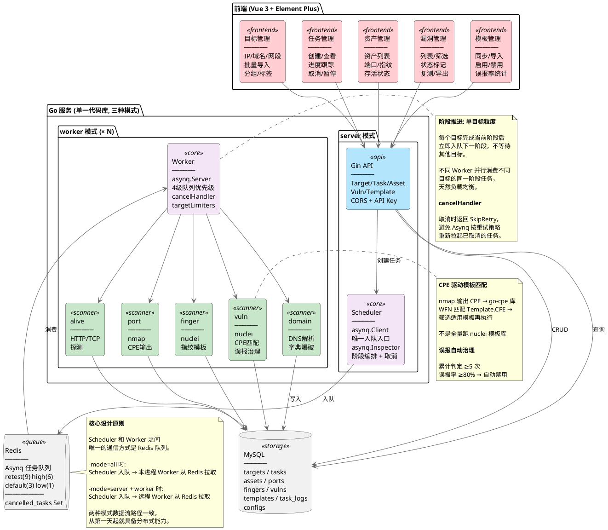

项目链接：[VulnScope](https://github.com/nk7667/VulnScope)

VulnScope 是一个基于 Go + Vue + Redis + MySQL 的黑盒漏洞扫描平台，后端用 Asynq 拆为多阶段流水线，Worker 异步消费，底层调用 nmap 和 nuclei。

### 架构总览



### 扫描流水线

一次扫描拆为五个阶段，按顺序执行：

| # | 阶段 | 说明 |
|---|------|------|
| 1 | domain | DNS 解析，将域名转为 IP |
| 2 | alive | 存活探测，过滤掉不可达的目标 |
| 3 | port | nmap 端口扫描，输出 CPE |
| 4 | finger | nuclei 指纹识别，识别服务/框架 |
| 5 | vuln | nuclei 漏洞扫描，CPE 匹配模板 |

每个目标完成当前阶段后立即入队下一阶段，不等待同批其他目标——慢目标不会拖住快目标。入队前 Scheduler 检查队列 pending 数，超过 10000 时延迟 5 分钟，Worker 侧按 host 做 QPS 限速，并跳过 CIDR 排除列表和冷却期内的 IP。取消任务时 cancelHandler 返回 SkipRetry，避免 Asynq 把已取消的任务按重试策略重新拉起来。

漏洞扫描不跑全量 nuclei 模板库。先拿 nmap 输出的 CPE 和 Service 通过 go-cpe 库做 WFN 匹配（[store.go](https://github.com/nk7667/VulnScope/blob/main/internal/store/store.go#L505-L519)），筛选出适用的模板后再调用 nuclei。每轮扫描结束后统计各模板的人工判定记录——误报率超过 80% 且累计判定 ≥5 次的模板自动禁用（[store.go](https://github.com/nk7667/VulnScope/blob/main/internal/store/store.go#L468-L501)）。

### 运行模式

同一份代码编译出单一二进制，通过 `-mode` 参数切换（[main.go](https://github.com/nk7667/VulnScope/blob/main/cmd/scanner/main.go)）：

- `-mode=all`：API + Worker，单机部署
- `-mode=server`：仅 API
- `-mode=worker`：仅 Worker

API 和 Worker 共享 Redis 和 MySQL，Worker 加机器即可扩容，不改代码。

### 数据模型

核心表关系：Target 提供扫描入口 → Task 记录执行状态 → Asset 存储发现的资产，Asset 下挂 Port（含 nmap 输出的 CPE）、Finger（指纹信息）和 Vuln（漏洞结果）。Port.CPE 与 Template.CPE 通过 go-cpe 库做 WFN 匹配，决定对哪些资产跑哪些模板。Vuln 用 MD5(url:templateID) 做唯一索引去重。

| 模型 | 说明 |
|------|------|
| Target | 扫描目标（ip / domain / cidr） |
| Task | 扫描任务（status / progress / type） |
| Asset | 扫描发现的资产（IP / Domain / Title / StatusCode） |
| Port | 资产端口（Port / Protocol / Service / CPE / Banner） |
| Finger | 资产指纹（Name / Category / Version） |
| Vuln | 漏洞结果（Name / Severity / URL / TemplateID / Status） |
| Template | nuclei 模板（Name / Category / Tags / Severity / YAML） |
| TaskLog | 任务日志（Stage / Level / Message） |

### 项目结构

`internal/` 按职责分层，`cmd/scanner/` 为入口，`web/` 为前端独立目录。

```
VulnScope/
├── cmd/scanner/              # 程序入口
├── internal/
│   ├── config/               # 配置加载
│   ├── model/                # 数据模型（GORM）
│   ├── store/                # 数据库操作 + 模板匹配
│   ├── scheduler/            # 任务调度（入队、取消、暂停）
│   ├── worker/               # 任务执行 + 扫描器封装
│   │   └── scanner/          # nmap/nuclei 子进程调用
│   ├── server/               # HTTP API（Gin）
│   │   └── handler/          # 请求处理
│   └── checker/              # 环境检查
├── web/                      # Vue 3 + Element Plus 前端
├── schema.sql                # MySQL 建表语句
└── config.yaml               # 配置文件
```