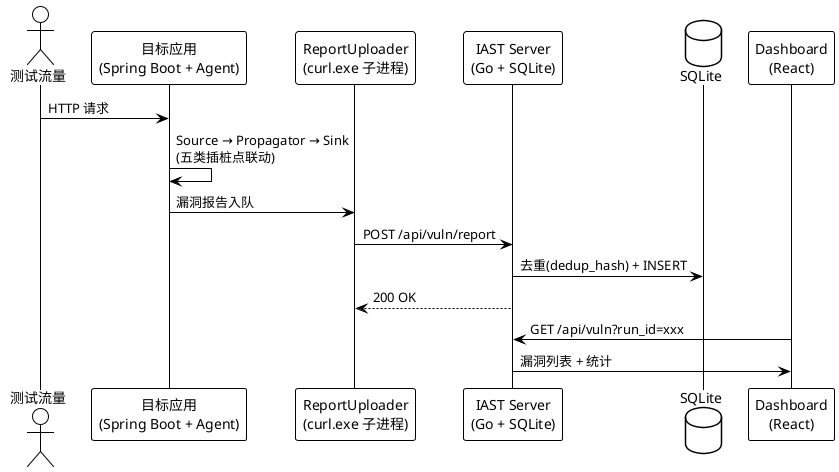
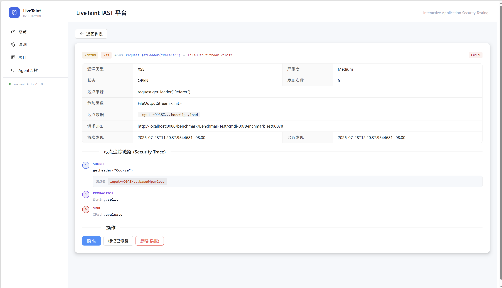

> **项目状态说明**：本文是 IAST 系列的总览篇，建立项目全景并导航到各技术篇与数据篇。IAST 引擎、Server 平台与 OWASP Be<!--  -->nchmark 评测闭环已完成验证，三类别（XSS / CMDI / PathTraversal）全量评测 TPR 均达到 100%。

## 1.概览

项目链接：[nk7667/TaintRader\_IAST: iast扫描器](https://github.com/nk7667/TaintRader_IAST)

LiveTaint 是一个用 Java + ASM + Go + React 实现的交互式应用安全测试（Interactive Application Security Testing，IAST）系统。核心目标：在不依赖商业产品的前提下，把 IAST 从原理 Demo 推进到可挂载真实 Spring Boot 应用、可对接 OWASP Benchmark 评测的最小可用形态。

### 1.1 核心概念

**污点（taint）** 是标记变量承载了不可信输入的状态标签。一个对象被标记为污点，意味着它的值来源于用户输入，在到达危险函数前需要被追踪。

**污点源（Source）** 是用户输入进入应用的入口方法，如 `getParameter`、`getHeader`。**污点汇（Sink）** 是可能引发漏洞的危险函数，如 `Runtime.exec`、`Statement.executeQuery`。**传播器（Propagator）** 是让污点跟随对象变化流动的方法，如 `String.concat`、`StringBuilder.append`。**净化器（Sanitizer）** 是在安全处理完成后删除污点标记的方法，如 `PreparedStatement.setString`。

### 1.2 整体流程

污点流动全景：Source 标记污点 → Propagator 沿程序结构传播污点 → Sanitizer 删除已净化的污点 → Sink 检查污点是否到达 → 命中即报告漏洞。

```
用户输入 → Source → Propagator → ... → Sink → 漏洞报告
(污点源)   (标记)   (传播)            (汇聚点)
```

IAST 与 SAST、DAST、RASP 的差异：它不探索代码，也不探索应用，只观察用户输入实际覆盖了哪条路径。这意味着它的误报率低于 SAST（有运行上下文），漏报率低于 DAST（看到完整数据流），代价是依赖测试流量——没被测试到的代码路径，IAST 无法发现。

| 维度   | SAST     | DAST  | RASP   | **IAST**     |
| :--- | :------- | :---- | :----- | :----------- |
| 检测方式 | 分析源码/字节码 | 发恶意请求 | 拦截危险函数 | **追踪污点数据流**  |
| 需要运行 | 否        | 是     | 是（生产）  | 是（测试）        |
| 误报率  | 高        | 中     | 低      | **低**        |
| 漏报率  | 中        | 高     | 中      | **低**        |
| 阻断请求 | 不阻断      | 不阻断   | 阻断     | **不阻断（仅观察）** |

底层技术栈与 RASP 一致（Agent + ASM + Bootstrap 可见性），IAST 新增的是出口插桩（`visitInsn(ARETURN)` + `DUP`）和跨方法的 ThreadLocal 污点状态。RASP 关注"这次调用危不危险"，IAST 关注"用户输入能否到达这次调用"。

### 1.3 本层角色

本文是系列的总览层，负责建立全景、定位各篇角色、能力总览、物理边界。不展开插桩点的具体 ASM 实现（属技术实现层，见 (一) 至 (四)），不列评测数据明细（属数据评测层，见 (五)）。

***

## 2. 架构总览

三层结构，每层职责单一：

| 层             | 技术                                | 职责                    |
| :------------ | :-------------------------------- | :-------------------- |
| **Agent**     | Java + ASM（`-javaagent` 挂载）       | 五类插桩点、污点追踪、漏洞构造、异步上报  |
| **Server**    | Go + Gin + GORM + SQLite（纯 Go 驱动） | 接收上报、去重存库、查询 API、状态流转 |
| **Dashboard** | React + Ant Design                | 统计卡片、趋势图、漏洞列表与详情      |

数据流：

```
HTTP 请求 → 目标应用(挂载 Agent) → 检测到漏洞
   → ReportUploader 队列 → curl.exe 子进程 → API Server
   → 去重(dedup_hash) → SQLite → Dashboard 展示
```


**为什么 Server 用 SQLite 而不是 MySQL**：纯 Go 驱动 `glebarez/sqlite` 零 CGO 依赖，Windows 上直接编译运行，开箱即用。Benchmark 评测场景下漏洞量级在千条以内，SQLite 完全够用。

**为什么 Agent 用 curl.exe 而不是 Java HTTP 客户端**：Java 网络栈每一层都被自己插桩了，只能通过外部进程。详见 (四) 企业化平台与 Agent 自干扰破局。

### 2.1 漏洞详情页



***

## 3. 五类插桩点

IAST 的所有检测能力都建立在五类插桩点上。这五类不是并列关系，而是一条数据流闭环：

```
HTTP（开关） → SOURCE（标记） → PROPAGATOR（传播） → SINK（检测） → 报告
                                       ↑
                                SANITIZER（净化，删除污点）
```

| 类型             | ASM 位置                                     | 作用                  | 读写 TaintContext                 |
| :------------- | :----------------------------------------- | :------------------ | :------------------------------ |
| **HTTP**       | `visitCode()` + `visitInsn(RETURN/ATHROW)` | 请求边界，开关 ThreadLocal | enterRequest / leaveRequest     |
| **SOURCE**     | `visitInsn(ARETURN)` + `DUP`               | 用户输入标记为污点           | addTaint（写）                     |
| **PROPAGATOR** | `visitInsn(ARETURN)` + `DUP`               | 污点跟到新对象             | isTainted + propagateTaint（读+写） |
| **SANITIZER**  | `visitInsn(RETURN)` + `ALOAD`              | 净化点删除污点             | removeTaint（删）                  |
| **SINK**       | `visitCode()`                              | 检测污点到达危险函数          | isTainted + getTaintTag（只读）     |

入口插桩 vs 出口插桩：Source/Propagator 必须用出口插桩——入口时返回值还不存在。Sink/Http 使用入口插桩即可——参数在入口时就能拿到。出口插桩的关键技巧是 `DUP` 复制返回值，一份给 Handler，一份留给 `ARETURN`。

具体的 ASM 实现与栈操作分析见 (一) 基础篇：ASM 插桩与污点追踪。

Sink 检测涉及三种 JVM 关系模式（接口实现、抽象类子类、具体类构造函数），详见 (二) Sink 检测体系与准确性提升。

污点追踪分层模型（对象级/值级/子串级）及对象级传播优化详见 (三) 污点传播：传播链补全与跨线程。

***

## 4. 检测能力总览

基于 `hook-rules.json` 的实际规则数量（173 条）：

| 类型                 | 数量 | 关键覆盖点                                                                                                                                                                                                                                                                                                                                                                                  |
| :----------------- | :- | :------------------------------------------------------------------------------------------------------------------------------------------------------------------------------------------------------------------------------------------------------------------------------------------------------------------------------------------------------------------------------------- |
| **HTTP 边界**        | 4  | `servlet.service` / `doFilter`                                                                                                                                                                                                                                                                                                                                                         |
| **Source**         | 12 | `getParameter`、`getHeader`、`getHeaders`、`getQueryString`、`getCookies`、`getInputStream`、`getReader`、`getParameterMap`、`getParameterValues`、`getParameterNames`、`getHeaderNames`、`resolveName`（Spring MVC）                                                                                                                                                                               |
| **Propagator**     | 51 | String(11 种操作)、StringBuilder/StringBuffer(3)、`StringConcatHelper.simpleConcat`、`URLDecoder.decode`、Base64(7)、`File.<init>`(4 种)、`URI.<init>`(2)、`Paths.get`、`StringReader.<init>`、`InputSource.<init>`、`new String(byte[])`、ArrayList/HashMap(5)、`XPath.compile`、Thing1/Thing2(2)                                                                                                      |
| **Sink**           | 86 | `Runtime.exec`(3 种)、`ProcessBuilder.start`、`Statement`(10)、`JdbcTemplate`(9)、`HttpURLConnection.connect`、`FileInputStream/FileOutputStream/FileReader/FileWriter/Scanner`(14)、`Files`(3)、`ObjectInputStream`(2)、`SAXParser/DocumentBuilder/XMLReader`(6)、`SpelExpressionParser`(2)、`PrintWriter`(11)、`JspWriter`(6)、`InitialDirContext/InitialContext`(4)、`XPath`/`XPathExpression`(5) |
| **Sanitizer**      | 19 | `PreparedStatement`(11 种 setter)、ESAPI Encoder(4)、`URLEncoder.encode`、`HtmlUtils.htmlEscape`、`StringEscapeUtils.escapeHtml`                                                                                                                                                                                                                                                            |
| **ThreadTransfer** | 1  | `ThreadPoolExecutor.execute`                                                                                                                                                                                                                                                                                                                                                           |

漏洞类型覆盖：CommandInjection、SqlInjection、SSRF、PathTraversal、Deserialization、XXE、SpEL Injection、XSS、LDAP Injection、XPath Injection 共 10 类，均已在迷你靶场（mini-vuln-lab）上验证通过。

***

## 5. OWASP Benchmark 评测

OWASP Benchmark 1.2 共 1572 个可评测用例，已全部完成评测。三类别全量评测（974 用例）的最终成果：

| 类别            | 用例数 | TPR  | FPR  | FN | FP | Precision |
| :------------ | :-- | :--- | :--- | :- | :- | :-------- |
| XSS           | 455 | 100% | 0%   | 0  | 0  | 100%      |
| CMDI          | 251 | 100% | 4.8% | 0  | 6  | 95.5%     |
| PathTraversal | 268 | 100% | 0%   | 0  | 0  | 100%      |

PathTraversal 类别从基线 TPR 51.1% 提升至 100%，65 个 FN 全部消除。详细的评测数据、FN/FP 根因分类、优化效果对比见 (五) Benchmark 评测与根因分析。

***

