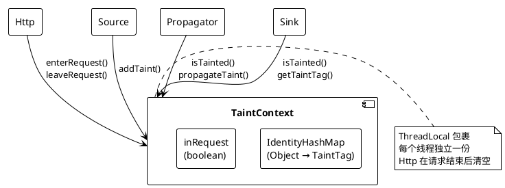
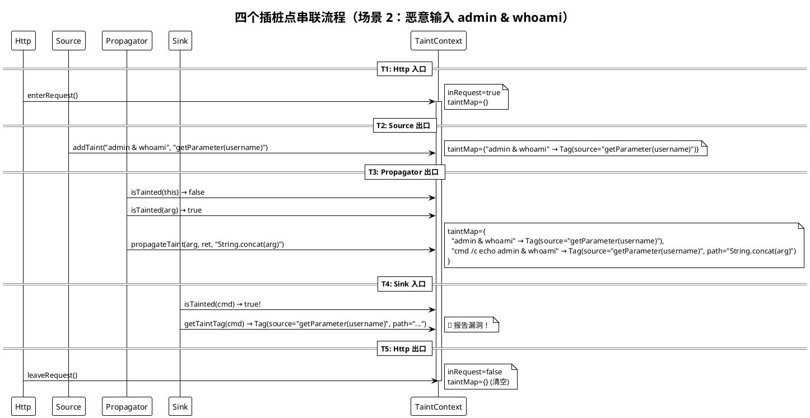

## IAST 阶段 1：四类插桩点与污点追踪

### 开篇：从零实现一个能追踪污点链路的 IAST Demo

基于 RASP 项目已掌握的 ASM + Agent 技术（[阶段 1](./2026-07-07-学习篇-ASM阶段1-Visitor模式与基础插桩.md)、[阶段 2](./2026-07-07-学习篇-ASM阶段2-检测逻辑注入与Bootstrap类加载.md)、[阶段 3](./2026-07-07-学习篇-ASM阶段3-RuntimeHook-agentmain-HTTP热开关.md)），本篇实现 IAST 的四类插桩点（Http / Source / Propagator / Sink），跑通一条完整的污点追踪链路。

```
用户输入 → Source → Propagator → ... → Sink → 漏洞报告
(污点源)   (标记)   (传播)            (汇聚点)
```

底层技术栈（Agent + ASM + COMPUTE\_FRAMES + Bootstrap 可见性）和 RASP 完全一样。新增的是出口插桩（`visitInsn(ARETURN)` + `DUP`）和跨方法的 ThreadLocal 污点状态。（IAST 与 RASP 的详细概念对比见[这篇](./../RASP/2026-06-29-学习篇-IAST、RASP基础.md)）

***

### 一、核心引擎：TaintContext + TaintTag

RASP 没有跨方法状态——每个 Sink 独立检测。IAST 必须有跨方法状态，因为 Source → Propagator → Sink 在不同方法中执行，需要共享"什么是污点"的信息。

TaintTag 和 TaintContext 不属于四类插桩点，它们是四类插桩点共享的数据模型：



| 插桩点        | 调用 TaintContext 的方法                                   | 读写          |
| :--------- | :---------------------------------------------------- | :---------- |
| Http       | `enterRequest()`, `leaveRequest()`                    | 写（开关+清空）    |
| Source     | `addTaint(obj, source)`                               | 写（标记污点）     |
| Propagator | `isTainted(obj)`, `propagateTaint(src, target, name)` | 读 + 写（传播污点） |
| Sink       | `isTainted(obj)`, `getTaintTag(obj)`                  | 只读（检测污点）    |

#### 1.1 TaintTag：记录来源和传播路径

```java
public class TaintTag {
    /** 污点来源方法（如 "getParameter(username)"） */
    private final String source;

    /** 传播路径，用 → 连接（如 "String.concat(this) → StringBuilder.append"） */
    private final StringBuilder propagationPath = new StringBuilder();

    public TaintTag(String source) {
        this.source = source;
    }

    public void appendPropagation(String propagator) {
        if (propagationPath.length() > 0) {
            propagationPath.append(" → ");
        }
        propagationPath.append(propagator);
    }
}
```

#### 1.2 TaintContext：线程级污点状态管理

```java
public class TaintContext {

    /** 当前请求的污点映射表：Object → TaintTag */
    private static final ThreadLocal<IdentityHashMap<Object, TaintTag>> taintMap =
            ThreadLocal.withInitial(IdentityHashMap::new);

    /** 当前是否在 HTTP 请求上下文中 */
    private static final ThreadLocal<Boolean> inRequest =
            ThreadLocal.withInitial(() -> Boolean.FALSE);

    // Http 插桩点调用
    public static void enterRequest() { ... }
    public static void leaveRequest() { ... }

    // Source 插桩点调用
    public static void addTaint(Object obj, String source) { ... }

    // Propagator 插桩点调用
    public static void propagateTaint(Object source, Object target, String propagator) { ... }

    // Sink 插桩点调用
    public static boolean isTainted(Object obj) { ... }
    public static TaintTag getTaintTag(Object obj) { ... }
}
```

**为什么用 IdentityHashMap 而不是 HashSet？**

| 集合                | 判等方式       | 问题                                                     |
| :---------------- | :--------- | :----------------------------------------------------- |
| `HashSet`         | `equals()` | `"abc".equals(new String("abc"))` → true → 不同对象被误判为同一个 |
| `IdentityHashMap` | `==`       | 严格追踪对象引用，不同 String 对象即使内容相同也不混淆                        |

IAST 追踪的是"**这个特定对象**"是否被污染，而非"与它内容相同的对象"。

**为什么用 ThreadLocal？**

HTTP 请求是并发处理的——线程 A 处理请求 1，线程 B 处理请求 2。如果污点状态是全局共享的，请求 1 的污点会泄漏到请求 2。ThreadLocal 让每个线程有独立的污点状态。

***

### 二、Http Transformer：标记请求边界

#### ① 插在哪个类的哪个方法？

`SimpleHttpServlet.service(SimpleHttpRequest, SimpleHttpResponse)`

#### ② 为什么在这个位置？

Http 插桩点是 IAST 独有的概念，RASP 不需要它。作用有两个：

- **入口**（`visitCode`）：`TaintContext.enterRequest()` → 初始化当前线程的污点状态
- **出口**（`visitInsn RETURN/ATHROW`）：`TaintContext.leaveRequest()` → 清理污点状态，防止泄漏

没有 Http 插桩点，`String.concat()` 在 JVM 启动阶段就会被调用无数次（JDK 内部大量使用），每个都会触发 Propagator 的检查逻辑。`isInRequest()` 守卫让 Propagator 只在请求上下文中生效。

#### ③ 核心代码

注入的等价 Java 代码：

```java
void service(SimpleHttpRequest req, SimpleHttpResponse resp) {
    HttpHandler.onServiceEnter(req);   // ← 入口注入
    try {
        // ... 原始方法体 ...
    } finally {
        HttpHandler.onServiceExit();    // ← 出口注入
    }
}
```

入口注入（`visitCode`）：

```java
@Override
public void visitCode() {
    super.visitCode();

    // ALOAD 1 → 加载 service() 的第一个参数 req（slot 0 = this, slot 1 = req）
    mv.visitVarInsn(Opcodes.ALOAD, 1);

    // INVOKESTATIC HttpHandler.onServiceEnter(Object)V
    mv.visitMethodInsn(Opcodes.INVOKESTATIC,
            HANDLER_CLASS, "onServiceEnter",
            "(Ljava/lang/Object;)V", false);
}
```

出口注入（`visitInsn`）——拦截 RETURN 和 ATHROW：

```java
@Override
public void visitInsn(int opcode) {
    if (opcode == Opcodes.RETURN || opcode == Opcodes.ATHROW) {
        mv.visitMethodInsn(Opcodes.INVOKESTATIC,
                HANDLER_CLASS, "onServiceExit",
                "()V", false);
    }
    super.visitInsn(opcode);
}
```

**为什么出口要拦截 RETURN 和 ATHROW？**

服务方法可能正常结束（`RETURN`），也可能抛异常（`ATHROW`）。如果只拦截 `RETURN`，异常退出时 `leaveRequest()` 不会被调用，当前线程的污点状态残留——下一个请求复用这个线程时，会看到上一个请求的污点数据。

***

### 三、Source Transformer：标记用户输入为污点

#### ① 插在哪个类的哪个方法？

`SimpleHttpRequest.getParameter(String name)` → 返回类型 `String`

#### ② 为什么在这个位置？

Source 必须在**出口**插桩，因为 `getParameter()` 的返回值就是污点——入口时返回值还不存在。出口插桩是 IAST 新增的关键技能，RASP 从未做过。

#### ③ 核心代码

在 `ARETURN` 前注入，栈操作如下：

| 步骤 | 指令                     | 栈变化                                           | 说明               |
| :- | :--------------------- | :-------------------------------------------- | :--------------- |
| ①  | `DUP`                  | `[ret]` → `[ret, ret]`                        | 复制返回值            |
| ②  | `ALOAD 0`              | `[ret, ret]` → `[ret, ret, this]`             | 加载 this          |
| ③  | `ALOAD 1`              | `[ret, ret, this]` → `[ret, ret, this, name]` | 加载参数名            |
| ④  | `INVOKESTATIC Handler` | `[ret, ret, this, name]` → `[ret]`            | Handler 消费 3 个参数 |
| ⑤  | `ARETURN`              | `[ret]` → (返回)                                | 原始返回指令           |

```java
static class GetParameterMethodVisitor extends MethodVisitor {

    @Override
    public void visitInsn(int opcode) {
        if (opcode == Opcodes.ARETURN) {
            // DUP: 复制返回值
            mv.visitInsn(Opcodes.DUP);

            // ALOAD 0: 加载 this
            mv.visitVarInsn(Opcodes.ALOAD, 0);

            // ALOAD 1: 加载 name 参数
            mv.visitVarInsn(Opcodes.ALOAD, 1);

            // 调用 SourceHandler.onGetParameterExit(Object, Object, String)
            mv.visitMethodInsn(Opcodes.INVOKESTATIC,
                    HANDLER_CLASS, "onGetParameterExit",
                    "(Ljava/lang/Object;Ljava/lang/Object;Ljava/lang/String;)V", false);
        }
        super.visitInsn(opcode);
    }
}
```

**为什么** **`DUP`** **后栈是** **`[ret, ret]`** **而不是** **`[ret₁, ret₂]`？**

`DUP` 是复制栈顶的**引用**，不是创建新对象。两个栈位置指向同一个 String 对象。Handler 接收到的 `returnValue` 和 `ARETURN` 返回的是**同一个对象**——标记这个特定对象为污点。

**为什么 ALOAD 0/1 在方法出口时仍然有效？**

局部变量表在方法执行期间一直存在（直到方法返回）。JIT 编译可能优化掉局部变量，但 ASM 在字节码层面操作，此时局部变量还在。

**为什么只拦截 ARETURN 而不拦截 RETURN？**

`getParameter()` 的返回类型是 `String`（引用类型），对应的返回指令是 `ARETURN`。`RETURN` 是 void 方法用的。如果 `getParameter` 返回 null，`ARETURN` 仍然会被执行（栈顶是 null 引用），Handler 内部的 null 检查会处理这种情况。

***

### 四、Propagator Transformer：传播污点到新对象

`java.lang.String.concat(String str)` → 返回类型 `String`

#### ② 为什么在这个位置？

Source 标记了 `"admin & whoami"` 为污点。但业务代码通常不是直接把用户输入传给 Sink，而是先拼接：

```java
String cmd = "cmd /c echo ".concat(username);  // username 是污点
Runtime.getRuntime().exec(cmd);                  // cmd 必须也是污点！
```

`concat()` 返回的是一个**全新的 String 对象**。如果不做传播，这个新对象不会被标记为污点，Sink 检测时就会漏报。Propagator 的作用就是："如果输入是污点，输出也必须是污点"。

#### ③ 核心代码

和 Source 一样的出口插桩模式，在 `ARETURN` 前注入：

| 步骤 | 指令                     | 栈变化                                          | 说明                      |
| :- | :--------------------- | :------------------------------------------- | :---------------------- |
| ①  | `DUP`                  | `[ret]` → `[ret, ret]`                       | 复制返回值                   |
| ②  | `ALOAD 0`              | `[ret, ret]` → `[ret, ret, this]`            | 加载 this（"cmd /c echo "） |
| ③  | `ALOAD 1`              | `[ret, ret, this]` → `[ret, ret, this, str]` | 加载参数（username）          |
| ④  | `INVOKESTATIC Handler` | `[ret, ret, this, str]` → `[ret]`            | Handler 消费 3 个参数        |
| ⑤  | `ARETURN`              | `[ret]` → (返回)                               | 原始返回指令                  |

```java
@Override
public void visitInsn(int opcode) {
    if (opcode == Opcodes.ARETURN) {
        mv.visitInsn(Opcodes.DUP);
        mv.visitVarInsn(Opcodes.ALOAD, 0);
        mv.visitVarInsn(Opcodes.ALOAD, 1);
        mv.visitMethodInsn(Opcodes.INVOKESTATIC,
                HANDLER_CLASS, "onConcatExit",
                "(Ljava/lang/Object;Ljava/lang/Object;Ljava/lang/Object;)V", false);
    }
    super.visitInsn(opcode);
}
```

Handler 的传播逻辑：

```java
public static void onConcatExit(Object returnValue, Object thisObj, Object arg) {
    if (!TaintContext.isInRequest() || returnValue == null) return;

    boolean thisTainted = TaintContext.isTainted(thisObj);
    boolean argTainted = TaintContext.isTainted(arg);

    if (thisTainted || argTainted) {
        Object taintSource = thisTainted ? thisObj : arg;
        String propagator = thisTainted ? "String.concat(this)" : "String.concat(arg)";
        TaintContext.propagateTaint(taintSource, returnValue, propagator);
    }
}
```

**为什么优先传播 this 的污点？**

考虑链式调用：`"a".concat(input1).concat(input2)`

- 第一次 `concat`：`this="a"`（非污点），`arg=input1`（污点）→ 传播 arg 的污点
- 第二次 `concat`：`this=第一次的结果`（污点），`arg=input2`（也是污点）

两次都是污点时，优先传播 this 的污点，因为 this 包含了更早的传播历史，能生成更完整的传播路径。

**插桩 Bootstrap 类（java.lang.String）**

RASP 阶段 2 插桩了 `ProcessBuilder`（Bootstrap 类），IAST 现在插桩 `String`（也是 Bootstrap 类）。处理方式完全一样：`appendToBootstrapClassLoaderSearch` + 独立外部类 Transformer。

但有一个**重要的性能考虑**：`String.concat()` 是 JVM 中使用最频繁的方法之一。Handler 中必须用 `isInRequest()` 守卫——非请求上下文中，Handler 在第一行就 return，开销只有一次 ThreadLocal.get() + 一次 boolean 判断，约 10 纳秒。

***

### 五、Sink Transformer：检测污点是否到达危险函数

#### ① 插在哪个类的哪个方法？

`java.lang.Runtime.exec(String command)`

#### ② 为什么在这个位置？

Sink 插桩点是 IAST 和 RASP 唯一共有的插桩点类型。注入位置完全一样（`visitCode`，方法入口），但检测逻辑不同：

- **RASP**：`cmd.contains(";")` → 检查参数内容是否有恶意字符 → 发现恶意 → 抛 SecurityException 阻断
- **IAST**：`TaintContext.isTainted(cmd)` → 检查参数来源是否被标记为污点 → 发现污点 → 生成漏洞报告（不阻断）

#### ③ 核心代码

```java
static class ExecMethodVisitor extends MethodVisitor {

    @Override
    public void visitCode() {
        super.visitCode();

        // ALOAD 1: 加载 command 参数（slot 0 = this, slot 1 = command）
        mv.visitVarInsn(Opcodes.ALOAD, 1);

        // INVOKESTATIC SinkHandler.onExecEnter(Object)V
        mv.visitMethodInsn(Opcodes.INVOKESTATIC,
                HANDLER_CLASS, "onExecEnter",
                "(Ljava/lang/Object;)V", false);
    }
}
```

和 RASP 的 `RuntimeExecTransformer` 对比：

| 维度   | RASP 阶段 2                      | IAST A1                              |
| :--- | :----------------------------- | :----------------------------------- |
| 注入位置 | `visitCode()`                  | `visitCode()`                        |
| 注入内容 | 12 条指令（取字段 + null检查 + 拼接 + 检测） | 2 条指令（ALOAD + INVOKESTATIC）          |
| 检测逻辑 | `cmd.contains(";")` → 内容检测     | `TaintContext.isTainted(cmd)` → 来源检测 |
| 阻断方式 | `throw SecurityException`      | 不阻断，只报告                              |

RASP 需要 12 条指令是因为它要在字节码层面完成"取字段 + null 检查 + 字符串拼接 + 危险字符检测"——所有逻辑都内联到插桩代码中。IAST 只需 2 条指令，因为检测逻辑在 Handler 的 Java 代码中完成，字节码只负责"把参数传给 Handler"。

***

### 六、Agent 入口

```java
public class IastAgentMain {

    public static void premain(String agentArgs, Instrumentation inst) throws Exception {
        // ① appendToBootstrapClassLoaderSearch（和 RASP 一样）
        String jarPath = IastAgentMain.class
                .getProtectionDomain().getCodeSource().getLocation().getPath();
        inst.appendToBootstrapClassLoaderSearch(new JarFile(jarPath));

        // ② 注册 Transformer（独立外部类，和 RASP 一样）
        inst.addTransformer(new IastTransformer(), true);

        // ③ retransform 已加载类（IAST 多了 String）
        for (Class<?> clazz : inst.getAllLoadedClasses()) {
            String name = clazz.getName();
            if ("java.lang.Runtime".equals(name) && inst.isModifiableClass(clazz)) {
                inst.retransformClasses(clazz);    // Sink 目标
            }
            if ("java.lang.String".equals(name) && inst.isModifiableClass(clazz)) {
                inst.retransformClasses(clazz);    // Propagator 目标（IAST 新增！）
            }
        }
    }
}
```

**为什么 IAST 需要额外 retransform String？**

RASP 只插桩 Runtime / ProcessBuilder——它们在 JVM 启动时就被加载了，需要 retransform。IAST 还需要插桩 `String.concat()`——String 更是 JVM 最先加载的类之一，当然也需要 retransform。

**为什么 SimpleHttpServlet / SimpleHttpRequest 不需要 retransform？**

因为它们是应用类，在 Agent 注册 Transformer 之后才被加载，Transformer 会自动拦截。JDK 核心类（String、Runtime）在 Agent 注册之前就已经加载了，所以必须手动 retransform。

***

### 七、联动效果：四个插桩点如何串联

以场景 2（恶意输入 `admin & whoami`）为例，追踪完整的污点传播链路：



**关键观察**：

1. **T1-T5 都在同一个线程中执行**——ThreadLocal 保证了污点状态的一致性
2. **T2 标记了 1 个污点，T3 传播后变成了 2 个**——原始污点 `"admin & whoami"` 和传播后的 `"cmd /c echo admin & whoami"` 都在 taintMap 中
3. **T5 必须清理**——否则下一个请求复用这个线程时会看到上一个请求的污点

***

### 附录 A：检测效果与对比分析

#### A.1 运行结果

```
[IAST Agent] premain 启动, args=null
[IAST Agent] Agent Jar 已加入 Bootstrap 搜索路径
[IAST Agent] Transformer 注册完成
[IAST Agent] 已对 java.lang.Runtime 执行 retransform
[IAST Agent] 已对 java.lang.String 执行 retransform
========================================
  IAST Demo A1：四类插桩点演示
  Http -> Source -> Propagator -> Sink
========================================

--- 场景 1: 硬编码命令（非污点数据）---
[IAST] → HTTP请求进入
[IAST] ✅ 命令执行安全（非污点数据）: cmd /c echo safe-hello
[IAST] ← HTTP请求结束 (污点数: 0)

--- 场景 2: 命令注入（污点数据通过 Source->Propagator->Sink）---
[IAST] → HTTP请求进入
[IAST] ★ Source标记污点: getParameter(username) → "admin & whoami"
[IAST] ★ Propagator传播污点: String.concat(arg) → "cmd /c echo admin & whoami"
[IAST] 🔴 发现命令注入漏洞！
[IAST]    污点来源: getParameter(username)
[IAST]    传播路径: String.concat(arg)
[IAST]    污点数据: "cmd /c echo admin & whoami"
[IAST] ← HTTP请求结束 (污点数: 2)

--- 场景 3: 正常用户输入（污点数据到达 Sink，IAST 仍报告漏洞）---
[IAST] → HTTP请求进入
[IAST] ★ Source标记污点: getParameter(username) → "alice"
[IAST] ★ Propagator传播污点: String.concat(arg) → "cmd /c echo alice"
[IAST] 🔴 发现命令注入漏洞！
[IAST]    污点来源: getParameter(username)
[IAST]    传播路径: String.concat(arg)
[IAST]    污点数据: "cmd /c echo alice"
[IAST] ← HTTP请求结束 (污点数: 2)
```

三个场景的对比：

| 场景       | 输入               | RASP 判定      | IAST 判定          | 原因                       |
| :------- | :--------------- | :----------- | :--------------- | :----------------------- |
| 1. 硬编码命令 | 无用户输入            | ✅ 放行         | ✅ 安全             | Sink 参数非污点               |
| 2. 恶意输入  | `admin & whoami` | 🔴 阻断（含 `&`） | 🔴 漏洞（来自 Source） | 检测方式不同，结论一致              |
| 3. 正常输入  | `alice`          | ✅ 放行（无恶意字符）  | 🔴 漏洞（来自 Source） | **IAST 发现 RASP 漏报的潜在漏洞** |

#### A.2 误报分析

场景 3 的输入 `"alice"` 没有任何恶意字符，IAST 却报了漏洞。

IAST 的判定逻辑是"用户输入能不能到达危险函数"，不是"当前输入有没有恶意"。`alice` 确实来自用户输入，也确实被拼进了 `Runtime.exec()`——这条代码路径就是有漏洞的，只是这次的输入刚好无害。

问题在于：如果每次用户输入到达 exec 都报，开发者很快会被海量报告淹没。需要一种机制来区分"确实危险"和"已经过安全处理"。生产环境用的方案是 Sanitizer（净化节点）——在特定方法调用后清除污点标记。比如 `PreparedStatement.setString()` 执行后，参数已通过预编译安全处理，不再需要标记为污点。初版不实现，留到阶段 D。

#### A.3 漏报分析

A1 只 Hook 了 `String.concat()` 作为传播方法，实际代码中最常见的字符串拼接方式都没覆盖：

- **`+`** **运算符**：Java 的 `+` 编译后是 `StringBuilder.append()`，不是 `String.concat()`。所以 `"cmd /c echo " + username` 不会被传播，污点丢失。这是最大的漏报。
- **`StringBuilder.append()`** **/** **`StringBuffer.append()`**：同上，是 `+` 的底层实现。
- **`URLDecoder.decode()`**：URL 解码后内容变了，但污点没有跟过去。

这些在 A3 扩展 Propagator 时会补上。

另外有三类先天限制，ASM 无法解决：

| 场景                      | 原因                               |
| :---------------------- | :------------------------------- |
| 反射调用（`Method.invoke()`） | ASM 插桩的是字节码，反射绕过了字节码             |
| 跨线程传播                   | ThreadLocal 不跨线程，线程 A 的污点传不到线程 B |
| JNI/native 调用           | ASM 只能处理 Java 字节码，管不到 native 层   |

`PreparedStatement` 场景是另一种情况——用户输入经过预编译参数化查询后实际是安全的，但因为没有 Sanitizer，污点标记没被清除，会报出不需要的告警。阶段 D 实现 Sanitizer 后解决。

#### A.4 性能开销

| 组件                                | 性能开销                                         | 评估                     |
| :-------------------------------- | :------------------------------------------- | :--------------------- |
| Http Handler                      | 1 次 ThreadLocal.set + HashMap.clear          | 极低（每请求 1 次）            |
| Source Handler                    | 1 次 isInRequest 检查 + 1 次 HashMap.put         | 极低（每 getParameter 1 次） |
| Propagator Handler（String.concat） | 1 次 isInRequest 检查 + 2 次 isTainted 检查        | **需关注**（concat 调用频率极高） |
| Sink Handler                      | 1 次 isInRequest 检查 + 1 次 HashMap.containsKey | 极低（exec 调用频率低）         |

`String.concat()` 是 JVM 使用最频繁的方法之一。Handler 入口用 `isInRequest()` 守卫，非请求上下文中仅做一次 ThreadLocal.get() + boolean 判断（约 10ns），几乎无开销。但在请求上下文中，每次 concat 都会触发 2 次 `isTainted` 检查——对高频字符串操作的场景可能有累积影响。

生产级 IAST 的优化方式：只对"可能传播污点"的方法做检查，而非对所有 concat 调用都检查。这需要更精细的规则配置。

#### A.5 和其他安全工具的区别

| 维度     | SAST（静态分析） | DAST（黑盒扫描） | RASP（运行时防护） | **IAST（交互式测试）**     |
| :----- | :--------- | :--------- | :---------- | :------------------ |
| 检测方式   | 分析源码/字节码   | 发送恶意请求     | 拦截危险函数调用    | **追踪污点数据流**         |
| 需要运行代码 | ❌          | ✅          | ✅ （生产环境）    | ✅ （测试环境）            |
| 检测时机   | 开发阶段       | 测试/部署阶段    | 生产运行时       | **测试运行时**           |
| 误报率    | 高（无运行上下文）  | 中（看不到代码）   | 低（但有绕过风险）   | **低（有运行上下文+数据流）**   |
| 漏报率    | 中（看不到运行路径） | 高（只测已知模式）  | 中（只防已知攻击）   | **低（追踪完整数据流）**      |
| 能定位代码  | ✅ 能        | ❌ 不能       | ✅ 能         | **✅ 能（含完整调用链）**     |
| 对业务影响  | 无          | 可能造成脏数据    | 阻断请求        | **仅观察，不阻断**         |
| 依赖测试覆盖 | 不依赖        | 不依赖        | 不依赖         | **依赖（代码覆盖率=测试覆盖率）** |

**IAST 的核心优势**：低误报 + 低漏报 + 精准定位。代价是依赖真实的数据流，没有被测试执行的代码路径，IAST 无法发现漏洞。

**IAST 的核心局限**：

1. 不支持反射调用（`Method.invoke()` 绕过插桩）
2. 不支持跨线程传播（线程 A 的污点传给线程 B 会丢失）
3. 不支持 native 方法（JNI 调用无法插桩）
4. 依赖测试覆盖率（没被测试到的路径不会被检测）

#### A.6 入口插桩 vs 出口插桩

入口插桩和出口插桩是两种完全不同的插桩方式，RASP 只做过入口插桩，IAST 两种都要用：

| 维度     | 入口插桩（RASP + IAST Sink）  | 出口插桩（IAST Source + Propagator）       |
| :----- | :---------------------- | :----------------------------------- |
| ASM 位置 | `visitCode()`           | `visitInsn(ARETURN)`                 |
| 能拿到什么  | 方法参数（ALOAD 1, 2, ...）   | 返回值（栈顶）+ 方法参数（局部变量表仍在）               |
| 关键技巧   | 无特殊技巧                   | `DUP` 复制返回值，一份给 Handler，一份留给 ARETURN |
| 适用场景   | Sink 检测、Http 入口         | Source 标记、Propagator 传播              |
| 栈影响    | 插入的指令不影响原始方法栈           | DUP 增加了栈深度，Handler 必须消费掉             |
| 必须处理   | `super.visitCode()` 先调用 | 只拦截 `ARETURN`，不拦截 `RETURN`/`IRETURN` |

**为什么 Source 和 Propagator 不能用入口插桩？**

入口时方法还没执行，返回值不存在。Source 需要标记 `getParameter` 的返回值为污点——这个值在入口时还不存在。

**为什么 Sink 不能用出口插桩？**

技术上可以，但没必要。Sink 只需要检查参数是否为污点，参数在入口时就能拿到。出口插桩反而更复杂（要处理返回值）。

#### A.7 踩坑记录

**坑 1：appendToBootstrapClassLoaderSearch 的路径问题**

`IastAgentMain.class.getProtectionDomain().getCodeSource().getLocation().getPath()` 在 `-cp classes` 目录运行时返回的是目录路径（如 `D:\...\target\classes`），而 `new JarFile()` 只能接受 `.jar` 文件 → `FileNotFoundException`。

**解法**：用 `-cp target/iast-demo-a1-1.0-SNAPSHOT.jar` 运行，确保路径指向 jar 文件。这也是 RASP 项目中 shade 插件的隐性价值——打包成 jar 后路径一定是 `.jar` 结尾。

**坑 2：String retransform 的性能考虑**

`java.lang.String` 是 JVM 中使用最频繁的类。插桩 `String.concat()` 后，每次调用 concat 都会触发 PropagatorHandler。如果 Handler 不做守卫，JVM 启动阶段的数千次 concat 调用都会被处理。

**解法**：Handler 入口用 `if (!TaintContext.isInRequest()) return;` 守卫。非请求上下文中，Handler 在第一行就返回，开销只有一次 ThreadLocal.get() + 一次 boolean 判断，约 10 纳秒。

**坑 3：DUP 后的栈平衡**

出口插桩中 `DUP` 复制了返回值，Handler 消费了 `[ret, this, arg]` 三个参数。如果 Handler 的描述符写错了（比如少了参数），栈会不平衡 → `VerifyError`。

**解法**：仔细核对 Handler 方法的描述符。`onGetParameterExit(Object, Object, String)` → `(Ljava/lang/Object;Ljava/lang/Object;Ljava/lang/String;)V`，三个参数 + void 返回。`COMPUTE_FRAMES` 会自动处理栈映射帧，但前提是栈操作本身是正确的。

***

### 附录 B：项目代码索引

#### B.1 项目骨架

```
iast-demo-a1/
├── pom.xml                                          # Maven + ASM 依赖 + shade 插件
└── src/main/java/com/iast/demo/
    ├── IastAgentMain.java                           # premain + Bootstrap 可见性 + retransform
    ├── IastTransformer.java                         # 类名路由（独立外部类）
    ├── TestApp.java                                 # 3 个场景验证
    ├── core/
    │   ├── TaintContext.java                         # ThreadLocal + IdentityHashMap 污点状态
    │   └── TaintTag.java                             # 污点标签（来源 + 传播路径）
    ├── handler/
    │   ├── HttpHandler.java                          # HTTP 请求边界回调
    │   ├── SourceHandler.java                        # 污点源标记回调
    │   ├── PropagatorHandler.java                    # 污点传播回调
    │   └── SinkHandler.java                          # 污点汇聚检测回调
    ├── hook/
    │   ├── HttpTransformer.java                      # service() 入口+出口双向插桩
    │   ├── SourceTransformer.java                    # getParameter() 出口插桩
    │   ├── PropagatorTransformer.java                # String.concat() 出口插桩
    │   └── SinkTransformer.java                      # Runtime.exec() 入口插桩
    └── servlet/
        ├── SimpleHttpRequest.java                    # 模拟 HttpServletRequest
        ├── SimpleHttpResponse.java                   # 模拟 HttpServletResponse
        └── SimpleHttpServlet.java                    # 模拟漏洞 Servlet
```

#### B.2 完整代码链接

项目路径：`iast-demo-a1/`

- [pom.xml](file:///d:/download/traeproject/trae_projects/iast/iast-demo-a1/pom.xml)
- [IastAgentMain.java](file:///d:/download/traeproject/trae_projects/iast/iast-demo-a1/src/main/java/com/iast/demo/IastAgentMain.java)
- [IastTransformer.java](file:///d:/download/traeproject/trae_projects/iast/iast-demo-a1/src/main/java/com/iast/demo/IastTransformer.java)
- [TaintContext.java](file:///d:/download/traeproject/trae_projects/iast/iast-demo-a1/src/main/java/com/iast/demo/core/TaintContext.java)
- [TaintTag.java](file:///d:/download/traeproject/trae_projects/iast/iast-demo-a1/src/main/java/com/iast/demo/core/TaintTag.java)
- [HttpHandler.java](file:///d:/download/traeproject/trae_projects/iast/iast-demo-a1/src/main/java/com/iast/demo/handler/HttpHandler.java)
- [SourceHandler.java](file:///d:/download/traeproject/trae_projects/iast/iast-demo-a1/src/main/java/com/iast/demo/handler/SourceHandler.java)
- [PropagatorHandler.java](file:///d:/download/traeproject/trae_projects/iast/iast-demo-a1/src/main/java/com/iast/demo/handler/PropagatorHandler.java)
- [SinkHandler.java](file:///d:/download/traeproject/trae_projects/iast/iast-demo-a1/src/main/java/com/iast/demo/handler/SinkHandler.java)
- [HttpTransformer.java](file:///d:/download/traeproject/trae_projects/iast/iast-demo-a1/src/main/java/com/iast/demo/hook/HttpTransformer.java)
- [SourceTransformer.java](file:///d:/download/traeproject/trae_projects/iast/iast-demo-a1/src/main/java/com/iast/demo/hook/SourceTransformer.java)
- [PropagatorTransformer.java](file:///d:/download/traeproject/trae_projects/iast/iast-demo-a1/src/main/java/com/iast/demo/hook/PropagatorTransformer.java)
- [SinkTransformer.java](file:///d:/download/traeproject/trae_projects/iast/iast-demo-a1/src/main/java/com/iast/demo/hook/SinkTransformer.java)
- [SimpleHttpServlet.java](file:///d:/download/traeproject/trae_projects/iast/iast-demo-a1/src/main/java/com/iast/demo/servlet/SimpleHttpServlet.java)
- [SimpleHttpRequest.java](file:///d:/download/traeproject/trae_projects/iast/iast-demo-a1/src/main/java/com/iast/demo/servlet/SimpleHttpRequest.java)
- [TestApp.java](file:///d:/download/traeproject/trae_projects/iast/iast-demo-a1/src/main/java/com/iast/demo/TestApp.java)

***

### 下一步：A2 → A3

A1 验证了四类插桩点的概念，但还有三个局限：

1. **只用模拟类**：Source 插桩的是 `SimpleHttpRequest.getParameter()`，不是真正的 `javax.servlet.http.HttpServletRequest`
2. **Propagator 只 Hook 了 String.concat**：实际业务中 `StringBuilder.append`、`URLDecoder.decode` 等都是常见的传播方法
3. **没有 Spring Boot 靶场**：无法验证在真实 Web 框架中的效果

A2 会阅读 javaweb-sec 的 IAST 章节，理解 Handler 设计模式。A3 会以 simpleIAST 为蓝本，用 ASM 重写核心 Handler，形成可运行的 iast-demo 项目。
