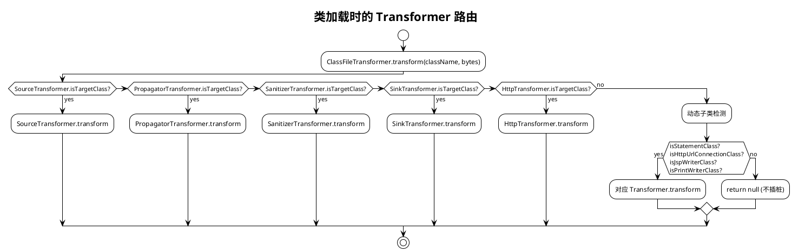
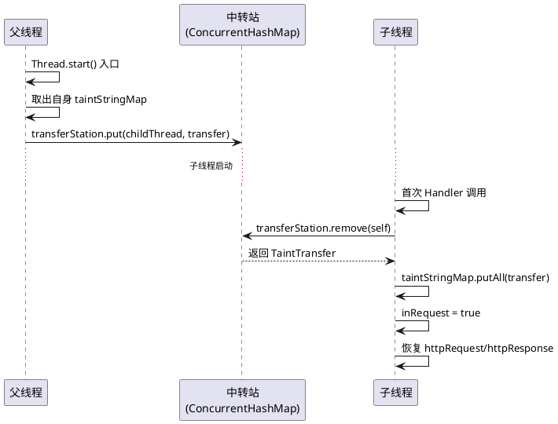

上一篇建立了 Sink 检测体系，但污点能否到达 Sink 取决于中间的传播链是否完整。本篇主要讲述：污点在不同方法/对象/线程间传递时，传播链怎么样保证稳固。本篇分五个部分展开：传播策略选择（一）、传播链补全（二）、污点分层模型（三）、对象级传播优化（四）、跨线程传递（五）。

***

## 一、传播策略光谱

IAST 的插桩策略决定了"哪些方法会被 hook"，本质是精度与开销的工程权衡。\*\*传播策略光谱（Propagation Strategy Spectrum）指从全量到选择性之间，按"插桩方法集合大小"排列的连续区间，不同位置对应不同的覆盖率与性能开销权衡。

### 1.1 三种传播策略对比

| 策略          | 思路                                                  | 覆盖率 | 性能开销 | 适用场景              |
| :---------- | :-------------------------------------------------- | :-- | :--- | :---------------- |
| **选择性插桩**   | 预定义规则列表，只 hook 已知的 Source/Propagator/Sink/Sanitizer | 中等  | 最低   | 生产环境、低开销需求        |
| **应用包路径插桩** | 对配置的应用包（如 `com.example.*`）下所有方法自动插桩                 | 高   | 中等   | 测试环境、Benchmark 评测 |
| **全量插桩**    | 对所有加载的类插桩所有方法                                       | 最高  | 最高   | 理论方案，实际不可用        |

商业 IAST（如 Contrast Security）采用"应用代码全量 + 库代码选择性"的混合策略：对应用包路径下的类默认插桩所有方法，对 JDK / 第三方库只插桩已知传播器。这样内部类透传 `return param` 这类简单传播会被覆盖，而 `String.concat` 等高频 JDK 方法只做选择性插桩以控制开销。

LiveTaint 当前采用纯选择性插桩策略。所有 hook 目标定义在 `hook-rules.json` 中，共 173 条规则，覆盖 33 个 retransform 类。

### 1.2 选择性插桩的路由逻辑

类加载时，`IastTransformer.transform()` 按优先级依次检查五类 Transformer：



**关键设计**：`IastTransformer` 路由 Sanitizer 检查在 Sink 之前。因为 `PreparedStatement.setString` 既是 Sanitizer 又是 `java.sql` 包的类，如果 Sink 先匹配会把它当作 Statement 的 Sink 处理，导致净化失效。

### 1.3 动态子类检测

选择性插桩的固有局限是"仅匹配预定义类名"。但 JVM 中很多 Sink 是接口或抽象类，实际执行的是运行时子类：

| 检测模式    | 目标类型 | 字节码字段                     | 典型 Sink                              |
| :------ | :--- | :------------------------ | :----------------------------------- |
| 接口实现    | 接口   | `interfaces` + 方法扫描       | `Statement` → `executeQuery`         |
| 抽象类子类   | 抽象类  | `superName`               | `HttpURLConnection` → `connect`      |
| 具体类构造函数 | 具体类  | `className` 精确 + `<init>` | `FileInputStream` → `<init>(String)` |

接口和抽象类无法直接 `retransformClasses`，只能在每个类加载回调里读取字节码，检查父类名或接口列表，动态判定是否为目标子类。`SinkTransformer.java` 中实现了 8 个 `is*Class` 方法覆盖这些场景。

### 1.4 应用代码插桩困境

选择性插桩的固有局限是：无法覆盖应用代码中的自定义传播方法。OWASP Benchmark 大量使用内部类传递污点：

```java
// BenchmarkTest00949.java
String bar = new Test().doSomething(request, param);
// bar 最终传入 new File(TESTFILES_DIR, bar)

private class Test {
    public String doSomething(HttpServletRequest request, String param) {
        String bar = param;
        return bar;  // 简单透传，但 Test 类不在预定义规则中
    }
}
```

三种解决方案对比：

| 方案            | 思路                                                                                                         | 覆盖范围 | 开销 | 风险        |
| :------------ | :--------------------------------------------------------------------------------------------------------- | :--- | :- | :-------- |
| **硬编码类名**     | 在 PropagatorTransformer 中逐一添加 `Thing1` / `Thing2`                                                          | 仅已知类 | 最低 | 无         |
| **应用包路径自动插桩** | 配置 `-Diast.app.packages=org.owasp.benchmark.testcode`，对包下 `doSomething(HttpServletRequest, String)` 方法自动插桩 | 应用全部 | 中等 | 可能误匹配业务代码 |
| **通用签名匹配**    | 对所有类中签名 `(HttpServletRequest, String) → String` 的方法自动插桩                                                    | 全局   | 较高 | 误匹配风险高    |

当前采用硬编码方案，覆盖了 Benchmark 的两个公共辅助类 `Thing1` / `Thing2`。但每个测试用例的私有内部类 `Test` 有几十个不同版本（`BenchmarkTest00949$Test`、`BenchmarkTest01155$Test` 等），无法逐一硬编码。

应用包路径插桩是商业 IAST 的标准做法，配合对象级污点传播（见第四节）可以在不增加开销的前提下解决内部类断链问题。

***

## 二、传播链补全：51 条 Propagator 规则

Source 标记污点源头后，真实代码中污点会经过多次方法调用变换对象身份（如 `String.concat` 返回新 String、`StringBuilder.toString` 收口为新对象），每一处变换都需要对应的 Propagator 规则，否则传播链断裂。

**传播器（Propagator）** 指在污点追踪中将输入污点传递到输出对象的方法，职责是"如果输入是污点，输出也必须是污点"。

### 2.1 PropagatorStyle 模式抽象

初版只有 5 个传播点，新增 9 个后遇到一个问题：之前的传播点都是"实例方法 + 一个参数"的模式，但新增方法不符合这一模式——有的没有参数（`toString()`），有的是 static 方法（`String.format`、`String.valueOf`），有的参数是 int 而非对象引用（`substring(int)`）。

如果给每种模式写一套独立的插桩逻辑，代码会越来越分散。为此引入**传播器样式（PropagatorStyle）** 枚举，作用是把"如何从栈上取 this 与 arg"这一插桩决策从具体方法中提取出来，统一成可声明的模式。新增传播点时只需在枚举里声明所属模式，不必再写新的插桩逻辑：

```java
enum PropagatorStyle {
    STANDARD,       // this + arg：concat, append, replace
    THIS_ONLY,      // 仅 this：toString, substring, toLowerCase
    STATIC_ONE_ARG, // static + arg0：valueOf
    STATIC_TWO_ARGS // static + arg0 + arg1：format(fmt, args)
}
```

插桩时根据 style 决定栈操作：

```java
switch (style) {
    case STANDARD:
        mv.visitVarInsn(Opcodes.ALOAD, 0);  // this
        mv.visitVarInsn(Opcodes.ALOAD, 1);  // arg
        break;
    case THIS_ONLY:
        mv.visitVarInsn(Opcodes.ALOAD, 0);  // this
        mv.visitInsn(Opcodes.ACONST_NULL);  // arg=null
        break;
    case STATIC_ONE_ARG:
        mv.visitInsn(Opcodes.ACONST_NULL);  // this=null
        mv.visitVarInsn(Opcodes.ALOAD, 0);  // arg0
        break;
    case STATIC_TWO_ARGS:
        mv.visitInsn(Opcodes.ACONST_NULL);  // this=null
        mv.visitVarInsn(Opcodes.ALOAD, 1);  // arg1（对于 format，检查 args 而不是 fmt）
        break;
}
```

Handler 侧对应处理：`String.format` 的 `onStringFormatExit` 只检查 arg 参数（格式化参数），thisObj 传 null；`substring` 的 `onSubstringExit` 只检查 thisObj，arg 传 null。

一条 Handler 描述符 `(Object thisObj, Object result, Object arg)` 统一处理所有模式——null 参数直接跳过检查。四种分发模式、所有传播点，共用一套 Handler 签名。

### 2.2 传播器分类总览

当前 `hook-rules.json` 中 51 条 Propagator 规则，覆盖以下分类：

| 分类                             | 方法数           | 覆盖的数据流场景                                                                                                                  | <br />                                                                                                                                                      |
| :----------------------------- | :------------ | :------------------------------------------------------------------------------------------------------------------------ | :---------------------------------------------------------------------------------------------------------------------------------------------------------- |
| <br />                         | **String 操作** | 14                                                                                                                        | `concat` / `trim` / `split` / `substring`(2 重载) / `replace` / `toLowerCase` / `format` / `valueOf` / `toCharArray` / `getBytes`(2 重载) + 字符串拼接、裁剪、大小写转换、编码转换 |
| **StringBuilder/StringBuffer** | 5             | `append`(2 重载) / `toString` + `StringBuffer` 对应方法                                                                         | `+` 运算符底层实现                                                                                                                                                 |
| **invokedynamic 拼接**           | 1             | `StringConcatHelper.simpleConcat`                                                                                         | JDK 9+ `+` 运算符的 invokedynamic 路径                                                                                                                            |
| **编码转换**                       | 8             | `URLDecoder.decode` / Base64 编解码 / `new String(byte[])`                                                                   | URL 解码、Base64 编解码                                                                                                                                           |
| **文件路径/URI**                   | 10            | `File.<init>`(4 重载) / `File.getAbsolutePath` / `File.getCanonicalPath` / `File.toPath` / `Paths.get` / `URI.<init>`(2 重载) | 路径字符串 → File/Path/URI 对象转换                                                                                                                                  |
| **容器操作**                       | 6             | `ArrayList.add/get/remove` / `HashMap.put/get` / `Enumeration.nextElement`                                                | List/Map 容器内存取                                                                                                                                              |
| **HTTP 请求**                    | 2             | `Cookie.getValue` / `prepareStatement`                                                                                    | Cookie 值提取、SQL 预编译语句传播                                                                                                                                      |
| **XML 解析**                     | 3             | `StringReader.<init>` / `InputSource.<init>` / `XPath.compile`                                                            | 字符串 → XML 输入源/XPath 表达式转换                                                                                                                                   |
| **Benchmark 辅助类**              | 2             | `Thing1.doSomething` / `Thing2.doSomething`                                                                               | OWASP Benchmark 公共辅助类透传                                                                                                                                     |

### 2.3 JDK 17 invokedynamic 字符串拼接

JDK 9+ 的 `+` 运算符不再编译为 `StringBuilder.append()` 链，而是编译为 `invokedynamic`（动态调用）调用 `java.lang.invoke.StringConcatFactory.makeConcatWithConstants`。底层调用 `StringConcatHelper.simpleConcat` 方法。

如果 Propagator 只 hook `StringBuilder.append` + `toString`，JDK 17 下所有 `+` 拼接的污点都丢失。在 `hook-rules.json` 中显式覆盖 `StringConcatHelper.simpleConcat` 解决此问题。

### 2.4 byte\[] 与 char\[] 跨类型传播

XSS 场景中常见的跨类型数据流：

```
String tainted → getBytes() → byte[] → Base64.decode() → byte[] → new String(byte[]) → String → PrintWriter.print(String)
String tainted → toCharArray() → char[] → PrintWriter.write(char[])
```

每种类型转换都需要对应的 Propagator，否则污点在转换点断裂。当前覆盖：

| 转换方向              | Propagator              | 备注                  |
| :---------------- | :---------------------- | :------------------ |
| `String → byte[]` | `String.getBytes()`     | 用于 Base64 编解码前      |
| `String → char[]` | `String.toCharArray()`  | 用于 XSS char\[] Sink |
| `byte[] → String` | `new String(byte[])`    | 用于 Base64 解码后       |
| `byte[] → byte[]` | `Base64.encode/decode`  | 编解码保持污点             |
| `byte[] → String` | `Base64.encodeToString` | 编码后转字符串             |

***

## 三、污点追踪分层模型

真实框架中对象引用变化是常态：Spring MVC 参数绑定产生新对象、URL 解码返回新字符串、Builder 收口成 String 也是新对象。只靠单一追踪策略无法覆盖所有场景。

| 层级      | 策略    | 数据结构                                          | 适用场景                          | 精度  |
| :------ | :---- | :-------------------------------------------- | :---------------------------- | :-- |
| **对象级** | 按引用判等 | `IdentityHashMap`（身份哈希映射）`<Object, TaintTag>` | Source 直接返回值、Propagator 直接新对象 | 最精确 |
| **值级**  | 按内容判等 | `HashMap<String, TaintTag>`                   | 对象身份丢失但字符串值一致                 | 中等  |
| **子串级** | 包含检查  | 遍历值级污点做 `contains`                            | 污点值已被拼进更大字符串                  | 最鲁棒 |

### 3.1 对象级优先

`TaintContext.java` 实现了对象级 + 值级两层：

```java
public static boolean isTainted(Object obj) {
    if (!isInRequest() || obj == null) return false;
    if (taintMap.get().containsKey(obj)) return true;          // 对象级
    if (obj instanceof String) {
        return taintStringMap.get().containsKey((String) obj);  // 值级
    }
    return false;
}
```

**对象级优先**：`isTainted` 先查对象级 `IdentityHashMap`，命中则直接返回。只有对象级未命中时才回退到值级 `HashMap`。这样同一字符串的不同对象实例（如 `new String("tainted")`）也能通过值级匹配检测到。

**为什么用 IdentityHashMap 而不是 HashSet**：`HashSet`（哈希集合）用 `equals()` 判等，`"abc".equals(new String("abc"))` 为 true 会把不同对象误判为同一个。IAST 追踪的是"这个特定对象"是否被污染，必须用 `==` 判等。

**值级的局限**：值级匹配是精确匹配（`containsKey`），不是子串匹配。如果污点值 `"alice"` 被拼进 `"hello alice world"`，值级匹配查不到。子串级匹配需要遍历值级污点做 `contains` 检查，当前未实现，是部分漏报的根因之一。

### 3.2 跨线程值级传递

跨线程场景下对象引用无意义（不同线程的 `IdentityHashMap` 是独立的），只传递值级污点：

```java
public static class TaintTransfer {
    public final HashMap<String, TaintTag> stringTaints;
    public final Object httpRequest;
    public final Object httpResponse;
}
```

父线程 `Thread.start()` 时将值级污点存入 `ConcurrentHashMap`（并发哈希映射）中转站，子线程首次 Handler 调用时取回。线程池场景使用 `TaintRunnableWrapper` 包装 `Runnable` 参数，在 `run()` 方法中恢复污点上下文。

***

## 四、对象级污点传播的边界与优化

对象级污点传播在对象引用变化场景下有两类边界问题：新对象污点丢失（FN）和常量字面量误传播（FP）。这两类问题相互制约——修复 FN 可能引入 FP，控制 FP 可能导致 FN 复发。三层协同修复同时解决这两类问题。

### 4.1 值级匹配在对象引用变化场景下的边界

当 Propagator 方法返回新对象但值与输入相同时，值级匹配会阻断传播：

```java
// URLDecoder.decode 返回新 String 对象
String decoded = java.net.URLDecoder.decode(param, "UTF-8");
// decoded 的值与 param 相同（无编码字符时），taintStringMap 已有此值
// propagateTaint 的 !isTainted(target) 检查命中，跳过传播
// decoded 未加入 taintMap，后续 File.<init>(decoded) 检测不到污点 → FN
```

根因：`propagateTaint(source, target, propagator)` 在传播前检查 `!isTainted(target)`，若目标已被标记（包括值级标记）则跳过。新对象的值与已有污点值相同时，这个检查误判为"已标记"，导致对象级标记未建立。

常量字面量误传播（FP）则是另一类边界：JVM 字符串常量池使相同字面量的 String 引用复用。当 `forcePropagateTaint` 将常量字面量加入 `taintMap` 后，后续所有引用该字面量的代码都会被误判为污点。

### 4.2 三层协同修复

三层修复相互关联，任一层缺失都会导致 FN 或 FP 复发：

| 修复层                      | 修改位置                                                | 修改内容                                              | 解决的问题         |
| :----------------------- | :-------------------------------------------------- | :------------------------------------------------ | :------------ |
| **引用相等检查（refEq）**        | `onThingDoSomethingExit`                            | `returnValue == arg` 作为传播前置条件                     | FP            |
| **StringBuilder 构造函数传播** | `PropagatorTransformer` + `onStringBuilderCtorExit` | 新增 `StringBuilder.<init>(String)` 插桩              | FN（Thing2 路径） |
| **传播方法选择**               | `onFileCtorExit`、`onEnumerationNextExit`            | 区分 `propagateTaint` 与 `forcePropagateTaint` 的使用边界 | FN + FP 防御    |

因果链：refEq 消除常量误传播 → 但 Thing2 路径因 `returnValue != arg` 而断链 → StringBuilder 构造函数补全使链路恢复 → 传播方法选择确保新对象传播用 force、常量防御用非 force。

### 4.3 引用相等检查（refEq）

`onThingDoSomethingExit` 的作用是 Thing.doSomething 返回时检查参数污点并传播到返回值。原逻辑用 `isObjectLevelTaint(arg)` 检查参数是否为对象级污点，但参数为常量字面量时仍可能命中（前序 `forcePropagateTaint` 误加入 `taintMap`）。

```java
// 修复前
boolean argTainted = arg != null && TaintContext.isObjectLevelTaint(arg);
if (argTainted) {
    TaintContext.forcePropagateTaint(arg, returnValue, "Thing.doSomething(arg)");
}

// 修复后
boolean argTainted = arg != null && TaintContext.isObjectLevelTaint(arg);
boolean refEq = arg != null && returnValue == arg;  // 引用相等
if (argTainted && refEq) {
    TaintContext.forcePropagateTaint(arg, returnValue, "Thing.doSomething(arg)");
}
```

**refEq 的语义**：只有当返回值就是输入参数本身（同一引用）时才传播。这覆盖了 Thing1 的场景（`return i;` → `returnValue == arg`），同时阻断了常量字面量的误传播路径。

### 4.4 StringBuilder 构造函数传播链

`onStringBuilderCtorExit` 的作用是 StringBuilder 构造函数返回时，将 String 参数的污点传播到新建的 StringBuilder 对象。Thing2 路径因 `refEq=false` 而断链，需要通过 StringBuilder 构造函数补全传播链。

```java
// PropagatorHandler.java
public static void onStringBuilderCtorExit(Object returnValue, Object thisObj, Object arg) {
    TaintContext.receiveFromParentThread();
    if (!TaintContext.isInRequest() || TaintContext.isInHandler()
            || thisObj == null || arg == null) return;
    TaintContext.setInHandler(true);
    try {
        boolean argObjLevel = TaintContext.isObjectLevelTaint(arg);
        if (argObjLevel) {
            TaintContext.forcePropagateTaint(arg, thisObj, "StringBuilder.<init>(arg)");
            addCallChain("StringBuilder.<init>", thisObj);
        }
    } finally {
        TaintContext.setInHandler(false);
    }
}
```

完整传播链：

```
param (Source 标记)
    ↓ StringBuilder.<init>(param)        ← 新增 Propagator
StringBuilder 对象 (forcePropagateTaint 标记)
    ↓ StringBuilder.toString()           ← 已有 Propagator
returnValue (forcePropagateTaint 标记)
    ↓ Thing2.doSomething 返回
最终污点对象 (refEq=false，但 StringBuilder 链已补全)
```

### 4.5 propagateTaint 与 forcePropagateTaint 的选择

两个传播方法的差异在于是否检查 `!isTainted(target)`：

| 方法                    | 检查 `!isTainted(target)` | 适用场景                   | 风险           |
| :-------------------- | :---------------------- | :--------------------- | :----------- |
| `propagateTaint`      | 是（目标未标记才传播）             | 常规 Propagator，目标可能已被标记 | 新对象污点丢失（FN）  |
| `forcePropagateTaint` | 否（强制传播）                 | 构造函数、返回新对象的方法          | 字符串常量池污染（FP） |

**选择原则**：目标对象是新创建的（构造函数、字符串方法返回的新 String）用 `forcePropagateTaint`；目标可能是常量池字面量（如 `Enumeration.nextElement` 返回值）用 `propagateTaint`。

| Propagator 类型                | 目标对象特征                            | 选择                              | 理由                         |
| :--------------------------- | :-------------------------------- | :------------------------------ | :------------------------- |
| 构造函数（File、StringBuilder、URI） | 新创建对象，不在 taintMap                 | `forcePropagateTaint`           | 绕过 `!isTainted(target)` 检查 |
| 字符串方法（substring、trim、concat） | 返回新 String，值可能与 taintStringMap 重合 | `forcePropagateTaint`           | 同上                         |
| `Enumeration.nextElement`    | 返回 String，可能是常量池字面量               | `propagateTaint`                | 避免 force 将常量加入 taintMap    |
| `Thing.doSomething`          | 返回值可能就是参数（refEq=true）             | `forcePropagateTaint` + `refEq` | refEq 防止常量误传播              |

`onEnumerationNextExit` 从 `forcePropagateTaint` 改为 `propagateTaint` 是防御性修复：header name（如 "CustomHeader"）是新 String 对象，不在 `taintStringMap` 中，`propagateTaint` 的 `!isTainted(target)` 检查通过，正常传播；同时避免将常量池字面量误加入 `taintMap`。

***

## 五、跨线程传播

传播链补全解决的是"同一个线程内污点能否跟上数据流"的问题。但线程切换会让污点状态丢失，这是单线程传播无法覆盖的场景。

污点状态存放在\*\*线程本地变量（ThreadLocal）中。ThreadLocal 的设计语义是线程隔离：每个线程持有独立的副本，线程之间互不可见。这一特性在 HTTP 请求并发处理时是必要的——请求 A 的污点不会泄漏到请求 B，避免误报串扰。但在跨线程场景下它成为障碍：父线程标记的污点，子线程无法读取。

```java
Thread t = new Thread(() -> {
    Runtime.getRuntime().exec(cmd);  // cmd 在父线程是污点，子线程读取不到
});
t.start();
```

`cmd` 在父线程被 Source 标记为污点，存储在父线程的 ThreadLocal。子线程启动后持有自己的 ThreadLocal 副本，其中没有该污点记录——`isTainted(cmd)` 返回 false，Sink 检测漏报。这就是跨线程丢失污点。

跨线程场景在业务中主要有两种形态：手动创建线程（`Thread.start()`）和线程池（`ThreadPoolExecutor`（线程池执行器））。两者的底层机制不同，决定了需要两套传递方案。

### 5.1 Thread.start() 中转站

针对手动创建线程的场景，使用一个**跨线程污点中转站（transfer station）** 作为传递媒介：父线程在启动子线程前把污点数据存入中转站，子线程在首次执行被插桩方法时从中转站取出属于自己的数据并恢复到本地 ThreadLocal。中转站的作用是跨越"父线程存入"与"子线程取出"之间的时间差，因为子线程启动后才会获得自己的 ThreadLocal 副本。

中转站基于\*\*并发哈希映射（ConcurrentHashMap）\*\*实现，两步协作：



第一步：`Thread.start()` 入口插桩。`ThreadTransferHandler.onThreadStartEnter(this)` 把父线程的值级污点和 HTTP 请求对象打包成 `TaintTransfer`，存入 `ConcurrentHashMap<Thread, TaintTransfer>` 中转站，key 是子线程对象。

第二步：子线程首次 Handler 调用时，先执行 `TaintContext.receiveFromParentThread()`，从中转站取出属于自己的 `TaintTransfer`，恢复到子线程的 ThreadLocal 中。`receiveFromParentThread()` 使用 `transferStation.remove(currentThread)`——取完即删，不残留。

**只传值级污点，不传对象级**：对象级污点用 `IdentityHashMap`，按 `==`（引用相等）查找。跨线程后子线程里的字符串可能是新对象，引用和父线程不同，`IdentityHashMap` 查不到。值级污点用 `HashMap`，按 `equals()`（字符串内容相等）查找，无论对象是不是同一个，只要内容一样就能匹配。所以跨线程只传值级污点，保证子线程能恢复污点状态。

### 5.2 ThreadPoolExecutor Runnable 包装

`Thread.start()` 的中转站方案覆盖了手动创建线程的场景，但业务中更常见的是线程池。线程池的线程是预先创建的，执行新任务时不会触发 `Thread.start()`，中转站里没有数据可取。

```java
executor.execute(() -> {
    Runtime.getRuntime().exec(cmd);  // cmd 在主线程是污点，线程池中丢失
});
```

**不能复用中转站方案**。中转站依赖"子线程首次 Handler 调用时主动取回"的机制——线程池的线程在提交任务时已存在、不触发 `Thread.start()`，也就不会往中转站里放数据。

换一种思路：替换 Runnable 参数。

`ThreadPoolExecutor.execute(Runnable)` 的参数是一个 Runnable 对象。可以在 `execute()` 的入口把这个 Runnable 替换为一个包装了污点数据的**污点 Runnable 包装器（TaintRunnableWrapper）**——线程池线程执行这个包装 Runnable 时，先恢复污点上下文，再执行原始逻辑。TaintRunnableWrapper 的作用是把"恢复污点"与"执行原始任务"两个动作绑定到同一个 Runnable 上，使污点恢复的时机与任务执行的时机严格同步，避免中转站方案中"取回时机不可控"的问题。

```
execute(Runnable r) 原始调用
        │
        ▼  插桩后
ALOAD 1                          // 加载原始 Runnable
INVOKESTATIC wrapIfNeeded          // 包装（如果当前在请求上下文中）
ASTORE 1                         // 替换为 TaintRunnableWrapper
        │
        ▼
线程池线程执行 TaintRunnableWrapper.run()
        │
        ├─ restoreFromTransfer(transfer)   // 恢复污点上下文
        ├─ delegate.run()                  // 执行原始 Runnable
        └─ leaveRequest()                  // 清理（finally）
```

**TaintRunnableWrapper 实现**：包装器持有原始 Runnable 和\*\*污点传递数据包（TaintTransfer）两个引用，`run()` 方法在执行原始逻辑前先恢复污点，在 finally 中清理请求上下文：

```java
public class TaintRunnableWrapper implements Runnable {
    private final Runnable delegate;
    private final TaintContext.TaintTransfer transfer;

    public TaintRunnableWrapper(Runnable delegate, TaintContext.TaintTransfer transfer) {
        this.delegate = delegate;
        this.transfer = transfer;
    }

    @Override
    public void run() {
        try {
            TaintContext.restoreFromTransfer(transfer);  // 恢复污点
            delegate.run();                               // 执行原始逻辑
        } finally {
            TaintContext.leaveRequest();                  // 清理
        }
    }
}
```

和 `Thread.start()` 中转站的隐式恢复不同，这里是显式恢复——`TaintRunnableWrapper.run()` 一开始就调用 `restoreFromTransfer(transfer)`，数据直接从 transfer 对象恢复到当前线程的 ThreadLocal，不需要从中转站查找。

**字节码插桩**：在 `execute()` 方法入口插入 `ALOAD 1 → INVOKESTATIC wrapIfNeeded → ASTORE 1` 三条指令，把方法参数槽位 1 的引用从原始 Runnable 替换为包装后的 `TaintRunnableWrapper`。

**wrapIfNeeded 防重复包装**：该函数在包装前做三项前置检查，避免无意义包装与嵌套包装：

```java
public static Runnable wrapIfNeeded(Runnable runnable) {
    if (!TaintContext.isInRequest()) return runnable;        // 不在请求上下文中
    if (runnable == null) return runnable;                   // 空参数
    if (runnable instanceof TaintRunnableWrapper) return runnable;  // 已包装
    // 构建传递数据包并包装
    TaintContext.TaintTransfer transfer = new TaintContext.TaintTransfer(...);
    return new TaintRunnableWrapper(runnable, transfer);
}
```

三种不包装的情况：不在请求上下文中（没有污点需要传递）、参数为 null、已经是 `TaintRunnableWrapper`（防止重复包装导致嵌套调用）。只有在请求上下文中且有污点数据时，才构建 transfer 并包装。

### 5.3 两种跨线程方案对比

| <br />        | Thread.start() 中转站          | ThreadPoolExecutor Runnable 包装 |
| :------------ | :-------------------------- | :----------------------------- |
| 传递方式          | ConcurrentHashMap 中转站       | Runnable 参数替换                  |
| 时机            | 子线程首次 Handler 调用时取回         | 包装 Runnable，run() 时立即恢复        |
| 插桩位置          | start() 入口                  | execute() 入口                   |
| 能否替换 Runnable | ❌ Thread 内部已持有引用            | ✅ execute 参数可替换                |
| 污点恢复          | 隐式（receiveFromParentThread） | 显式（restoreFromTransfer）        |

`Thread.start()` 创建新线程时，Runnable 已经被 `Thread` 内部持有，execute 之前无法替换。所以只能用中转站——父线程先把数据存进去，子线程启动后自行取回。

`ThreadPoolExecutor.execute(Runnable)` 的参数是可以替换的——`execute()` 方法还没执行，Runnable 还在参数槽位上。所以直接把参数换成包装后的 `TaintRunnableWrapper`，线程池线程执行 `run()` 时立刻恢复污点，不需要额外查找。

两种方案不能互换使用：中转站方案要求"子线程主动取回"，但线程池线程在提交任务时已存在、不触发 `Thread.start()`，无法向中转站写入数据；包装方案要求"Runnable 参数可替换"，但 `Thread.start()` 时 Runnable 已被 `Thread` 内部持有，无从替换。方案选择由底层机制决定，而非偏好。

***

## 六、能力边界

| 已做到                                        | 还未做到                             |
| :----------------------------------------- | :------------------------------- |
| 51 条 Propagator 覆盖 String/编码/文件路径/容器等 9 大类 | byte\[] 中间操作传播、集合类型增强验证          |
| Thread.start() + ThreadPoolExecutor 跨线程    | CompletableFuture / ForkJoinPool |
| 对象级 + 值级双层污点追踪                             | 子串级污点匹配                          |
| refEq + StringBuilder 构造函数传播链              | 更多自定义传播策略                        |

51 条 Propagator 覆盖了主要字符串、编码转换、文件路径、容器操作等 9 大类，但还有两类常见的传播缺口：`byte[]` 中间操作传播和集合类型完整验证。HTTP 请求体读取、文件操作等场景经常返回 `byte[]`，经过 `new String(bytes)` 转换后污点丢失；`List.add()` / `Map.put()` 把污点对象存入集合，`List.get()` / `Map.get()` 取出时污点也没有跟着回来。

跨线程方面，`Thread.start()` 和 `ThreadPoolExecutor` 覆盖了手动创建线程和线程池两种最常见场景。但 Java 还有 `CompletableFuture`（基于 ForkJoinPool）和直接使用 `ForkJoinPool` 的场景——它们的任务提交和执行机制不同于 `ThreadPoolExecutor.execute()`，现有的 Runnable 包装模式不能直接复用。

对象级污点传播的优化解决了 PathTraversal 类别的 65 个 FN，TPR 从 51.1% 提升至 100%。详细的评测数据与根因分析见 (五) Benchmark 评测与根因分析。

***

## 职责边界

| 本篇                                       | 其他章节          |
| ---------------------------------------- | ------------- |
| 传播策略光谱                                   | 平台化（见(四)）     |
| 传播链补全与 51 条 Propagator 规则                | 评测数据（见(五)）    |
| 污点分层模型（对象级/值级/子串级）                       | Sink 检测（见(二)） |
| 对象级传播优化（refEq/StringBuilder/force）       | <br />        |
| 跨线程传播（Thread.start + ThreadPoolExecutor） | <br />        |

***

## 系列文章导航

本系列按总览 / 技术实现 / 数据评测三层组织：

**总览层**

| 章节         | 内容                      |
| :--------- | :---------------------- |
| **(零) 总览** | 项目全景、架构、五类插桩点、能力总览、物理边界 |

**技术实现层**

| 章节                         | 内容                                                       |
| :------------------------- | :------------------------------------------------------- |
| **(一) 基础篇：ASM 插桩与污点追踪**    | TaintContext、入口/出口插桩、Http/Source/Propagator/Sink 联动      |
| **(二) Sink 检测体系与准确性提升**    | 三种 JVM 关系检测模式、Sink 全覆盖、Sanitizer 体系、漏洞去重、JSON 规则驱动       |
| **(三) 污点传播：传播链补全与跨线程**     | 传播策略光谱、传播链补全、污点分层模型、对象级传播优化、跨线程传播                        |
| **(四) 企业化平台与 Agent 自干扰破局** | Agent→Server→Dashboard 全链路、curl 绕过自干扰、漏洞去重与分级、Agent 离线检测 |

**数据评测层**

| 章节                        | 内容                                       |
| :------------------------ | :--------------------------------------- |
| **(五) Benchmark 评测与根因分析** | TPR/FPR/FN/FP 数据、FN 根因分类、FP 根因分析、PT 优化案例 |

