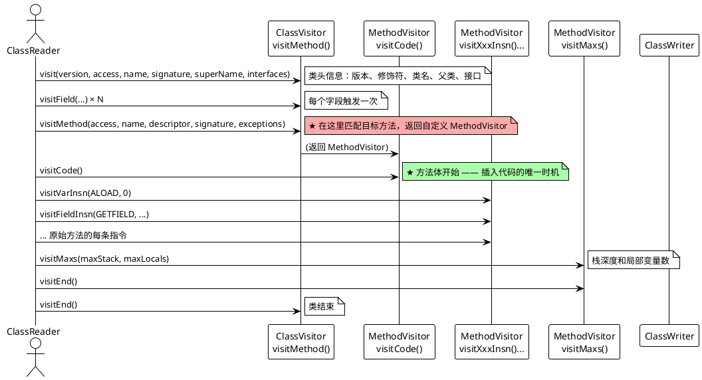

## ASM 阶段 1：Visitor 模式与基础插桩

从 Javassist 切换到 ASM，Javassist 让你"写 Java 代码"，ASM 让你"写字节码指令"。这一篇的目标是：**用 ASM 在** **`ProcessBuilder.start()`** **方法入口插入一行** **`System.out.println("Agent loaded")`，并通过** **`COMPUTE_FRAMES`** **避免** **`VerifyError`**。

> **前置知识**：Class 文件结构（常量池、方法表、Code 属性）已在 [Java · 字节码安全](../2026-04-06-java-字节码.md) 第五章详述，本篇不再重复。

> **RASP 场景**：`ProcessBuilder.start()` 是命令执行攻击链的核心 Sink 点。在这之前插入检测代码，就实现了对操作系统命令执行的实时监控。

***

### 一、运行结果预览

先看最终效果，再看原理：

```
[Agent] premain 启动, args=null
[Agent] Transformer 注册完成
=== TestApp 启动 ===
[Agent] 拦截到 ProcessBuilder 加载, loader=null
[Agent] 找到目标方法: start()Ljava/lang/Process;
>>> 即将调用 ProcessBuilder.start() ...
Agent loaded                    ← 成功注入的打印语句
=== TestApp 结束 ===
```

关键观察：`loader=null` 表示 `ProcessBuilder` 由 Bootstrap ClassLoader 加载。而我们的 Agent Jar 由 AppClassLoader 加载——父加载器无法"向下"看到子加载器的类，所以 `ProcessBuilder` 不能直接引用 `RaspProtector`。详见 [第八章](#八bootstrap-classloader-可见性问题预告阶段-2)。

***

### 二、项目骨架

```
javaagent-asm-lab/
├── pom.xml                                    # Maven + ASM 依赖 + shade 插件
└── src/
    ├── main/java/com/agentlab/
    │   ├── AgentMain.java                     # premain 入口，注册 Transformer
    │   └── ProcessBuilderTransformer.java      # ASM 核心：Visitor 链
    └── test/java/com/agentlab/test/
        └── TestApp.java                        # 测试目标应用
```

#### pom.xml 关键配置

```xml
<dependencies>
    <dependency>
        <groupId>org.ow2.asm</groupId>
        <artifactId>asm</artifactId>
        <version>9.7.1</version>
    </dependency>
</dependencies>

<build>
    <plugins>
        <plugin>
            <groupId>org.apache.maven.plugins</groupId>
            <artifactId>maven-shade-plugin</artifactId>
            <version>3.6.0</version>
            <executions>
                <execution>
                    <phase>package</phase>
                    <goals><goal>shade</goal></goals>
                    <configuration>
                        <transformers>
                            <transformer implementation="...ManifestResourceTransformer">
                                <manifestEntries>
                                    <Premain-Class>com.agentlab.AgentMain</Premain-Class>
                                    <Can-Redefine-Classes>true</Can-Redefine-Classes>
                                    <Can-Retransform-Classes>true</Can-Retransform-Classes>
                                </manifestEntries>
                            </transformer>
                        </transformers>
                    </configuration>
                </execution>
            </executions>
        </plugin>
    </plugins>
</build>
```

> **为什么用 maven-shade-plugin？** ASM 是外部依赖，`shade` 会把它打入 Agent Jar 中，确保 Agent 加载时能找到 ASM 类。`Premain-Class` 告诉 JVM 启动时调用哪个类的 `premain` 方法。

***

### 三、AgentMain：注册 Transformer

```java
public class AgentMain {
    public static void premain(String agentArgs, Instrumentation inst) {
        System.out.println("[Agent] premain 启动, args=" + agentArgs);

        inst.addTransformer(new ClassFileTransformer() {
            @Override
            public byte[] transform(ClassLoader loader, String className,
                                    Class<?> classBeingRedefined,
                                    ProtectionDomain protectionDomain,
                                    byte[] classfileBuffer) {
                // 只拦截 ProcessBuilder
                if ("java/lang/ProcessBuilder".equals(className)) {
                    System.out.println("[Agent] 拦截到 ProcessBuilder 加载, loader=" + loader);
                    return ProcessBuilderTransformer.transform(classfileBuffer);
                }
                return null; // null = 不修改，使用原始字节码
            }
        });

        System.out.println("[Agent] Transformer 注册完成");
    }
}
```

**关键点**：

- `transform()` 返回 `null` 表示"不修改此类"，JVM 使用原始字节码。
- 返回新的 `byte[]` 表示"这是修改后的字节码"，JVM 用它来定义类。
- `className` 使用内部格式（`java/lang/ProcessBuilder`），不是 `java.lang.ProcessBuilder`。

#### 3.1 transform() 的字节数组流转原理

很多初学者以为插桩是"修改 .class 文件"，实际上**整个过程全在内存中完成，不产生任何文件**：

```
JVM 加载 ProcessBuilder.class
    │
    ▼
从磁盘/rt.jar 读取原始字节码到内存: byte[] original = classfileBuffer
    │
    ▼
JVM 回调所有 ClassFileTransformer.transform(loader, className, ..., original)
    │
    ▼
我们的 transform() 内部:
    ClassReader cr = new ClassReader(original);  // ① 解析原始 byte[]
    ClassWriter cw = new ClassWriter(cr, ...);   // ② 准备写新的 byte[]
    cr.accept(visitor, ...);                     // ③ 遍历原始 → 触发回调 → 写入 cw
    return cw.toByteArray();                     // ④ 取出修改后的 byte[]
    │
    ▼
JVM 拿到返回的 byte[] modified
    │
    ▼
JVM 用 modified 定义类（替代 original）
```

整个链路是 `byte[] → byte[]`，不是 `File → File`。`.class` 文件只存在于 JVM 类加载的那一刻，之后就以字节数组形式存在于内存中。`ClassFileTransformer` 的签名 `byte[] transform(...)` 本身就是这个设计意图的体现——输入字节数组，输出字节数组。

> **为什么不直接修改** **`classfileBuffer`** **然后返回它？** 因为原始字节数组长度是固定的，插入指令意味着字节码变长，无法原地修改。必须用 `ClassWriter` 生成一个全新的、更长的字节数组。

***

### 四、ASM 核心：Visitor 链

这是整个阶段 1 的核心。ASM 用 **Visitor 模式** 遍历和修改 Class 文件结构。

#### 4.1 顶层流程

```
byte[] (原始 .class 文件)
    │
    ▼
ClassReader ──读取并解析──▶ 触发一系列 visitXxx() 回调
    │
    ▼
ClassVisitor.visit()           ← 类名、父类、接口
    ├── visitField()           ← 每个字段
    ├── visitMethod()          ← 每个方法
    │       └── MethodVisitor.visitCode()     ← 方法体开始
    │           ├── visitVarInsn(ALOAD, 0)     ← 每条指令
    │           ├── visitFieldInsn(GETFIELD, ...)
    │           ├── visitMethodInsn(INVOKEVIRTUAL, ...)
    │           └── visitInsn(RETURN)           ← 返回指令
    └── visitEnd()
    │
    ▼
ClassWriter ──生成──▶ byte[] (修改后的 .class 文件)
```

> **为什么用 Visitor 模式而不是直接修改字节数组？** Class 文件结构复杂——常量池的索引会级联影响方法表、属性表（见 [Class 文件结构详解](../2026-04-06-java-字节码.md#五字节码与类文件结构jvm-的汇编语言)）。Visitor 模式让 ASM 帮你管理这些依赖关系，你只需要关注"要在哪里插入什么指令"，ASM 自动调整常量池引用和偏移量。

#### 4.1.1 为什么是三个组件，而不是一个？

三个组件各司其职，职责分离：

```
ClassReader  = 拆解（把 byte[] 拆成事件流）
ClassVisitor = 修改（拦截事件，决定改什么）
ClassWriter  = 组装（把事件流组装回 byte[]）
```

**为什么不让 ClassWriter 直接读原始字节码？**

因为"读"和"写"是两个独立关注点。同一个 ClassReader 可以驱动多个不同的 Visitor——比如你同时想"打印类结构" + "插桩"，只需要两个 Visitor 串联：

```
ClassReader → ClassPrinterVisitor → ProcessBuilderVisitor → ClassWriter
                  ↑ 只打印                   ↑ 只插桩            ↑ 只生成
```

**为什么不用 if/else 而用 Visitor 模式？**

Class 文件结构有 20+ 种不同的事件类型（`visitMethod`、`visitField`、`visitAnnotation`、`visitInnerClass` 等），用 if/else 会变成上千行的 switch-case。Visitor 模式让你只需重写关心的事件，其余自动透传给下一个 Visitor。

**为什么不让 ClassVisitor 直接修改字节数组？**

因为写入顺序必须和读取顺序严格一致——常量池、字段、方法、属性的顺序不能乱。如果 ClassVisitor 自己写，写错顺序就毁掉整个 Class 文件。ClassWriter 保证写入顺序 = 读取顺序，你只管"在某个事件中多写几笔"。

#### 4.2 ClassVisitor：匹配目标方法

```java
static class ProcessBuilderVisitor extends ClassVisitor {

    public ProcessBuilderVisitor(int api, ClassVisitor classVisitor) {
        super(api, classVisitor);
    }

    @Override
    public MethodVisitor visitMethod(int access, String name,
                                     String descriptor, String signature,
                                     String[] exceptions) {
        MethodVisitor mv = super.visitMethod(access, name, descriptor,
                                              signature, exceptions);
        // 精确匹配: start() 方法，描述符 ()Ljava/lang/Process;
        if ("start".equals(name) && "()Ljava/lang/Process;".equals(descriptor)) {
            System.out.println("[Agent] 找到目标方法: " + name + descriptor);
            return new StartMethodVisitor(api, mv);
        }
        return mv; // 不匹配 → 原样透传
    }
}
```

**关键设计**：ASM 的 Visitor 链是**可嵌套的代理模式**。`ProcessBuilderVisitor` 包装了 `ClassWriter`；`StartMethodVisitor` 包装了原始的 `MethodVisitor`。每一层只做自己关心的修改，其余事件透传给下一层。

**为什么必须同时匹配方法名和描述符？**

Java 允许方法重载——同一个类里可以有多个同名方法，靠参数类型区分。在字节码层面，方法签名由 **名称 + 描述符** 共同确定唯一性：

| 源码                        | 字节码名称   | 描述符                                   |
| :------------------------ | :------ | :------------------------------------ |
| `Process start()`         | `start` | `()Ljava/lang/Process;`               |
| `Process start(File dir)` | `start` | `(Ljava/io/File;)Ljava/lang/Process;` |

如果只用 `"start".equals(name)` 匹配，会错误地 Hook 到重载版本。同时匹配描述符 `()Ljava/lang/Process;` 才能精确定位无参版本。

> **描述符速查**：`(参数类型)返回类型`，其中 `V`=void, `I`=int, `Z`=boolean, `L全限定类名;`=对象类型。例如 `(Ljava/lang/String;[I)Z` 表示 "参数是 String 和 int\[]，返回 boolean"。

#### 4.3 MethodVisitor：在方法入口插入指令

##### 4.3.1 ASM 完整回调链

从 `ClassReader.accept()` 到方法体结束，整个 ASM 回调链如下：



这条链有两个关键点：

1. **`visitMethod()` 是"拦截点"**——在这里匹配方法名+描述符，返回自定义的 `MethodVisitor` 来修改方法体。不匹配就返回原始 `MethodVisitor`，原样透传。
2. **`visitCode()` 是"插入点"**——方法体的第一条指令执行之前，你在这里写的 `visitXxxInsn()` 会插入到原始方法的最前面。

##### 4.3.2 阶段 1 的 MethodVisitor 实现

```java
static class StartMethodVisitor extends MethodVisitor {

    public StartMethodVisitor(int api, MethodVisitor methodVisitor) {
        super(api, methodVisitor);
    }

    @Override
    public void visitCode() {
        // ★ 先调用 super.visitCode()，让 ClassWriter 初始化方法体
        super.visitCode();

        // --- 插入: System.out.println("Agent loaded") ---

        // ① GETSTATIC java/lang/System.out : Ljava/io/PrintStream;
        mv.visitFieldInsn(Opcodes.GETSTATIC,
            "java/lang/System", "out", "Ljava/io/PrintStream;");

        // ② LDC "Agent loaded"
        mv.visitLdcInsn("Agent loaded");

        // ③ INVOKEVIRTUAL java/io/PrintStream.println (Ljava/lang/String;)V
        mv.visitMethodInsn(Opcodes.INVOKEVIRTUAL,
            "java/io/PrintStream", "println", "(Ljava/lang/String;)V", false);
    }
}
```

**为什么必须先调用** **`super.visitCode()`？** `ClassWriter` 需要在 `visitCode()` 中初始化方法体的内部数据结构。如果我们不调用 `super.visitCode()`，后续的指令写入会失败或产生错误的字节码。

***

### 五、字节码指令的栈操作详解

上面三条 ASM 调用生成了三条 JVM 指令。理解它们对栈的影响是后续手动写复杂插桩的基础：

| 步骤 | ASM 调用                                                                  | JVM 指令                           | 操作数栈（执行前 → 执行后）                     |
| :- | :---------------------------------------------------------------------- | :------------------------------- | :---------------------------------- |
| ①  | `visitFieldInsn(GETSTATIC, "java/lang/System", "out", ...)`             | `GETSTATIC java/lang/System.out` | `(空) → PrintStream`                 |
| ②  | `visitLdcInsn("Agent loaded")`                                          | `LDC "Agent loaded"`             | `PrintStream → PrintStream, String` |
| ③  | `visitMethodInsn(INVOKEVIRTUAL, "java/io/PrintStream", "println", ...)` | `INVOKEVIRTUAL println(String)V` | `PrintStream, String → (空)`         |

操作数栈是 JVM 执行引擎的核心数据结构。每条指令要么向栈顶压入数据，要么从栈顶弹出数据。理解"栈上有什么"是编写正确字节码的前提（常用指令速查见 [字节码指令简览](../2026-04-06-java-字节码.md#54-字节码指令简览)）。

> **描述符** **`(Ljava/lang/String;)V`** **的含义**：括号内是参数类型（一个 `String`），`V` 表示返回值 `void`。

***

### 六、COMPUTE\_FRAMES：避免 VerifyError 的关键

```java
public static byte[] transform(byte[] originalBytes) {
    ClassReader cr = new ClassReader(originalBytes);
    // COMPUTE_FRAMES: 让 ASM 自动计算栈映射帧
    ClassWriter cw = new ClassWriter(cr, ClassWriter.COMPUTE_FRAMES);
    ClassVisitor cv = new ProcessBuilderVisitor(Opcodes.ASM9, cw);
    cr.accept(cv, ClassReader.EXPAND_FRAMES);
    return cw.toByteArray();
}
```

#### 为什么需要栈映射帧？

Java 6 引入了 **StackMapTable** 属性——JVM 在类加载的验证阶段用它来快速校验字节码的类型安全。每个跳转目标或异常处理器的入口处，都必须有一个栈映射帧记录"此时操作数栈和局部变量表中各是什么类型"。我们插入新指令后，原始帧中的栈深度和类型与实际指令序列不匹配，JVM 抛出 `VerifyError`。

#### COMPUTE\_FRAMES vs COMPUTE\_MAXS

| 选项               | 自动计算的内容                           | 性能 | 注意事项                                     |
| :--------------- | :-------------------------------- | :- | :--------------------------------------- |
| `COMPUTE_MAXS`   | 只计算 `max_stack` 和 `max_locals`    | 快  | 需要 `visitFrame()` 仍有效                    |
| `COMPUTE_FRAMES` | 计算栈映射帧 + max\_stack + max\_locals | 较慢 | 需要传入 `ClassReader` 实例到 `ClassWriter` 构造器 |

> **`ClassReader.EXPAND_FRAMES`**：告诉 `ClassReader` 展开原始方法的栈映射帧，使 `COMPUTE_FRAMES` 能基于更完整的信息重新计算。不传这个标志可能导致某些场景下帧计算错误。

#### 6.1 COMPUTE\_FRAMES 的取舍：什么时候用，什么时候不用

`COMPUTE_FRAMES` 很方便，但不是免费的。它的内部流程是：

```
1. 遍历所有指令，模拟每条指令的栈效应
2. 在每个跳转目标/异常处理器入口，记录当前栈状态
3. 生成 StackMapTable 属性，写入 Class 文件
```

这个过程需要**遍历整个方法体两次**（一次模拟栈，一次写入帧），对于方法体很长或插桩量很大的场景，开销不可忽略。

| 场景                    | 推荐做法              | 原因                        |
| :-------------------- | :---------------- | :------------------------ |
| 原型开发 / Demo           | `COMPUTE_FRAMES`  | 开发效率优先，出错概率低              |
| 方法入口简单插桩（如本例）         | `COMPUTE_FRAMES`  | 不影响原始帧结构，开销极小             |
| 方法中间插入复杂逻辑            | `COMPUTE_FRAMES`  | 手动计算帧容易出错                 |
| 生产环境 + 上万处插桩          | 手动 `visitFrame()` | 省掉帧计算的时间，累积收益显著           |
| 含 `jsr`/`ret` 指令的老字节码 | 必须手动              | `COMPUTE_FRAMES` 不支持这两个指令 |

> **经验法则**：学习阶段一律用 `COMPUTE_FRAMES`，先跑通再优化。生产环境 RASP 通常也是 `COMPUTE_FRAMES`（几十个 Hook 点的开销可忽略）。只有 IAST 大规模污点追踪才需要手动指定帧。更多字节码修改的常见错误见 [Class 结构相关错误](../2026-04-06-java-字节码.md#62-修改字节码时可能遇到的-class-结构相关错误)。

***

### 七、TestApp：验证 Agent

```java
public class TestApp {
    public static void main(String[] args) throws Exception {
        System.out.println("=== TestApp 启动 ===");

        ProcessBuilder pb = new ProcessBuilder("cmd", "/c", "echo hello");
        System.out.println(">>> 即将调用 ProcessBuilder.start() ...");
        Process process = pb.start();
        process.waitFor();

        System.out.println("=== TestApp 结束 ===");
    }
}
```

运行命令：

```powershell
# 打包
mvn clean package -DskipTests

# 用 -javaagent 启动测试应用
java -javaagent:target/javaagent-asm-lab-1.0-SNAPSHOT.jar \
     -cp target/test-classes \
     com.agentlab.test.TestApp
```

***

### 八、Bootstrap ClassLoader 可见性问题

运行结果中有一个关键线索：

```
[Agent] 拦截到 ProcessBuilder 加载, loader=null
```

`loader=null` 不是 bug——JVM 中，Bootstrap ClassLoader 由 C++ 实现，在 Java 层没有对应的 `ClassLoader` 对象，所以表示为 `null`。`ProcessBuilder` 位于 `java.lang` 包，由 Bootstrap ClassLoader 加载。

#### 8.1 类加载器的层级与可见性

```
Bootstrap ClassLoader (加载 rt.jar / java.base)
    ↑
Platform ClassLoader (加载 JDK 扩展)
    ↑
AppClassLoader (加载 classpath)
```

**双亲委派的可见性规则**：子加载器能"向上"看到父加载器加载的类，但父加载器**不能**"向下"看到子加载器加载的类。

这意味着：

- `ProcessBuilder`（Bootstrap）**无法**直接引用 `RaspProtector`（AppClassLoader 加载，在我们的 Agent Jar 里）
- 如果在 `ProcessBuilder.start()` 中注入对 `RaspProtector.checkCommand()` 的调用 → `NoClassDefFoundError`

#### 8.2 三种解决方案（阶段 2 会实现）

| 方案       | 做法                                                                               | 适用场景                  |
| :------- | :------------------------------------------------------------------------------- | :-------------------- |
| **方案 A** | `inst.appendToBootstrapClassLoaderSearch(jarFile)` 把 Agent Jar 加入 Bootstrap 搜索路径 | 最简单的方案                |
| **方案 B** | 把 `RaspProtector` 的代码**直接复制**到被插桩类中（作为新增的私有静态方法）                                 | 避免跨类引用，但违反了"不新增方法"的约束 |
| **方案 C** | 通过反射调用——在注入的字节码中用 `Class.forName()` + `Method.invoke()`                          | 灵活但性能略差               |

> 阶段 2 会用方案 A，同时对方案 A 的两个副产品——`ClassCircularityError`（循环加载）和类冻结问题——给出处理方案。

***

### 九、阶段 1 知识点总结

| 知识点                                              | 对应位置                                            | RASP 中的意义            |
| :----------------------------------------------- | :---------------------------------------------- | :------------------- |
| `ClassFileTransformer.transform()`               | [AgentMain.java](#三agentmain注册-transformer)     | RASP 拦截类加载的唯一入口      |
| `ClassReader` → `ClassVisitor` → `ClassWriter` 链 | [4.1 顶层流程](#41-顶层流程)                            | 解析→修改→生成的 ASM 标准范式   |
| `visitMethod()` 匹配方法名+描述符                        | [4.2 ClassVisitor](#42-classvisitor匹配目标方法)      | 精确定位要 Hook 的 Sink 方法 |
| `visitCode()` 插入指令                               | [4.3 MethodVisitor](#43-methodvisitor在方法入口插入指令) | 在原始逻辑之前注入检测代码        |
| `GETSTATIC` + `LDC` + `INVOKEVIRTUAL` 栈操作        | [第五章](#五字节码指令的栈操作详解)                            | 理解字节码插入对栈的影响         |
| `COMPUTE_FRAMES` 自动处理栈映射帧                        | [第六章](#六compute_frames避免-verifyerror-的关键)       | 避免生产环境 `VerifyError` |
| `loader=null` (Bootstrap ClassLoader)            | [第八章](#八bootstrap-classloader-可见性问题预告阶段-2)      | 阶段 2 要解决的类可见性问题      |

***

现在我们已经能在 `ProcessBuilder.start()` 入口打印 `"Agent loaded"`，但阶段 2 要调的是 `RaspProtector.checkCommand(fullCmd)`——给 `ProcessBuilder` 注入一个外部类的静态方法调用，`loader=null` 的问题（[第八章](#八bootstrap-classloader-可见性问题预告阶段-2)）就无法避免。下一篇会详细说明。

***

### 十一、完整项目代码

项目路径：`javaagent-asm-lab/`

- [pom.xml](file:///d:/download/traeproject/trae_projects/iast/javaagent-asm-lab/pom.xml)
- [AgentMain.java](file:///d:/download/traeproject/trae_projects/iast/javaagent-asm-lab/src/main/java/com/agentlab/AgentMain.java)
- [ProcessBuilderTransformer.java](file:///d:/download/traeproject/trae_projects/iast/javaagent-asm-lab/src/main/java/com/agentlab/ProcessBuilderTransformer.java)
- [TestApp.java](file:///d:/download/traeproject/trae_projects/iast/javaagent-asm-lab/src/test/java/com/agentlab/test/TestApp.java)

