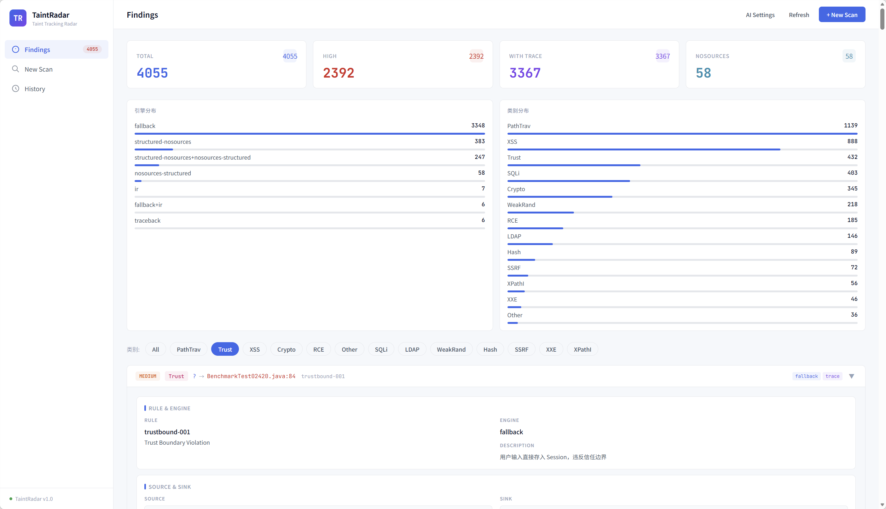
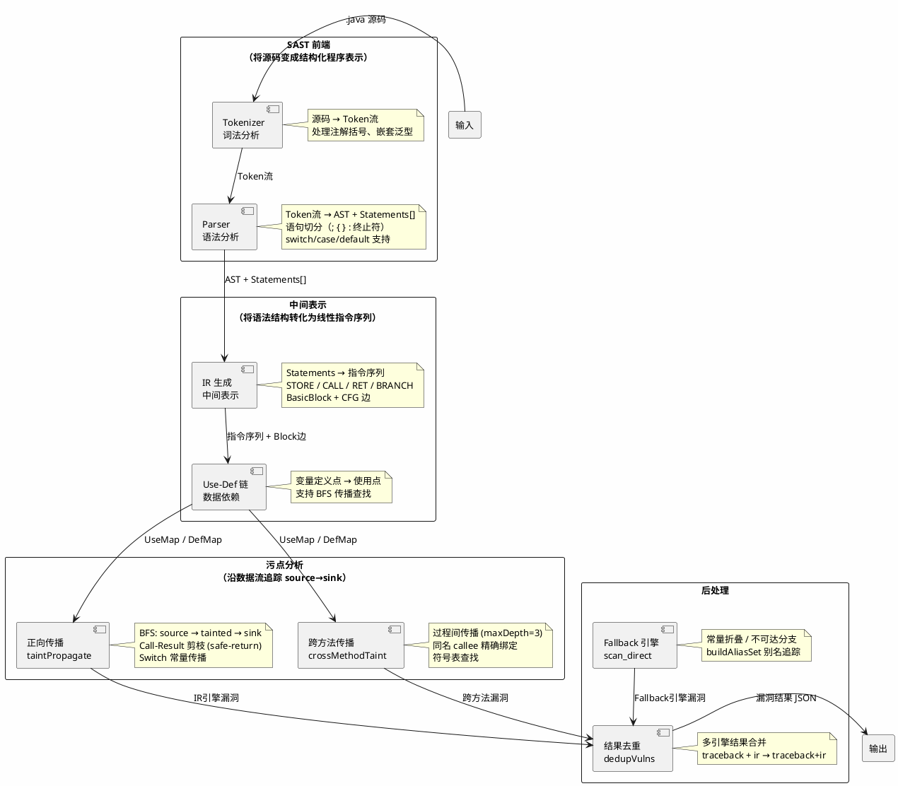

# TaintRadar — SAST 引擎总览

> TaintRadar 是一个用 Go 写的 Java SAST 引擎，能从源码中检测 SQL 注入、XSS、路径穿越、命令注入等 11 类安全漏洞。引擎内部采用 Tokenizer → Parser → IR → 污点传播这条经典链路，但重点不在链路本身，而在于每一层实际解决了什么问题——比如前端怎么处理注解和泛型、IR 怎么做对象状态传播、规则层怎么把硬编码收敛成 schema。检测准确率通过 OWASP Benchmark 量化验证。

## 1. 项目概述

项目地址：<https://github.com/nk7667/TaintRadar>



TaintRadar 是一个 Go 语言编写的 Java SAST 引擎，核心能力是**从 Java 源码中自动检测 SQL 注入、XSS、路径穿越、命令注入等 11 类安全漏洞**。

### 分析链路

```
.java 源码
    |
    v
Tokenizer → Token 流（词法分析）
    |
    v
Parser → AST + Statements[]（语法分析）
    |
    v
IR 生成 → 指令序列 + BasicBlock + CFG（中间表示）
    |
    v
污点传播 → source → tainted → sink（数据流分析）
    |
    v
结果去重 → 漏洞结果 JSON
```

三条互补的扫描链：

| 扫描链                             | 职责                          | 功能                                                                                       | 短板                               |
| ------------------------------- | --------------------------- | ---------------------------------------------------------------------------------------- | -------------------------------- |
| **污点传播型：direct traceback**      | 方法内回溯                       | 方法内 source→sink 追踪（如 sqli/xss/cmdi）                                                      | 跨方法调用链；无 source 的规则（crypto/hash） |
| **参数语义型：fallback / structured** | 常量折叠、不可达分支、noSources 专题     | 无 source 规则的参数语义检查（crypto/hash/weakrand/securecookie）                                    | 需要污点传播的规则（source→sink）           |
| **跨方法污点传播：IR engine**           | 过程间传播、call-result 分析、对象状态传播 | 跨方法 taint 传播（Controller→Service→Dao）；receiver 状态 sink（`prepareCall(sql).executeQuery()`） | 无 source 的规则；方法内轻量回溯（成本较高）       |

***

## 2. 架构设计



**架构说明**：

- **SAST 前端**（Tokenizer + Parser）：把 Java 源码从文本变成结构化程序表示（AST + 语句序列），是整个链路的基础——前端解析丢失的信息，下游分析永远无法补回（**编译器/静态分析领域的前端**（Tokenizer + Parser），不是 Web 开发的前端。SAST 前端负责词法分析和语法分析，是整个分析链路的第一步。）
- **中间表示**（IR + CFG + Use-Def 链）：将 AST 的层次结构转化为线性指令序列，作为数据流分析的输入
- **污点分析**：沿数据流追踪 source→sink，支持方法内回溯和跨方法过程间传播
- **后处理**：常量折叠消除不可达分支、多引擎结果去重

***

## 3. 扫描准确率

基于 OWASP Benchmark v1.2（2740 个测试用例，11 类漏洞）：

| 类别           |       TP |      FP |       TN |      FN |     Youden |
| ------------ | -------: | ------: | -------: | ------: | ---------: |
| cmdi         |       91 |      29 |       96 |      35 |     0.4902 |
| crypto       |      130 |       0 |      116 |       0 |     1.0000 |
| hash         |      129 |       0 |      107 |       0 |     1.0000 |
| ldapi        |       21 |       9 |       23 |       6 |     0.4965 |
| pathtraver   |      102 |      63 |       72 |      31 |     0.3003 |
| securecookie |       36 |       0 |       31 |       0 |     1.0000 |
| sqli         |      158 |      51 |      181 |     114 |     0.3611 |
| trustbound   |       66 |       7 |       36 |      17 |     0.6324 |
| weakrand     |      218 |       0 |      275 |       0 |     1.0000 |
| xpathi       |       13 |      11 |        9 |       2 |     0.3167 |
| xss          |      167 |      24 |      185 |      79 |     0.5640 |
| **overall**  | **1131** | **194** | **1131** | **284** | **0.6529** |

说明：

- crypto / hash / weakrand / securecookie 已达到满分（Youden = 1.0）
- pathtraver、sqli、cmdi、xss 经过多轮专题收敛后已有明显提升
- Youden Index（约登指数）= TPR − FPR，是衡量二分类器综合性能的指标，1.0 为完美

***

## 4. 能力全景

| 类别        | 具体能力                                                             | 技术文章                                                                |
| --------- | ---------------------------------------------------------------- | ------------------------------------------------------------------- |
| **前端解析**  | Tokenizer / Parser / Statement 切分 / switch-case 支持               | [TaintRadar (一)：前端解析](2026-07-13-TaintRadar\(一\)-前端解析.md)           |
| **中间表示**  | IR 指令 / BasicBlock / CFG / Use-Def 链                             | [TaintRadar (二)：中间表示](2026-07-13-TaintRadar\(二\)-中间表示.md)           |
| **污点传播**  | 正向 BFS / 跨方法传播 / call-result authority / 对象状态传播                  | [TaintRadar (三)：污点传播](2026-07-13-TaintRadar\(三\)-污点传播.md)           |
| **规则引擎**  | structured noSources / ArgCheck / SinkIOEvidence / receiverSinks | [TaintRadar (四)：规则引擎与误报收敛](2026-07-13-TaintRadar\(四\)-规则引擎与误报收敛.md) |
| **AI 研判** | 单条 + 批量 / 对抗性 prompt / 分类审计模板                                    | [TaintRadar (五)：AI 研判与工程化](2026-07-13-TaintRadar\(五\)-AI研判与工程化.md)  |
| **持久化**   | GORM + SQLite / 内存优先 + DB fallback                               | 同上                                                                  |
| **前端工作台** | 浅色工作台 / 三栏实时面板 / AI 配置与执行入口                                      | 同上                                                                  |
| **效果度量** | OWASP Benchmark / 约登指数 / 单元测试回归边界                              | [TaintRadar (六)：效果度量与迭代验证](2026-07-13-TaintRadar\(六\)-效果度量与迭代验证.md) |

***

## 5. 规则体系

TaintRadar 的漏洞检测规则按类别独立配置，每类规则是一个 YAML 文件：

| 规则文件              | 漏洞类别       | 检测模式                             |
| ----------------- | ---------- | -------------------------------- |
| sqli.yaml         | SQL 注入     | source→sink 污点传播 + receiverSinks |
| xss.yaml          | 跨站脚本       | source→sink 污点传播                 |
| cmdi.yaml         | 命令注入       | source→sink 污点传播                 |
| pathtraver.yaml   | 路径穿越       | source→sink + SinkIOEvidence     |
| rce.yaml          | 远程代码执行     | source→sink 污点传播                 |
| crypto.yaml       | 弱加密        | structured noSources             |
| hash.yaml         | 弱哈希        | structured noSources             |
| weakrand.yaml     | 弱随机数       | structured noSources             |
| securecookie.yaml | 不安全 Cookie | structured noSources             |
| trustbound.yaml   | 信任边界违反     | source→sink 污点传播                 |
| xpathi.yaml       | XPath 注入   | source→sink 污点传播                 |
| xxe.yaml          | XML 外部实体   | source→sink 污点传播                 |
| ldapi.yaml        | LDAP 注入    | source→sink 污点传播                 |
| ssrf.yaml         | 服务端请求伪造    | source→sink 污点传播                 |

规则层支持的关键 schema 字段：

| 字段                                | 用途               | 说明                                  |
| --------------------------------- | ---------------- | ----------------------------------- |
| `structuredMode`                  | noSources 模式开关   | 无显式 source 的规则使用此模式                 |
| `argCheck.argIndex / argIndices`  | 参数级检查            | 指定检查第几个参数                           |
| `argCheck.matchMode`              | 匹配模式             | exact / substring                   |
| `forbidden / safe / safePrefixes` | 安全/危险值列表         | 如 `Cipher.getInstance("DES")` → 弱加密 |
| `sinkReceiverConstraint`          | Receiver 约束      | 限定 sink 只在特定 receiver 上触发           |
| `sinkIOEvidence`                  | IO 证据            | pathtraver 误报过滤                     |
| `excludeFilePatterns`             | 路径排除             | 过滤非文件操作的 pathtraver 误报              |
| `receiverSinks`                   | Receiver 状态 Sink | 无参 sink，危险性来自 receiver 对象状态         |

***

## 6. 项目结构

```
TaintRadar/
├── cmd/
│   ├── our-sast/
│   │   ├── main.go          # CLI入口，协调 direct/fallback/IR 三条扫描链
│   │   ├── ir_gen.go        # Statements → IR 指令序列
│   │   ├── scan_direct.go   # Fallback 引擎、structured noSources、误报过滤
│   │   ├── scan_nosources.go# 旧 noSources 路径（Deprecated）
│   │   ├── ai_triage.go     # AI 研判层
│   │   ├── server.go        # Web API 服务
│   │   ├── dashboard.go     # 前端工作台
│   │   └── store.go         # SQLite 持久化
│   ├── benchscore/          # Benchmark 评分与 category 统计
│   └── debug_parser/        # Parser 调试工具
│
├── pkg/
│   ├── token/               # Tokenizer
│   ├── frontend/            # AST + Parser + 语句切分
│   ├── ir/                  # IR 指令 / BasicBlock / ProgramIR
│   ├── engine/              # 正向传播、call-result、过程间分析
│   ├── rule/                # 规则 schema / YAML 反序列化
│   ├── result/              # 漏洞结果结构
│   ├── symbol/              # 符号表与跨文件方法索引
│   ├── cfg/                 # 控制流图
│   ├── mybatis/             # MyBatis XML 解析
│   └── usedef/              # Use-Def 链
│
├── rules/                   # sqli / pathtraver / hash / crypto / xss ...
└── scripts/                 # benchmark 对比脚本
```

### 快速开始

```powershell
# 扫描一个 Java 项目
go run ./cmd/our-sast -target "D:\path\to\java-project" -format json -o result.json

# 启动 Web UI
go run ./cmd/our-sast -serve :8080 -target "D:\path\to\java-project"

# 执行 Benchmark 评分
go run ./cmd/benchscore/ -expected expectedresults-1.2.csv -actual bench.json
```

***

## 7. 设计边界

为保持项目可解释、可维护，设定了几个明确边界：

| 边界                    | 规则                                                                  | 原因                                        |
| --------------------- | ------------------------------------------------------------------- | ----------------------------------------- |
| 方法内 vs 跨方法            | `scan_direct.go` 的 traceback 只做方法内回溯，`pkg/engine/engine.go` 负责跨方法传播 | 避免两个引擎行为重叠且不可解释                           |
| call-result authority | `callResultSource` 是 call-result 污点传播的唯一入口                          | 避免修 bug 时分不清是 direct traceback 还是 IR 引擎中断 |
| 结构化字段替代字符串回推          | `CallReceiver/CallMethod` 优先于正则提取                                   | 全限定名/短类名并存时，字符串回推不稳定                      |
| 规则层 vs 引擎硬编码          | 规则语义通过 YAML schema 表达，而非 `if ruleID == xxx`                         | 新增规则不需要改引擎代码                              |

***
